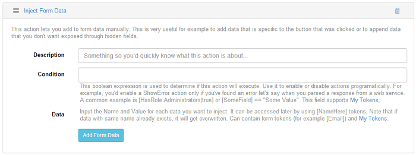
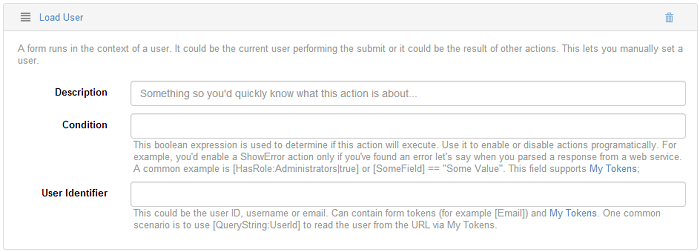

# Context

## Inject Form Data

This action lets you add to the grid data manually and is very useful, for example, for when you want to add data which is specific to the button that was clicked or to append data that you don't want exposed through hidden fields.

Bellow is an example of how to use the Inject Data action on an Item button from the grid - we'll try to send two emails, one email with predefined body which will be displayed for admin users only and the other email with another body for the non-admin users. Here's how you can do it: on a grid add an Item button and as actions on the button add two Inject Data actions and the Send Email action. 

On the first Inject Data action, put a condition to send the email to admin users and define the data which is to be send: 

as condition use: `[HasRole:Administrators|true]`

and add a Data where the Name should contain the value which should be used as token in the body of the email, let's say "body" and define the Value field with the text which you want displayed in the email (e.g. *The email has been successfully sent!*) 

On the second Inject Data action set as condition: `[HasRole:Administrators|false]` and add the same Data Name as above, "body" and define the value field with the text you want to be displayed for non-admin users. 

Set the Send Email action accordingly and in the Body field use the token predefined in Data Name: `[body]`. And all that remains to do is to test it.

## Load User

This action once set on a button lets you manually set a user, it could be the current user performing the submit or it could be the result of other actions.

