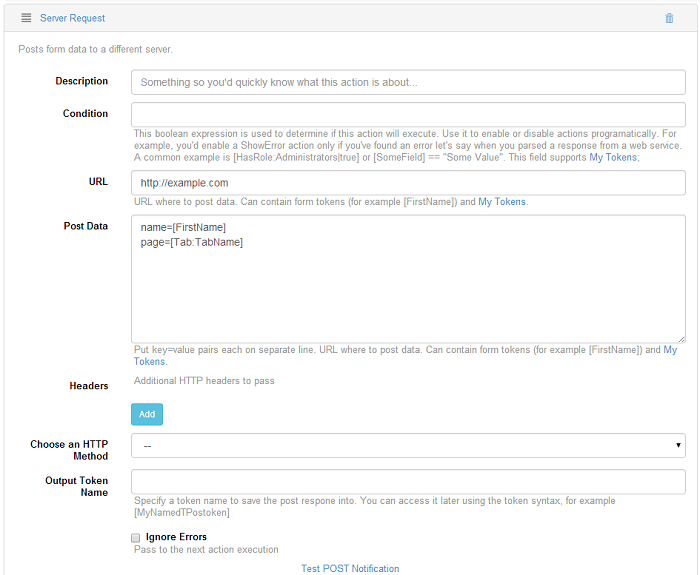

# Data

## Run SQL Query 

This action executes an SQL statement, optionally capturing the output. The SQL runs in the context of the DNN database, but there are plans to extend it to also allow a connection string or a connection string name that will make it possible to run in other databases as well – not restricted to SQL Server either. This action supports context tokens and My Tokens inside the SQL query. Here are some common scenarios when you would use this action:
* Use an UPDATE statement to calculate some statistics for large databases on an interval, instead of calculating them on every call. 
* Execute a SELECT statement to retrieve data to be used with other actions down the stack. 
* Flush old temporary data using a DELETE statement. 
Execute a stored procedure that calculates commissions paid through a referral program. Currently, only one field can be captured from an SQL action, so make sure that your query returns the data you need on first column of the first row. We may extend this in the future to be able to store multiple columns. As a workaround, either create multiple SQL actions, or produce the final text output directly from the SQL query. For example, if you need the full name of a user, you can use something like:

``` sql
SELECT FirstName + ‘ ‘ + LastName from Users where UserId = [UserId].
```


## Server Request

This action has the purpose of posting the grid data to a different server, you can use the URL field to determine the location for where the data will be posted (you can use DNN API Endpoint module to generate the URL), in this box you can also use tokens, and there's another useful box, the Post Data box, where you can put `key=value` pairs on separate lines and you can also add additional HTTP headers, in case you need it, and you can specify the HTTP method by selecting it from the "Choose an HTTP Method" drop down list.


