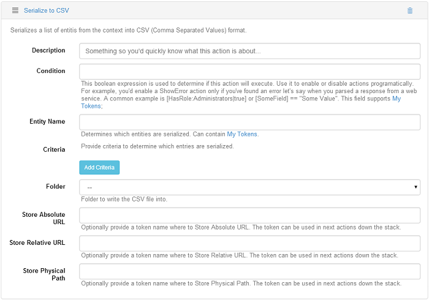

# Serialization

## Serialize to CSV

This action comes with Action Grid version 1.1 and lets you serialize a list of entities from the context into a CSV  (Comma Separated Values) format. When set on a Grid button and executed, this action downloads all the items into a .csv file. On this action there are lots of options which can be let empty and just store an URL to the generated file - use the Store Absolute URL to generate the file somewhere on the disk and gives you the URL or the file path which you'll use if you want to send an email with the file. But if you need to redirect to the file you need the URL, not the file path. If you want to email the link, then you have to use the Absolute URL but if you want to redirect, you have to use the Relative URL, it depends on the context and especially on how you use the action. 

As example, create a Grid  button, call it export, add as action on this button the Serialize to CSV and let's call the Relative URL, so in Store Relative URL field put the value "url" which will create a token. Add Redirect to URL action on the same button, and on the URL field put the token previously created: `[url]`. After saving and getting back on the page, test how this button works, click on it and you'll see that the redirect is made to a pop up page because the browser doesn't know to view this file, and click on it to open and take a look inside the file to see the data exported. The export can also be made on filtered data, if you need to extract only certain data. 

## Serialize to Excel

Similar to Serialize from Text in Action Form, you can use Serialize from Entity List to have your grid items saved in an XLS file. You have the possibility to choose which entities to export to XLS, and even to include all fields at once by ticking one single button.

Here is one example of such an exported grid:

