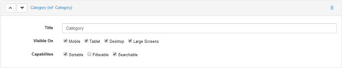

# Filter

Each field can be set to be sortable, searchable and filterable, and according to the view template of the grid, the layout on front end will differ.

### How to setup the filter

As mentioned on the [General Settings](general-settings.md) page, there is this Enable Filters box in the General Settings section which if it's not checked then the filter buttons and drop downs will be hidden even if the fields are marked as filterable. 

As a second step to setup this functionality, you have to check the *Filterable* box for each field that you want to use when filtering info. And after saving and getting back on the page you can see how the Filter is displayed in the Grid template. 

Do not forget that you can also change the order of the fields, for example you can change the column order on the grid by moving the fields up and down with the two arrows displayed in front of each field.

### SQL data source supports stored procedures for filtering

With Action Grid 2.0, whenever the user sets in a grid's data source the SQL Query source and uses a stored procedure, all the records are correctly displayed on the grid and if the grid fields are set to be filterable, then the filter option works as expected.

### Filter fieldname

Scenario: 

We have a grid that pulls data from a table. It has a filterable column Division. If we call the page with query parameter `filter-Division=some value`, then it filters the grid to only show entries with that division. However, there is no option to reset the filters and show all entries.

A workaround could be to add a Grid Button to say Clear Filters, which would do a redirect to the same page, therefore losing the filters. You can have `[$filter-fieldname] != ""` in the Condition field of the button so that it only shows when there's something in the URL.

### Filter grid data by column

If you want to filter grid data by column, not by one search box across all columns, i.e. if you need to filter based on product description, you can do it by unchecking the search checkbox from all the other fields. If you need to search in multiple columns separately, then you need to add an action form above the grid and e.g. work with query string variables to apply the search text to the grid.

