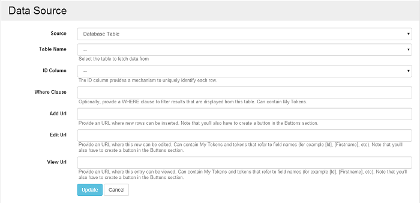

# Database Table

Since first line of code we've designed Action Grid with the ability to connect to database tables in mind. The applicability of this data source is only limited by one's imagination. First, it can still be used with Action Form. In many cases, it makes sense to store data submitted by Action Form in specialized tables shared by different business components using the Execute SQL action. If other components were to also update data from this table, then connecting directly to the [Action Form](http://www.dnnsharp.com/dnn/modules/action-form-builder) module would pull incomplete and inaccurate data. 

The other big scenario is the ability to manage database tables directly. And not only tables, views too. The Action Grid module can easily replace the Users module or the Event Log. Note that if you need to build a grid from a complex query across multiple tables, there's another SQL Query data source that it more appropriate. The advantages of the Database Table data source over the SQL Query data source are the ease of use (simply select a table name from a drop down) and the fact that delete is automatically implemented. For the [SQL Query data source](sql-query.md), since data could come from multiple tables governed by various laws, Action Grid can't determine the best way to delete an entry, so this need to be done manually from the On Delete event by adding one or more Execute SQL actions.

Once the Database Table data source is selected, additional configuration options will appear. 

* **ID Column**

  Action Grid uses this column to uniquely refer to a row. When deleting rows for example, is this ID that is passed back to the server.

* **Where Clause**

  This is passed exactly as it is into the SQL Query used to retrieve data from the table. Use it to filter the results that are being managed.

* **Add URL**

  Action Grid doesn't know how data into this table should be inserted. Provide a link that's relevant. For example, for a User management listing you'd put here the link to the Add User page or to an Action Form that registers a new URL. Note that if the Add URL is not provided, then the Add button will not be visible on the front end.

* **Edit URL**

  For the same reason as above, an Edit URL can be provided where data can be altered. In this field, reference any of the row fields using the token notation. For example: in `/user-add.aspx?id=[UserId]&issuper=[IsSuperUser]` the `[UserId]` and `[IsSuperUser]` tokens will get replaced with the values from the row that's being edited. If the Edit URL is left empty, then the Edit button from each row will be missing. 

When saving the data source, the list of fields would refresh to show all columns from the database. The fields can't be removed, but they can be turned off, and later back on if needed. While off, the fields won't appear in the grid, but they can still be used in the actions which run on events on the server side. 

Each field can be expanded to configure its capabilities in terms of sorting, searching and filtering, thus overriding the defaults. The field names are initialized with their respective column name from the database table. The names can be freely edited. Action Grid shows the original column name in the list of fields in the admin screen inside brackets next to each title. This way, each field can be traced back to a database column. 

Unlike the Action Form data source, data coming from the Database Tables is not cached in a Lucene Index. The query is built directly on the database table. There are immediate implications for this design related to search and filters. In particular, we’re talking about setting up Full Text Search in SQL Server for the table being searched and adding Index Keys for the fields that can be filtered. These two aspects can be ignored for small datasets, but can become a huge performance issue with large datasets. 

If search and filters are properly implemented, this Database Table data source should be blazing fast. It also uses CTE (Common Table Expressions) for retrieving data which also optimizes it for pagination.