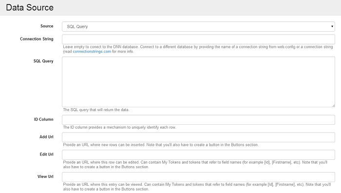

# Sql Query

The SQL Query data source fills the need of managing data that comes from multiple tables or built using complex statements. Note that this data source is not currently heavily optimized and should be used with care, especially with large data sets. It doesn't use a Lucene index nor CTE \(Common Table Expressions\).



Once the SQL Query data source is selected, additional configuration options will appear.

* **ID Column**

  Action Grid uses this column to uniquely refer to a row. When deleting rows for example, is this ID that is passed back to the server.

* **Connection String**

  Leave this empty to use the current DNN database or provide a connection string to connect to another database. It can also be the name of a connection string from `web.config`.

* **SQL Query**

  This is the SQL Query that will get executed to retrieve data.

* **Add URL**

  Action Grid doesn't know how data into this table should be inserted. Provide a link that's relevant. For example, for a User management listing you'd put here the link to the Add User page or to an Action Form that registers a new URL. Note that if the Add URL is not provided, then the Add button will not be visible on the front end.

* **Edit URL**

  For the same reason as above, an Edit URL can be provided where data can be altered. In this field, reference any of the row fields using the token notation. For example: in `/user-add.aspx?id=[UserId]&issuper=[IsSuperUser]` the `[UserId]` and `[IsSuperUser]` tokens will get replaced with the values from the row that's being edited. If the Edit URL is left empty, then the Edit button from each row will be missing.

The SQL Query data source does not implement deletion of entries. For this, you'll need to use the On Delete event with Execute SQL actions that remove data from the appropriate tables. Because of foreign keys, this usually needs to be done in a particular order.

### How to edit an item

As an example, if you want to edit the existing products from a Grid which uses as Data Source the SQL Query option, we depend on the Add URL/Edit URL options which have the purpose to redirect the user to a page where an existing Action Form will use an SQL statement in order to insert or to update the columns in the database.

Here's how: after adding a grid on a page and setting the SQL Query option as Data Source for the grid, usually we use a Select statement in the SQL Query box in order to list the existing database items in the grid. After updating the grid with this option and also defining the fields which we want to display in the grid, by using the Add Fields button, we get back on the page and in the grid we'll have all the existing records which are relevant to our SQL statement displayed in the grid.

If, for example, I want to add a new item in the database, and I want to do this by clicking an Add grid button, I have to get back on the manage page of the grid, and in Data Source section I have to provide a page URL in the Add URL box, where I'll be redirected after I click on the Add button. On the page I want to be redirected, it's recommended to add an Action Form, where we can use as action on the button an Insert SQL statement in order to add new records in the database.

After I create a redirect page with an Action From which uses an Insert statement on the submit button, I get back on the grid where, I have to add the Add button which will redirect the user to the Form page. On the management page of the grid, there is the Add Special Button option displayed on the Grid Buttons section, if I click on it, the Add Item button option will be displayed. After I select it, I can see that this button is predefined with a Datasource Add action which will get the URL previously set in the Data Source where new entries can be added.

### `[_PageUrl]` token in SQL Query

In order to use this token you need to set as grid data source the SQL Query option, and a query like this:

```sql
select *, '[_PageUrl]' as Url from Users
```

Then set a Column ID and when you click on Add field button then, an option called URL will be displayed, once selected, when you get back on the page with the grid, in the URL column the relative path of the page you have the grid on will be displayed.

### How to use dollar prefixed token names

You can use  `[$id]` instead of `[QueryString:id]`, for example in a grid's data source you can set as statement:

```sql
select * from Users where UserID=[$ID=1]
```

If I access a page with no id in query string, then the -1 id will be taken as default and no value will be returned because there is no user with -1 id.

### How to determine field sum of all rows

Let's say you have a field for hotel rooms and you want to display the number of hotel rooms across all of your records. To achieve this, you can make an SQL data source with a UNION, something like

```sql
select HotelName, RoomCount from Hotels 
union all 
select 'All Hotes' as HotelName, SUM(RoomCount) as RoomCount from Hotels
```

If you want to determine the table 'from' name when your data source is an action form, you should go with a custom template and sum up the results from the angular directive. You can take a look at templates under `\DesktopModules\DnnSharp\ActionGrid\static\angrid\views\`. You can start by cloning one of the templates and use it in the admin console.

### 


