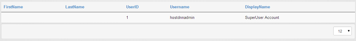
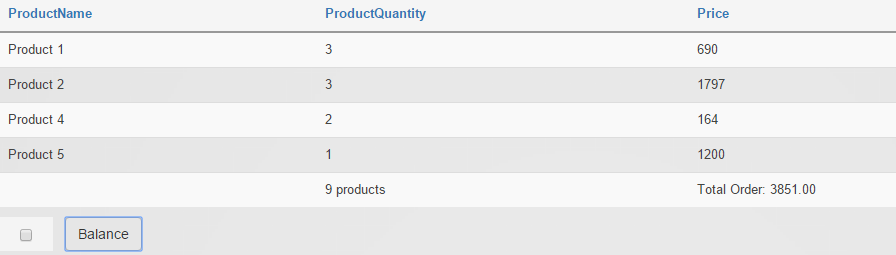

# Examples

## How to display biography token in a computed field


The biography token is being pulled from the user profile info, the user profile biography is a rich text editor field with html. Here's how you can use a computed field to display several user profile tokens in a template - notice that when the biography info is displayed, the html should be correctly rendered in the computed field:

1. add as data source on the grid the SQL Query option;

2. add a statement like this in SQL Query box:
``` sql
select U.UserID,
U.DisplayName,
U.Email,
UP.Biography,
UP.Country,
UP.Cell,
('/Portals/0/' + D.MappedPath + F.FileName) as AvatarUrl
FROM (
select UP.UserID, UP.PropertyValue, PD.PropertyName
from UserProfile as UP
inner join ProfilePropertyDefinition PD on PD.PropertyDefinitionID = UP.PropertyDefinitionID and PD.PortalID IS NULL
) as P pivot (
min(P.PropertyValue)
for P.PropertyName in (Country, Cell, Photo, Biography)
) as UP
inner join Users U on UP.UserID = U.UserID
left join Files F on F.FileId = UP.Photo
left join Folders D on D.FolderID = F.FolderID
```

3. set UserID on ID Column;

4. add a computed field on the grid, check the Allow HTML option and use the following content:
``` html

<div><h3>[DisplayName]</h3></div>
<div><strong>[Profile:FirstName]</strong><div>
<div>[Biography]</div>
```

5. set in Template section the Listing option and select a number of columns;

6. save and back on the page.

## How to use the WHERE Clause in a Data Source

In order to have WHERE clause displayed, you need to select as Data Source the Database Table option. Once the Table Name is set to the Users table and the ID Column is set to the UserID, you can set in the WHERE Clause a condition to display in the grid only a certain user - let's say the user with the id = 1. To do this, put in WHERE Clause the following:

`UserID = [GET:uid=1] or UserID = [GET:userId=1]`




## Use query string to populate form with items from grid


1. add Action Grid on a page
  * go in Manage grid 
  * set a Data Source to SQL Query 
  * on the SQL Query box add:
``` sql
   Select * from Auctions
```
  * Define a column in ID Column box
  * add an Item button with Redirect to URL action 
  * set the link to the form which you want to populate with grid's items like this: 
```
www.example.com/form-page?AuctionID=[AuctionID]
```

2. on another page add an Action Form module 
  * add On Init section a Run SQL Query with SQL Query:
``` sql
   select * from VehicleInfo where VehicleID=[QueryString:VehicleID=-1]
```
  * and Extract Columns with the info you need to retrieve from the table and store in form fields

**Result:** when you click on the grid item button, the id of the item will be checked and the redirect will be made to the form page where the form fields will be auto-populated with items values.  

**Info note:** We have a client who wanted to help us and posted this info on our support forum - it's more detailed and provides explanation on each action which needs to be made, so if you want to see it, please click [here](http://www.dnnsharp.com/Support.aspx#opturl=%2Faction-grid%2Fusing-action-grid--forms-to-manage-your-own-data). 


We've made a video tutorial where we provide a practical sample on how you can integrate Google Charts into your DNN website by using My Tokens (to feed data), Action Grid and Google Charts modules. The purpose of our example is to make a Pie Chart to show different types of errors that exist in DNN Log errors. To see how this can be made, click [here](https://www.youtube.com/watch?v=UqCDxRC3IIw).

## View URL with SQL query instead of Action Form source

If for example you use a form in order to insert records in the database, on ActionGrid, after you set the datasource as SQL Query, you can place in View URL the link of the page where the form is. 


## Load State on Pre-Init

Scenario:

We have a form where we save the state on the server session and Load On Init to populate the values back if the user comes back to the first step or just starts the whole thing over. After we perform the Load State On Pre-Init, there are certain situations where the state is null (because of a time for example) but putting the condition `[SavedState] == null` or `[SavedState] == ""` doesn't work. Is there a way to check if the state is null or not?

We can't change the state directly, but we can check one of the fields from the state. For example, we can add a hidden field - let's say Status - and set the value to Submitted. Then, just use this condition `[Status] != "Submitted"`.

## How to apply CSS to specific columns

If you would like to apply CSS to specific columns, you can use the nth child selector to write CSS for each individual column: [http://www.w3schools.com/cssref/sel_nth-child.asp](http://www.w3schools.com/cssref/sel_nth-child.asp).

## How to export (serialize to CSV) the fields that are not displayed in the grid

1. Add the field you need to export on the grid 

2. uncheck all the Visible on options 

3. check the Export all fields option on the Serialize to csv action

## How to use Carousel template 

In this scenario we'll use the Files table:

1. add as data source on a grid SQL Query with 
``` sql
select * from Files f
inner join Folders d on d.FolderID=f.FolderID
where ContentType='image/png' and d.FolderPath='Images/'
```
2. set ID Column to `FileId > update`
3. add a template field with Allow HTML checked and `/portals/0/images/[FileName]`
4. set Template of grid to Carousel

## How to display a column's total on client side in a new row inside Grid with JavaScript

In this scenario we'll use a Grid Button that calculate the Price & ProductQuantity column's total and display the result on a new row.
We'll insert our custom code inside the button's Javascript Code field:
``` js
var total = 0,
      products = 0,
      data = scope.source.data;

//remove the existing total row
if(_.map(data[data.length - 1], function(val) { return val; }).length < _.map(data[0], function(val) { return val; }).length)
     data.splice(-1, 1);

//calculate the columns total
 _.forEach(data, function(row) {
     total += parseFloat(row.Price.replace(/[^0-9\.]+/g,""));
     products += parseFloat(row.ProductQuantity.replace(/[^0-9\.]+/g,""));
});

var totalRow = {
     Price :  "Total Order: " + total.toFixed(2),
     ProductQuantity : products > 1 ? products + " products" : products + " product"         
};

data[data.length] = totalRow;
scope.source.data = data;
```
The result will be:


