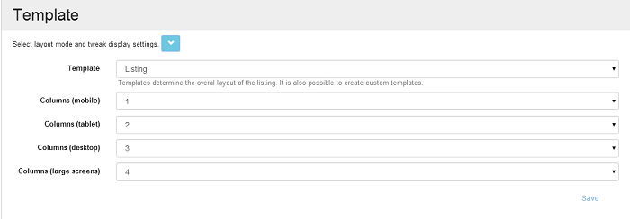

# Grid Template

No matter the Data Source linked to your grid, the data can now be displayed in a listing predefined template, and along with this predefined option which lets you determine the layout of the grid, you can also create your own [custom template](custom-template.md). This capability comes with the new Action Grid module, here's how it works:
How to set the Template 

When you are on the manage page of the module, go to Template section and enlarge the list, here you can let the default template option or you can choose the Listing template where you can see multiple columns where you get to specify on each device how many columns to be displayed. When you'll get back on the page, the data will no longer be displayed in grid layout but in some nice boxes - click [here](listing-view/README.md) to see the layout. 

The first column set in the Data Source will always be displayed on top of the box, so if you want a specific field to be displayed on top, you have to move it by using the upper arrows until it goes on the first line.  
