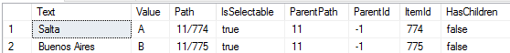
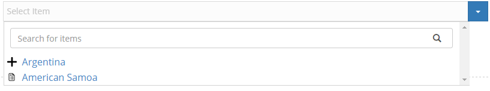

# Item Picker \(Tree View\) field

This fields was especially designed for choosing items from a dropdown where the data source and the display should be structured as a tree. There are now 3 data sources that where redesigned to work properly with this new field in Action Form and Action Grid \(Form Builder\). Those are: **PortalPages**, **PortalFolderList** and the most powerful **SQL Query.**

# PortalPages & PortalFolderList

Those datasources will bind all the the data and you will be able to select a page or a node \(a page with subpages or folder\). There are no restriction applied for those data sources and you can select only one.

The result should be something like this:

# SQL Query

This field is more customizable than other fields that are at the moment so an custom more powerful SQL Query is need it to use all the features.

Here is an example of  query and will look below of what is new:

> `SELECT TOP 1000`
>
> `[Text]`
>
> `,[Value]`
>
> `, CASE WHEN ParentId = 0 THEN CAST([EntryID] as nvarchar(50)) ELSE  CAST(ParentID as nvarchar(50)) + '/' + CAST([EntryID] as nvarchar(50)) END as 'Path'`
>
> `, CASE WHEN ParentId != 0 THEN 'true' ELSE 'false' END as IsSelectable`
>
> `, CASE WHEN text = 'Argentina' THEN null ELSE 11 END ParentPath`
>
> `, CASE WHEN 0 = 0 THEN -1 ELSE ParentID END ParentId`
>
> `, EntryID as ItemId`
>
> `, CASE WHEN ParentId = 0 and EntryID != 12 THEN 'true' ELSE 'false' END as HasChildren`
>
> `FROM [Lists]`
>
> `where`
>
> `--condition for getting descendents of an item`
>
> `ParentID = @parentId`
>
> `--condition for getting the root items`
>
> `or`
>
> `(@parentId = -1 And   EntryID = 11)`
>
> `or`
>
> `(@parentId = -1 And   EntryID = 12)`
>
> `--condition for search`
>
> `or`
>
> `(`
>
> `@searchText != ''`
>
> `AND`
>
> `-- this condition should bring all items when searchText has a value`
>
> `(ParentID = 11  or EntryID = 11 or EntryID = 12)`
>
> `)`

The SQL Header should look like this :

The result should be something like this:

### Fields:

**Text: ** This will be displayed for the user to select and/or expand.

**Value:** This will be the value that for further processing, if you have any, this field will return as token.

**Path & ParentPath**_\(!\)_**: ** Those Fields are used create the logic behind the arborescent view where the **Path **is the whole path to item including him and the **ParrentPath ** is only the parent path if the item. _\(Use only one of those two\)\(!\)_

**ItemId & ParentId**_\(!\)_**: ** Those Fields are used create the logic behind the arborescent view where the **ItemId **is the whole path to item including him and the **ParrentId ** is only the parent path if the item. _\(Use only one of those two\)\(!\)_

**HasChildren: **Tell the fields if it has children there for is expandable. We need this info because this control has lazy loading so we can keep the traffic and the database at a minimum.

**IsSelectable: **Tell the item if it can be selectable _\(can be a leaf or a node\)_

### Notes:

**If the columns name is not provided as above the control will not work. **

**It is only necessary to provide only one of the two combinations of Path/ParentPath or ItemId/ParentId. **

### SQL Conditions:

For all the featues of this field to work properly specific conditions must be set on the SQL based on @parentId/@parentPath and @searchText, their values are automatically set by our code. In our example we used @parentId.

Different values are set for these parameters based on the action executed:
- on page initialization (searchText is empty, itemPath is /, itemId is -1)
- on search (searchText is the provided value, itemPath is /, itemId is -1)
- on expanding an item (searchText is empty, itemPath/itemId is the value of the selected field)

The SQL must work on all of these actions or the field will crash.

**--condition for getting descendents of an item**

This condition should return all children of a field based on @parentId or @parentPath.

**--condition for getting the root items**

This condition should return all root elements when @parentId and @parentPath have the defaults values.

**--condition for search**

This condition should return all items when the @searchText is not empty

Note that all these condition should be exxclusive Or (XOR). So at any time only one of them should be true, while the other two must be false.

# IsSelectable \(SQL Query Only\)

When this value is 'true' than the leaf or node can be selected and chosen as an option. When 'false' the mouse pointer will be change and let you know that you can't click that item and choose it as an option.

# Expanding & Collapsing

Because mainly the data sources require the nodes to be selectable the expanding and collapsing is made from the plus \(  \) and minus \(  \) where the file \(  \) mean that there is a leaf and can't be expanded.

# Search

The search works with by pressing the button on the right of the textbox \(  \) or by pressing Enter key._ It will not search when the input is changed._

# Initially Selected

### PortalPages: _TabID_

### PortalFolderList: _Path_

### SQL Query: _value from Value Column_

