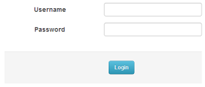
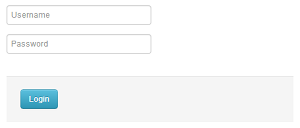

# Apperance

## General Settings Options

The forms, among other things, are frequently one of the main communication path between your visitors and your website. Feedback is always important, this is why is absolutely necessary to make sure that the forms you are using are easy to understand and intuitive for any user.

Your forms do not need to be boring, you can be sure that they are attractive and very effective if you use Action Form module. To get noticed, you need to come up with something unique and interesting - colors, position, size of the form are often used to reach interesting designs. Luckily, Action Form delivers this out of the box.

The General Settings, along with the <a href="https://sites.google.com/a/dnnsharp.com/action-form-v2/form-layout">Layout</a> settings, give you the ability to set up the forms exactly the way you want so they match with your website design and to also be attractive.

 

Bellow we'll list all the general settings options which can be found on the forms with a short description which will cover the functionality of each option - these settings can be used in order to configure the form at the level of template of display.

## Template

The default template of the forms is the Bootstrap one which has the purpose of rendering the form - more on this option can be found on the <a href="/action-form/template.html">Template</a> page.

## Include Bootstrap and jQuerry UI

Include Bootstrap and Include jQuery and jQuery UI options are checked by default and have the role of customize the layout of the forms accordingly. They can be used along with the jQuery Theme option which will give a different appearance to the forms. Click here to read more about jQuery Theme option.  

## Background

The form background can be solid color, pattern or cover image and these options are best used with the Text Color options which will give a nice effect to the form if you don't want to remain to the standard default options. The usability of these settings is that you don't need to write code for each form when wanting to customize it, you just have to use these drop down lists from where you can select the option which suits you. Among the themes, background color, text color, there's also the possibly to change the padding - you can enlarge the space between the forms and the surrounding elements.

## Label Align

The Label Align property allows you to align the labels on the action forms. The labels are the title names for the text boxes, for example "Last Name" and "First Name". You can position the labels to the Left, Right, Center, Top, Inside. Note that the position is displayed on the space allocated in the <b>Label Width</b>. To select a position for your labels, select from the Label Align drop down box and specify the position.

  

<b>Below are several images which exemplify the front end layout after setting different Label Alignments on the forms:</b>

    
<b>Align Label to Left</b>
        

    
<b>Align Label to Center</b>
        

    
<b>Align Label to Right</b>
        

    
<b>Align Label Inside</b>
        

    
<b>Align Label to Top</b>
          

## Label Width

The Label Width property allows you to specify the width of the label columns on the action form. It controls the space allocated for labels, so it can display the labels closer or farther from the controls. This option ensures the responsive layout according to each setting. Make sure that you select an option which provides sufficient space, does not overlap the labels or insert a wide space between the labels and the text box.

  

## Field Spacing

The Field Spacing determines the spacing between controls. You can chose from 3 options: Loose, Normal, Compact. This is a good option to be used when you have a big complex form because you need to save some space.

  

<b>Here are listed several layouts where the Field Spacing options were used:</b>

    
 <b> Field Spacing - Loose</b>
        

    
 <b> Field Spacing - Normal</b>
        

    
 <b> Field Spacing - Compact</b>
        

## Manual Layout

To implement more complex layout scenarios, you have the Manual Layout option which provides you with an HTML template which can be edited according to your needs in order to achieve a nicer form. When editing the HTML template you can also use Tokens for the fields you want to use. More on this option can be found on the Form Layout page.

## Display Mode

This option is used to determine either if the form will be displayed on the page or if it will get displayed when the user clicks a link. More on this option can be found on the <a href="https://sites.google.com/a/dnnsharp.com/action-form-v2/display-mode"> Display Mode</a> page in this documentation.  

## Show Form Condition

In this box you can provide a Boolean server expression or you can use Tokens to determine if the form is visible for certain users (note that for admins the form is always visible in edit mode).

## Sidebar Options

Left and Right Sidebar HTML options let you insert text which will be displayed accordingly on the form, on mobile devices, the text gets displayed on top of the form.

## Initialization Scripts

This option lets you include more scripts on the page along with the form - <a href="https://sites.google.com/a/dnnsharp.com/action-form-v2/form-settings/initialization-scripts">click here</a> to read more on this option.

## Enable Client Side Validation

<a href="https://sites.google.com/a/dnnsharp.com/action-form-v2/validations">Click here</a> to read more on this option.

## Show Tool tips

When enabled, this option will show the short description of the fields, if there is any, when the user hovers over the field Label. If a short description for the Title field is added, for example, a Name field could have a short description like "Please enter your Name.", when hovering the title of the field, this description will be displayed.

## Debug Mode

Click <a href="https://sites.google.com/a/dnnsharp.com/action-form-v2/debugging">here</a> to see how this options works when is enabled.