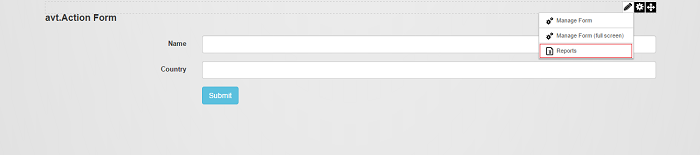
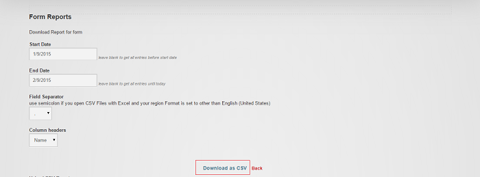

# FAQ

## Contents

* [How can I save the completed fields so that when I get back to the form the completed data is loaded in the fields?](#1)
* [How do I copy a form from another page?](#2)
* [How do I create a multi-step form?](#3)
* [How do I give color to a button?](#4)
* [How do I set a default password?](#5)
* [How do I view submitted data using Action Form?](#6)
* [How do I change the Display/Error Message text and background color?](#7)
* [What is the difference between Condition and Show options?](#8)
* [Why can't I use My Tokens in bind expressions?](#9)
* [With a live site, I do not want to stop users from using it for any significant time.  At the same time I will need to update/test forms and then make the changes live.](#10)
* [I have a question that's not included in this FAQ, where can I get an answer?](#11)

### <a name="1"></a> How can I save the completed fields so that when I get back to the form the completed data is loaded in the fields ?

There are several possibilities to do that:

1. you can create another button like "Save for Later" on which you can set a Display Message action and inside the Message put the following token: [_EditUrl] > in this way after the user clicks on it, an url will be displayed instead of a message and the user can save the url and then access it directly when s/he wants to finish the form

2. or you can do it manually following the same steps as above but with an additional token in Display Message box: [_ReportKey] - in this way, an id will be generated and you can store it in cookies to be activated when the user comes back on the site

3. if the user is logged on the site and you want to use the information from the user's profile to be fetched in the form's fields, you can set on each corresponding field a token like [Profile:FirstName] or [Profile:Email] in Initial Value field.

### <a name="2"></a> How do I copy a form from another page ?

In order to copy an existing form from one page to another, you have to go on Modules header option > click on Add existing module > select the page where the form is created from the first drop down list > add the form to content pane.

### <a name="3"></a> How do I create a multi-step form ?

Begin by creating a first page with a form which will be used to collect user information, a second page with another form where we can select products and a third page with a shipping form. After saving the form, we need to redirect the user to the step two and three of the forms in order to fill in all the three steps form and we also need to create a Previous button to give the user the possibility to get back on the page s/he previously added info and modify it.

1) Create the <u>first form page</u>, add an Action Form module, select let's say a contact form, add a <b>Next</b> button and set as actions on it:

<b>Save State</b> with Save Location in Server Session and as Key <i>UserInfo</i><br>
<b>Redirect to Portal Page</b> - select the form page where the user will be redirected to the second step.

On Form Events section > <b>On Init</b> add a <b>Load State</b> action where you have to give the same key as in the Save State action: <i>UserInfo</i> - this will keep the info already filled in the form fields and display it so that the user sees the details provided in the form.  

2\) On the <u>second form page</u>, add another Action Form module and add a list of products by using the Multiple Choice Checkbox list, determine the products you want to display on the Items box and add another <b>Next</b> button with the following actions:

<b>Save State</b> with Save Location in Server Session and Key <i>ProductInfo</i><br>
<b>Redirect to Portal Page</b> where the step three page should be selected.

We need to add here a <b>Previous</b> button on which set as actions:

<b>Save State</b> in order to save the changes we've made to the current step - Save Location in Server Session and Key <i>PorductInfo</i>;
and a <b>Redirect to Portal Page</b> action back to the first step form page.

And on Form Event section > <b>On Init</b> add as action <b>Load State</b> with Key <i>ProductInfo</i>

3\) On the <i>third form page</i> where we want to add the shipping details start with a blank form and add a Country field and a Large Text field and a Finish/Send button on which we need to load all the previous actions because we need the data:

two <b>Load State</b> actions with Key <i>UserInfo</i> and <i>ProductInfo</i>
and optionally a send email action, or display message or create user account action, according to your needs.

Add a Previous button where use as actions:

<b>Save State</b> with Save Location in Server Session and Key <i>ShippingInfo</i>
and a <b>Redirect to Portal Page</b> - to get back to the second form page
and in Form Event section > On Init set as action Load State with Key <i>ShippingInfo</i>

Now, as you go next and back on the form, all the info filled in the fields will be saved and displayed.

<iframe width="910" height="512" src="https://www.youtube.com/embed/oIclb99Xgt4" frameborder="0" allow="autoplay; encrypted-media" allowfullscreen></iframe>

### <a name="4"></a> How do I give color to a button ?

Each field on a form has an UI Settings section, when you want to define a certain color on a button, you can use the CSS style in Control CSS Classes > Styles: background-color:red !important. The !important property to the tag is a way to have the rule applied no matter where that rule appears in the CSS document.

### <a name="5"></a> How do I set a default password ?

In case you want to have a form where the Password field is visible only if certain criteria are met, there is a simple and elegant way to do that.

From the Modules drop-down menu select Add New Module, then choose Action Form. Select the blank template and proceed to configure the needed fields - for example Username, Email, and Password. Select Add Field; from here, choose Text > Text Box for the Username and Password fields, andText > Email for email. 

Click on the Password field and scroll down to Bind Expressions. In the Show field write [Username] == 'test', where 'test' is the name that must be entered in the Username box for the Password field to become visible. Note that the words are case-sensitive.

Lastly, click on Add Field, then Buttons, and pick Button. Scroll down to On Click Handler and select whichever action you want it to perform when clicked. The default is Submit. Save and go back.

### <a name="6"></a> How do I view submitted data using Action Form ?

There are 3 ways to see the entries:

1) check the database

2) use Action Grid and set the respective form as source

3) in Edit Mode, there is the Reports button, which downloads the data as CSV (illustrated below).

<br>
<br>

### <a name="7"></a> How do I change the Display/Error Message text and background color ?

If you'd like to change the background and/or text color of the Display or Error messages that appear after you submit a form, you have to go to Page Settings > Advanced Settings and scroll down to Page Header Tags. There, paste the following bits -

For Display Message:

```css
<style>
.submit-confirm {background-color:blue !important;color:black !important}
</style>
```

For Error Message:

```css
<style>
.server-error {background-color:blue !important;color:black !important} 
</style>
```

Update the page and voilà!

### <a name="8"></a> What is the difference between Condition and Show options ?

The Condition option runs on server side, is C# code and can contains tokens (default tokens or custom tokens). For example in Condition you can put [User:UserId] == 2 (default token), or [HasRole:MyRole \|true]. The field will be displayed if the UserId =2 or the user has the role "MyRole".

The Show option runs on client side, is JavaScript code, you can use [FieldId] from your form. In this option you can display the field depending on other fields from your form.

In other words, "Show Conditionally" applies from the server side, it supports C# syntax. It's not real time. It evaluates on form load and on button clicks. But you have the power of everything that's on the server, including My Tokens.

"Bind Show" applies from client side, through JavaScript and Angular JS. It's real time. But obviously you don't have access to server side objects, such as My Tokens. This is good to show/hide fields based on values in other fields.

### <a name="9"></a> Why can't I use My Tokens in bind expressions ?

Even if you used the same syntax to reference field value (i.e. [FieldName]), binding expressions are pretty much javascript code (Angular JS actually), so the tokens translate to JavaScript variables which are bound to form fields. So when a form field changes the variable changes, and vice versa. That's how all binding libraries, including Angular JS, work. My Tokens on the other hand runs on server side. For this to work, there would need to be an HTTP AJAX request made to the server to get back a token response. While we are considering either this is something we can build into Action Form, there are simple ways to do it.

The easiest would be to use DNN API Endpoint to create a method that receives the input and you can just output Raw Response and put My Tokens in there. Then, copy the jQuery code that is generated for you, and place that in the On Click / Change binding. Add your custom JavaScript code to do the wiring. For example, if you wanted to populate the text in a textbox, you'd write [TextBoxFieldName] = data;

### <a name="10"></a> With a live site, I do not want to stop users from using it for any significant time.  At the same time I will need to update/test forms and then make the changes live.

We recommend to clone the site after it is ready for release and all module upgrades and testing be done on the development clone.

Only after the upgrade and features have been fully tested upgrade your live site and import the modules from the clone site.

### <a name="11"></a> I have a question that's not included in this FAQ, where can I get an answer ?

You can find more resources in our <a href="/action-form/how-to.html">How to</a> and <a href="/action-form/exemples-troubleshooting.html">Examples & Troubleshooting</a> sections; if everything else fails, do not hesitate to contact our <a href="https://www.dnnsharp.com/helpcenter/action-form">Support</a> team.