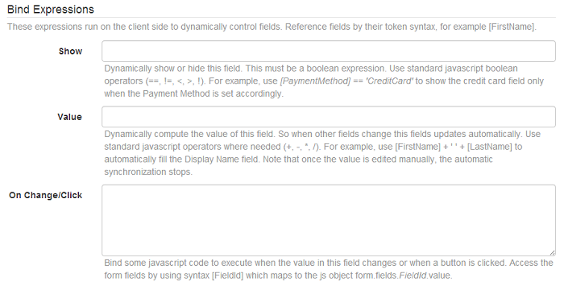
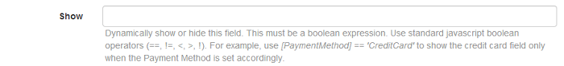

# Bindings (aka Dynamic Forms)

This feature provides the ability to build dynamic forms through the use of bindings. A binding is an expression made of field values as they exist on client side when the expression is evaluated, and which affects the form state on client side, thus creating forms that dynamically change based on user input. More specifically, there are expressions that can control field visibility or the value.

Behind the scenes, Action Form uses the popular Angular JS library, but we've implemented a layer that would provide the more familiar syntax which is the field name between square brackets (eq <i>[FieldId]</i>).

 <br>

## More on Expressions

These are JavaScript flavor expressions which are evaluated by Action Form to determine if a form field is visible or to auto generate a value. So the first thing you need to know about these expressions is that they are of two kinds: Boolean expressions and Value expressions. A Boolean expression evaluates to true or false and it's used by the Show binding. A value expression returns something that is stored in a field value.

These expressions are implemented on top of Angular JS data binding mechanism. Besides field value, you can invoke any JS function. For example, show a Continue button when the zip code length is 5 using this expression: <i>[ZipCode].length == 5</i>. Or, show it if a field is a number: <i>!isNaN([Age])</i>. The ability to use the JS Api is what gives limitless potential to Action Form binding expressions!

Don't let yourself be fooled by the square brackets syntax. This is just a way to reference fields. But they're still JavaScript expressions, Action Form will replace the references with constructs like <i>form.fields.<fieldId>.value</i> before evaluating as JavaScript. So all specific rules apply. You need to use quotes (single or double) around text, concatenate using the plus operator, compare using the Boolean operators and so on. But you don't need to be a guru in JavaScript to use bindings. In 50% of the cases all that you'll use is the == operator to show or hide fields and the plus operator to concatenate strings the set the value in another field.

Inside expressions you're limited to using operators only. You are not allowed to use control structures, to declare variables, functions and so on. You can however use the On Click/Change binding where you have full syntax.

## Using Tokens

We get this often on support: "Why can't I bind using [User:FirstName]?". The answer is simple: these tokens live on the server side. We manage to fool some with this answer, but others are more alert and come with this clever question: "Ok, but what about <i>[FormFileId]</i> syntax? It works in binding expressions and pretty much everywhere else". Well, like mentioned earlier, we did extra work to implement this layer on top of Angular JS to translate <i>[FormFileId]</i> from tokens to angular specific code like <i>form.fields.FormFieldId.value.</i> But we've only done it for form fields. Invoking all tokens just to export them to JS would be overkill.

### Solution 1: Hidden Fields

But that doesn't mean you can't do it. It's just that you have to do the work yourself. One way to do it is with Hidden Fields. Add one such field to your form and input the token in the value field. Now you have it on client side and can use it in expressions via the hidden field, pretty much like any other field.

### Solution 2: Initialization Script

Another way to do it is to export the tokens as JavaScript variables via the Initialization Scripts section in Action Form. For example, write something like:

``` code
this.myUsername = "[User:Username]";.
```

Notice the using of this keyword. It refers to the Angular JS scope. Every time you use a variable in an expression, it's fetched from this scope. So now that we've placed <b>myUsername</b> in the scope, we can later use it in an expression just by its name. So one field could be made visible with the following expression:<b> myUsername == 'host'.</b>

<b>Some very important side notes</b> on this technique. You can also "import" global variables into Action Form. So writing something like <b>this.myPage = g_tabId; </b> would bring the value of a global variable to be used inside the expressions. And you can also place functions in <b>this</b>. For example,

```js
this.myFunc = function(args) {
    // do something
};
```

And then, just invoke the function from an expression just as you'd invoke any function in JavaScript.

## Visibility / Show

This binding dynamically shows or hides fields based on a Boolean expression. Access field values by their name between square brackets and use standard JavaScript Boolean operators (==, !=, <, >, !). For example, use <b>[PaymentMethod] == 'CreditCard'</b> to show the credit card field only when the Payment Method is set accordingly. More complex expressions are possible by using the logical and operator (&&) and the or operator (\|\|).

 <br>

Here are a few different scenarios that use this binding.

* <b>Based on a check box </b>

Because a check box is already a Boolean, the expression can be as simple as <b>[CheckboxFieldId].</b>
This is equivalent to: <b>[CheckboxFieldId] == true</b>

* <b> Based on a radio button </b>
  
The default radio box is called Yes/No. So the expression must check the field value against a string like this:

 <b>[RadioFieldId] == 'Yes'</b>

* <b> Based on Multiple Choice fields </b>

The multiple choice field allows administrators to provide a list of items. The expression need to compare against the item value. You have to pay attention to this only when using the pipe syntax to provide both a text and a value for an item (for example Item Text\|value here). Here's an example: <b> [MultpleChoiceFieldID] == 'Some Value'. </b>

* <b> Complex Expressions </b>

So far you've seen some simple examples. Often you'll need to take into account more that one field. For example, to show a button after a user has ticked the Agreed to Terms check box and has written his or her name in the signature field, use this expression:
    <b>     [AgreedToTerms] && [Signature] == [Name] </b>

If you need to join more expressions, also use round brackets to group conditions in order the define priorities. For example,
    <b>     [AgreedToTerms] && ([Signature] == [Name] || [SignLaterAtYourOffice]) </b>

<strong> Important! </strong>
Hidden fields do not get submitted to the server. This is because the show binding is commonly used to create conditional logic, where only the visible fields make sense to be filled in and sent to server.

## Enable

This binding is used to auto determine in realtime(only based on data available on front-end) if the field is enabled or not. As for all the bind expression conditions you will not be able to use [MyTokens](/my-tokens/index.html) tokens as they will be evaluated only once, at form initialization.


> The setting was added in Action Form 5.0.519 and is available in all following versions.

## Value

This binding is used to auto-populate a field based on values in other fields. Let's take the most natural example in DNN:
    <b>     [FirstName] + ' ' + [LastName] </b>


This is the expression that you would bind to the Display Name field. It simply concatenates the First Name with Last Name and separate them with a white space. The field will update automatically every time first name or last name fields change. But there is a catch. Once the user "touches" the Display Name field the value is no longer updated automatically. Currently there is no way to reactivate the binding once that happens. If you do need to do this, then take a look at creating the binding manually in the On Click/Change section further down on this page.

You've already seen the concatenation operator in the example above. Here are more usages of this feature:

* <b>Conditional binding</b>

    Here's a classic example with two fields, call them Source and Target, that need to be synchronized when a check box called Sync is ticked.  For this purpose, you can use the conditional operator from JavaScript and write the following expression in the Target field:

    <b>     [Sync] ? [Source] : "". </b>

    This simply says "If Sync is checked, then use the value from Source field, otherwise use nothing". There is a video on this example at <a href="//youtu.be/iOjGys1NVmg">youtu.be/iOjGys1NVmg</a> and also some files that you can find attached to this page.

* <b> Parse values </b>

    Think a common example with ID numbers which sometimes contain the date of birth. Why not parse this and populate the date of birth field automatically? With an ID like 20010110xxxxxxxx, where we have YYYYMMDD at the beginning, we can extract the date using the JavaScript <a href="https://www.w3schools.com/jsref/jsref_substr.asp">subtr</a> function. So, to the date time field that accepts the MM-DD-YYYY format, bind the following expression:
    <b>     [IdField].substr(4, 2) + '-' + [IdField].substr(6, 2) + '-' + [IdField].substr(0, 4) </b>

All this does is take parts of the ID fields and concatenate them together but in a different order and separated by a hyphen.

## On Click/Change

This binding is used to bind some code to be executed when a button is clicked or a field value changes. This allows for more advanced scenarios compared to the other bindings and you can use the full JavaScript capabilities, including conditions and loops and so on. In this context, this refers to the field that raised the event, more specifically to the jQuery object built with this DOM object.


Here are some common scenarios:

* <b>Advanced bindings</b>

The example in the previous section can be rewritten like:

``` js
if ([Sync] == 'Yes')
        [Target] = [Source];
```

This is somehow cleaner code and it also bypasses the Action Form mechanism to break the binding after the Target field is "touched". It also allows for more advanced processing so values can be compared, iterated, parsed and so on before being bound again to a field. There is a video on this example at youtu.be/iOjGys1NVmg and also some files that you can find attached to this page.

* <b>Fetch data from Web Service</b>

Now this gets interesting! Let's say we have two fields, Source and Target. We want to update the Target with the value from a web service whenever Source changes. To make the request we can use the $http service from Angular JS. This is already included by Action Form, we can just use it in the On Click/Change binding of the Source field:

```js
$http({method: 'GET', url: '/someUrl'})
        .success(function(data) {
            [Target] = data;
        });
```

More services are available in Angular JS, but not all of them are exposed by Action Form. Write to us below in comments or via email if you need more services.

* <b> Custom bindings </b>

In a future version we'll add more bindings to control CSS classes, to disable fields and so on. But until then you can achieve all of these manually via this On Click/Change binding. Consider the following example:

```js
  if ([Sync])
        $(this).addClass('field-synched');
```

What this does, it adds a class to a field when it changed and the Sync check box is ticked. Note the use of this in this context refers to the form field that generated the change event.