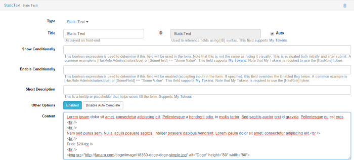
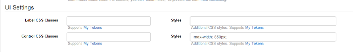
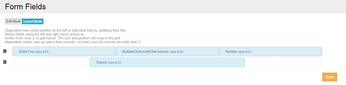
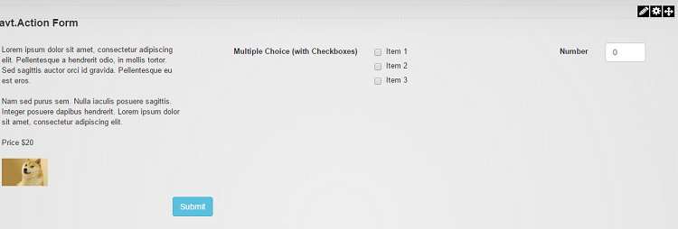

# Examples & Troubleshooting

## Contents

* [Create a store-like form with HTML content](#1)
* [Evoq 8 and DNN 740 compatibility](#2)
* [Folder Selection for Single File Upload](#3)
* [Have 10 added and 10 subtracted in the TextBox field when the value selected in Radio Boxes is "Yes" and "No," respectively](#4)
* [IFrame is open when I click on the Manage Form option](#5)
* [Image map filter](#6)
* [[HasRole] token not working in Action Form](#7)
* [JavaScript errors due to some .map files not found](#8)
* [Problem with Bootstrap and Jquery when the 'Include Bootstrap' and 'Include jQuery and jQuery UI' options are unchecked](#9)
* [Problem with DnnSharp.Common.dll](#10)
* [Regular expression validators](#11)
* [Send email to registered user](#12)
* [SQL query of Action Form data](#13)
* [On Change/Click AJAX & JSON Example](#14)

### <a name="1"></a> Create a store-like form with HTML content

In order to create a store-like form, from the Modules drop-down menu select Add Module and choose the Blank template.
Add the desired fields as follows: in Add Field select Text, and there Static Text. In Content field insert the product description in HTML format. Also there you can add images and other info, like price, for example.
<br>
Scrolling down to UI Settings, you can define a maximum text width so that the text doesn’t take too much of the page.  Under UI Settings, in the second Control CSS Classes field write <b>max-width: 350px;</b> .
<br>
From Add Field select Multiple Choice, then Multiple Choice (with Checkboxes). Here you can define whatever items you want associated with the above-described product. In the Items box write Item 1, Item 2, Item 3, etc – one per row.

Add another Field by going to Add Field and selecting Text, and from there Number. This is where customers can select how many of a specific item they want to purchase.

The last step is to add a Buy button by selecting Add Field – from Button choose Button. Click on the newly-created button to customize it. Scroll down to On Click Handler and click on Add Action, and from there select Authorize.Net and Add a Simple Check Out to a Button.
<br>
In Layout Mode drag and resize the fields to your liking – in our case 4/12.
<br>
Final form:


### <a name="2"></a> Evoq 8 and DNN 740 compatibility

Action Form has been tested on Evoq 8 and DNN 740 and no issues have been encountered.

### <a name="3"></a> Folder Selection for Single File Upload

In Action Form, there are several ways through which to determine the folder where the file gets uploaded. 

From the Modules drop-down menu select Add New Module and choose Action Form. Pick the blank template and create an upload field by clicking on Add Field, then Files > Single File Upload.

Under Single File Upload, scroll down to Upload to Folder, which provides a drop-down menu from where you select the folder you want to upload the files to. In our case, it's called Random Folder.

### <a name="4"></a> Have 10 added and 10 subtracted in the TextBox field when the value selected in Radio Boxes is "Yes" and "No," respectively
  
Add a Radio Box and TextBox field. In Initial Value from the TextBox field add 10. In a Submit button, in Bind Expressions, add this syntax to the On Change/ Click option:

```code
if([Radioboxes] == 'Yes')
{
form.fields.TextBox.value = parseInt(form.fields.TextBox.value) + 10;
}
else if([Radioboxes] == 'No')
{
form.fields.TextBox.value = parseInt(form.fields.TextBox.value) - 10;
```

### <a name="5"></a> IFrame is open when I click on the Manage Form option

The problem is with the IIS virtual directory, which could be different from the portal alias. The portal alias must be the same with the IIS virtual directory, because they are case sensitive.

### <a name="6"></a> Image map filter

Say you want to have a picture of a state with the counties clickable. When the user clicks on a county it will filter the table below showing the county that was clicked on.

To do this, you need an image of the state in question with all the counties drawn out. Load this into an html module and map the image's counties to hyperlinks that point back to the page you're on passing a query string variable equaling the county clicked. e.g. mypage.aspx?county=swain .

Below the HTML module place an Action Grid. The SQL query will read the query string county passed in and load the grid. The SQL will look something like this:

```sql
 select * from countystuff where county='[$county='']' .
```

### <a name="7"></a> [HasRole] token not working in Action Form

Cause:

The My Tokens module is not installed. The [HasRole] is not a default token of DNN, it’s a token from My Tokens.

Solution:

Install the My Tokens module on your site.

### <a name="8"></a> JavaScript errors due to some .map files not found

Exception:

404 Not Found /DesktopModules/AvatarSoft/ActionForm/static/angular/angular.min.js.map

404 Not Found /DesktopModules/AvatarSoft/ActionForm/static/angular/angular-animate.min.js.map

Cause:

When is reporting a 404 for a some.map files first thing to know that are requested by browser when you open the development console (F12).

Solution:

The .map files are debug files for JavaScript. We do not distribute these because the take up space and don't provide any functionality.

### <a name="9"></a> Problem with Bootstrap and Jquery when the 'Include Bootstrap' and 'Include jQuery and jQuery UI' options are unchecked

Cause:

Action Form module uses more recent versions of Jquery and Bootstrap. Action Form uses the 1.10.2 version of Jquery and the 3.0.2 version of Bootstrap. The DNN platform uses older versions.

Solution:

Check the 'Include Bootstrap' and 'Include jQuery and jQuery UI' options.

### <a name="10"></a> Problem with DnnSharp.Common.dll

Exception:

```code
DotNetNuke.Services.Exceptions.PageLoadException: Method not found: 'System.String DnnSharp.Common.TokenUtil.TokenizeWithCollection(System.String, System.Data.IDataReader, Boolean)'. ---> System.MissingMethodException: Method not found: 'System.String DnnSharp.Common.TokenUtil.TokenizeWithCollection(System.String, System.Data.IDataReader, Boolean)'.

at DnnSharp.ActionGrid.Core.DataSource.Providers.DbTableDataSource.ConvertResult(ComponentConfiguration settings, IDataReader dr, String idColumn)

at DnnSharp.ActionGrid.Core.DataSource.Providers.DbTableDataSource.GetData(ComponentConfiguration settings, DataQuery query, Boolean cache, Boolean clearCache)

at DnnSharp.ActionGrid.Core.Actions.ActionGridContext..ctor(ComponentConfiguration settings, HttpContext context)

at DnnSharp.ActionGrid.Core.Config.ComponentConfiguration.AngridSettingsJson()

at ASP.desktopmodules_dnnsharp_actiongrid_main_ascx.__Render__control1(HtmlTextWriter __w, Control parameterContainer)

at System.Web.UI.Control.RenderChildrenInternal(HtmlTextWriter writer, ICollection children)

at System.Web.UI.Control.RenderChildren(HtmlTextWriter writer)

at System.Web.UI.Control.Render(HtmlTextWriter writer)

at System.Web.UI.Control.RenderControlInternal(HtmlTextWriter writer, ControlAdapter adapter)

at System.Web.UI.Control.RenderControl(HtmlTextWriter writer, ControlAdapter adapter)

at System.Web.UI.Control.RenderControl(HtmlTextWriter writer)

at System.Web.UI.Control.RenderChildrenInternal(HtmlTextWriter writer, ICollection children)

at System.Web.UI.Control.RenderChildren(HtmlTextWriter writer)

at DotNetNuke.UI.Modules.ModuleHost.RenderContents(HtmlTextWriter writer)

at System.Web.UI.WebControls.WebControl.Render(HtmlTextWriter writer)

at System.Web.UI.Control.RenderControlInternal(HtmlTextWriter writer, ControlAdapter adapter)

at System.Web.UI.Control.RenderControl(HtmlTextWriter writer, ControlAdapter adapter)

at System.Web.UI.Control.RenderControl(HtmlTextWriter writer)

at System.Web.UI.Control.RenderChildrenInternal(HtmlTextWriter writer, ICollection children)

at System.Web.UI.Control.RenderChildren(HtmlTextWriter writer)

at System.Web.UI.HtmlControls.HtmlContainerControl.Render(HtmlTextWriter writer)

at System.Web.UI.Control.RenderControlInternal(HtmlTextWriter writer, ControlAdapter adapter)

at System.Web.UI.Control.RenderControl(HtmlTextWriter writer, ControlAdapter adapter)

at System.Web.UI.Control.RenderControl(HtmlTextWriter writer)

at System.Web.UI.Control.RenderChildrenInternal(HtmlTextWriter writer, ICollection children)

at System.Web.UI.Control.RenderChildren(HtmlTextWriter writer)

at System.Web.UI.Control.Render(HtmlTextWriter writer)

at System.Web.UI.Control.RenderControlInternal(HtmlTextWriter writer, ControlAdapter adapter)

at System.Web.UI.Control.RenderControl(HtmlTextWriter writer, ControlAdapter adapter)

at System.Web.UI.Control.RenderControl(HtmlTextWriter writer)

at System.Web.UI.Control.RenderChildrenInternal(HtmlTextWriter writer, ICollection children)

at System.Web.UI.Control.RenderChildren(HtmlTextWriter writer)

at System.Web.UI.HtmlControls.HtmlContainerControl.Render(HtmlTextWriter writer)

at System.Web.UI.Control.RenderControlInternal(HtmlTextWriter writer, ControlAdapter adapter)

at System.Web.UI.Control.RenderControl(HtmlTextWriter writer, ControlAdapter adapter)

at System.Web.UI.Control.RenderControl(HtmlTextWriter writer)

at System.Web.UI.Control.RenderChildrenInternal(HtmlTextWriter writer, ICollection children)

at System.Web.UI.Control.RenderChildren(HtmlTextWriter writer)

at System.Web.UI.HtmlControls.HtmlContainerControl.Render(HtmlTextWriter writer)

at System.Web.UI.Control.RenderControlInternal(HtmlTextWriter writer, ControlAdapter adapter)

at System.Web.UI.Control.RenderControl(HtmlTextWriter writer, ControlAdapter adapter)

at System.Web.UI.Control.RenderControl(HtmlTextWriter writer)

at ASP.portals__default_skins_u1_standardmenu_standardmenu_inner_ascx.__Render__control1(HtmlTextWriter __w, Control parameterContainer)

at System.Web.UI.Control.RenderChildrenInternal(HtmlTextWriter writer, ICollection children)

at System.Web.UI.Control.RenderChildren(HtmlTextWriter writer)

at System.Web.UI.Control.Render(HtmlTextWriter writer)

at System.Web.UI.Control.RenderControlInternal(HtmlTextWriter writer, ControlAdapter adapter)

at System.Web.UI.Control.RenderControl(HtmlTextWriter writer, ControlAdapter adapter)

at System.Web.UI.Control.RenderControl(HtmlTextWriter writer)

at System.Web.UI.Control.RenderChildrenInternal(HtmlTextWriter writer, ICollection children)

at System.Web.UI.Control.RenderChildren(HtmlTextWriter writer)

at System.Web.UI.Control.Render(HtmlTextWriter writer)

at System.Web.UI.Control.RenderControlInternal(HtmlTextWriter writer, ControlAdapter adapter)

at System.Web.UI.Control.RenderControl(HtmlTextWriter writer, ControlAdapter adapter)

at System.Web.UI.Control.RenderControl(HtmlTextWriter writer)

at System.Web.UI.Control.RenderChildrenInternal(HtmlTextWriter writer, ICollection children)

at System.Web.UI.HtmlControls.HtmlForm.RenderChildren(HtmlTextWriter writer)

at System.Web.UI.HtmlControls.HtmlContainerControl.Render(HtmlTextWriter writer)

at System.Web.UI.HtmlControls.HtmlForm.Render(HtmlTextWriter output)

at System.Web.UI.Control.RenderControlInternal(HtmlTextWriter writer, ControlAdapter adapter)

at System.Web.UI.Control.RenderControl(HtmlTextWriter writer, ControlAdapter adapter)

at System.Web.UI.HtmlControls.HtmlForm.RenderControl(HtmlTextWriter writer)

at System.Web.UI.Control.RenderChildrenInternal(HtmlTextWriter writer, ICollection children)

at System.Web.UI.Control.RenderChildren(HtmlTextWriter writer)

at System.Web.UI.HtmlControls.HtmlContainerControl.Render(HtmlTextWriter writer)

at System.Web.UI.Control.RenderControlInternal(HtmlTextWriter writer, ControlAdapter adapter)

at System.Web.UI.Control.RenderControl(HtmlTextWriter writer, ControlAdapter adapter)

at System.Web.UI.Control.RenderControl(HtmlTextWriter writer)

at System.Web.UI.Control.RenderChildrenInternal(HtmlTextWriter writer, ICollection children)

at System.Web.UI.Control.RenderChildren(HtmlTextWriter writer)

at DotNetNuke.Framework.PageBase.Render(HtmlTextWriter writer)

at DotNetNuke.Framework.DefaultPage.Render(HtmlTextWriter writer)

at System.Web.UI.Control.RenderControlInternal(HtmlTextWriter writer, ControlAdapter adapter)

at System.Web.UI.Control.RenderControl(HtmlTextWriter writer, ControlAdapter adapter)

at System.Web.UI.Control.RenderControl(HtmlTextWriter writer)

at System.Web.UI.Page.ProcessRequestMain(Boolean includeStagesBeforeAsyncPoint, Boolean includeStagesAfterAsyncPoint)

--- End of inner exception stack trace ---
```

Cause:

An old DnnSharp.Common.dll version was kept on your website in bin folder

Solution:

Copy DnnSharp.Common.dll from zip package file to your website /bin folder.

### <a name="11"></a> Regular expression validators

You can create a new (custom) validation in (C:\wwwroot\dnn733\DesktopModules\AvatarSoft\ActionForm\Config\Validators).

More documentation is available <a href="http://action-form.dnnsharp.com/form-fields">here</a> (scroll to "Validation"). One important aspect to keep in mind is that you have to manually add this after every module upgrade.

### <a name="12"></a> Send email to registered user

Scenario: I want to go to a registered user's page and click a button that will take me to a form that I will fill out and when completed I want it to email the entered data to the registered user whose page I was previously on (as well as email it to me).

This can be easily done with Action Form. First thing is to pass data from the user page to the form page. I suggest you can append the user ID to the query string, and then you can read it in Action Form using [QueryString:userid]. Use the Load User into context action to make [User:*] tokens refer to this user instead of the currently logged in user. Add a Send Email action on the button and you're done.

### <a name="13"></a> SQL query of Action Form data

In order to do SQL queries of the Action Form's data found in the table "avtActionForm_Reports" and column "FormData," you can use XML-specific functions. You can find more info here: https://msdn.microsoft.com/en-us/library/ms190798.aspx.

### <a name="14"></a> On Change/Click AJAX & JSON Example

If you want, for example, to take the string input into the first textbox and reverse it in the second textbox, you can do that as follows:

Create an Action Form with two textboxes: InString and OutString.
In its "On Change/Click" field, put this code:

```js
var responsePromise = $http.get("http://yourserver.com/strrev.php?instr=" + [InString]);
responsePromise.success(function(data, status, headers, config) {
   [OutString] = data.instr;
});
responsePromise.error(function(data, status, headers, config) {
    alert("AJAX failed on Instr = " + [InString]);
});
```

On your server, write a short PHP script to return the reversed string JSON encoded. This file is named "strrev.php".

```php
<?php
if ($_SERVER["REQUEST_METHOD"] == "GET")
{
    if (isset($_GET['instr']))
    {
        $_GET['instr'] = strrev($_GET['instr']);
        echo json_encode($_GET);
    }
}
?>
```