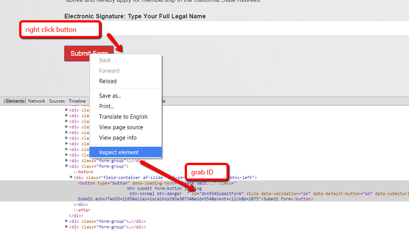
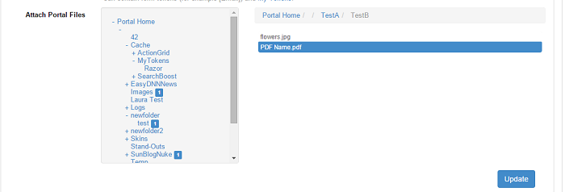

# How to ...

## Contents

* [... access form values from JavaScript](#1)
* [... add an asterisk before required fields](#2)
* [... allow a user to edit their own entry](#3)
* [... apply a different discount for the Total field](#4)
* [... call another Action Form's button](#5)
* [... color a button based on a hidden value](#6)
* [... count and display in a TextBox field the number of selected values from Multiple Choice (with Checkboxes) field](#7)
* [... customize Action Form using CSS Styles and Classes](#8)
* [... develop a reporting system using Action Form](#9)
* [... display a text box only when the user clicks on a check box](#10)
* [... display assets depending of the selected value from DropDown/RadioBoxes field](#11)
* [... display Profile fields with Action Form and MyTokens](#12)
* [... display User Accounts (role specific)](#13)
* [... display the system date and time](#14)
* [... export all rows in the SQL query data source - not just those that are displayed and selected on the grid](#15)
* [... hide Label](#16)
* [... implement an action in Action Form](#17)
* [... inject custom JavaScript and Html into page using Custom Action](#18)
* [... load SessionID into state](#19)
* [... lock a field on the fly](#20)
* [... logout user with button action](#21)
* [... make a multiple choice token get text value](#22)
* [... make responsive horizontal checkboxes](#23)
* [... make "Other" option Required for Multiple Choice (with Dropdown)](#24)
* [... make Title text bold](#25)
* [... manually trigger client-side validation as the user types](#26)
* [... mark the required fields with a red border](#27)
* [... mask the first digits of an SSN](#28)
* [... open the form in Pop-up](#29)
* [... parse the QueryString to pre-select a DropDown list option](#30)
* [... pass QueryString to new page as-is](#31)
* [... populate a drop-down with a list of users from DNN](#32)
* [... populate a drop-down with a list of users from DNN](#33)
* [... populate a field with current date on button click](#34)
* [... populate the profile property from a registration form](#35)
* [... pre-fill a field on my form using the Form Event On Init section](#36)
* [... reference AWS file upload path in Action Grid](#37)
* [... remove an attached portal file](#38)
* [... save the country name (e.g. Australia) and not the country code (e.g. AU) to Reports](#39)
* [... save the info filled in the form fields and display it when the user comes back on the page after a longer period](#40)
* [... set a default beginning from an established start date](#41)
* [... set a unique id per user session and use that id](#42)
* [... show fields conditionally based on query string](#43)
* [... skin the form controls](#44)
* [... tie two drop-downs dynamically with SQL](#45)
* [... truncate the Reports table](#46)
* [... update information from User Profile using Action Form](#47)
* [... use the Show Tooltips option](#48)
* [... use Action Form as a Calculator](#49)
* [... use Action Form's GUID as a voucher code](#50)
* [... validate the max number of characters for a field](#51)

### <a name="1"></a> ... access form values from JavaScript

Action Form uses Angular JS. This means that all form fields are bound to a JavaScript object. You can get this object using

```js
var formModel = angular.element($("#dnn1548root")).scope().form;
console.log(formModel);
```

Note that you'll have to replace dnn1548root with any ID of an element inside the form. Also note that if you want to update this object, you'll need to also let Angular JS know to update the UI as well. You can do this using

```js
angular.element($("#dnn1548root")).scope().$apply();
```

console.log will show you the entire model inside the F12 Developer Tools console so you can pick what you need.

### <a name="2"></a> ... add an asterisk before required fields

You can have an asterisk next to the required fields by going to Admin > Site Settings > Stylesheet Editor and somewhere at the beginning add the following code:

```css
    label.control-label.af-slide.required:after {

    content: '*';

    color: red;

    }
```

Save Stylesheet > Update

### <a name="3"></a> ... allow a user to edit their own entry

If you would like to allow a user that filled out a form to edit their own entry at a later date without giving users access to edit all entries from all users, you can do this with a form that loads the data in the pre init. You should filter the select query with a token: select 'whatever' from yourtable where userid=[User:UserId].

### <a name="4"></a> ... apply a different discount for the Total field

<b>Solution1:</b>

Add 2 TextBox fields, TotalSum and Total Sum With Discount.
In a Submit button, in Bind Expressions, in the On Change/ Click option add this syntax:

```code
if([TotalSum]=='100'){$scope.form.fields.TotalSumWithDiscount.value=[TotalSum]*0.80}
```

<b>Solution2:</b>

Add 2 TextBox fields, TotalSum and Total Sum With Discount
In the TotalSum field, in Bind Expressions, in the On Change/Click option add this syntax:

```code
if([Total]== '100')
{
return [Totalwithdiscount]=[Total]*0.8
}else{
return [Totalwithdiscount]=[Total]*0.95
}
```

<b>Solution3:</b>

Add 3 TextBox fields, TotalSum, 2 TotalSumWithDiscount fields with different id(TotalSumWithDiscount1 and TotalSumWithDiscount2)

In the TotalSumWithDiscount1 field, in Bind Expressions, in the Show option add the syntax [TotalSum]>='100' and in Value option add the syntax [TotalSum]*0.80

In the TotalSumWithDiscount2 field, in Bind Expressions, in the Show option add the syntax [TotalSum]<'100' and in Value option add the syntax [TotalSum]*0.95

### <a name="5"></a> ... call another Action Form's button

Say you have 2 Action Form instances on a page and you would like to execute a button on Form 1 by clicking a button on Form 2.

The easiest way to do it would be via jQuery. Alternatively, you can use DNN API Endpoint to build web services and call this via AJAX in the OnChange/Click binding.

To call the button ID of the other form via jQuery, you can use the Inspector from F12 Developer Tools to identify the button and grab its ID.

<br>

### <a name="6"></a> ... color a button based on a hidden value

Add a button and a HiddenFieldwithCustomValue Field with 1 as Initial Value. Go to General Settings-> Initialization scripts -> add this syntax:

```js
if([inputName]==1) {
$('#'+form.fields.buttonName.id).css({'background':'red'});
}
```

### <a name="7"></a> ... count and display in a TextBox field the number of selected values from Multiple Choice (with Checkboxes) field

Add a Multiple Choice (with Checkboxes) field with name Checkboxes and Items: item1, item2, item3, item4, item5
Add a TextBox field, named <b>Testx</b> to properly work.

In General Settings-> Initialization scripts -> add this syntax:

```code
form.fields.Testx.value=$.grep(form.fields.Checkboxes.options, function(o){return o.selected}).length;
```

In Multiple Choice (with Checkboxes) field, in Bind Expressions, at On Change/Click option add this syntax:

```code
form.fields.Testx.value=$.grep(form.fields.Checkboxes.options, function(o){return o.selected}).length;
```

### <a name="8"></a> ... create an Action Form to update both Username and Password

Many of you may have already hit a brick wall when trying to update a Username in DNN. It is almost taboo to talk about. This is because DNN uses the Username to connect to ASP.Net’s core tables for login credentials. The username is stored in various places throughout your website’s database, so it is not as simple as one would think. However, with a program as cool as Action Form and a little knowledge of DNN we can overcome this.

First we need a form to collect and validate the Username & Password. This form will be used for whoever is currently logged in and would like to change their login credentials. So its purpose is to let your users manage their own login info.

Create an Action form that has these fields on it:

OldUsername (Type: Hidden) and set the Initial Value to [User:Username]

Username (Type: Username) and set the Initial Value to [User:Username]. Click on the required field check box, and select the validation to be ‘Username Is Available (excluding current user)'

Password (Type: Password). Click on the required field check box, and select the validation to be ‘No White Space’

ConfirmPassword (Type: Password). Click on the required field check box, and select the validation to be ‘No White Space’.  

*** Set the ‘Confirmation Of ’ dropdown to Password to set up the automatic compare validator.

Now create a Button to Submit the Form.

Now the fun begins. We need to create a few Actions to update Username & Passwords.

First add an ‘Update User Profile Action’. Click the ‘Allow Password Update’ checkbox to tell the action to update the password.

Next (here comes the stuff) add a ’Run  SQL Query’ Action. Add the code listed at the bottom of this article into the ‘SQL Query’ box.

Because we just changed the Username internally inside DNN we must now add a ‘User Login’ Action. This will magically reload the User with the new Username & Password.  *** Without this action, the User will be automatically logged out, but the changes have been made and they would log back in with new credentials. I found that this action prevents that.

The last action I use is purely optional. Once the above actions have run, I added a ‘Redirect To Portal Page’ action and redirected to the Home Page. You can redirect anywhere you please, or fire other actions that may be relevant to you.

So this is where it ends and works great for our clients. Just one simple disclaimer, I typed all this code in and could have possibly fat fingered or stumbled on the keyboard. Please look over my SQL Code for any obvious dumb errors. Also please test all this in a testing environment first. When changing Usernames & Passwords you run a risk of preventing someone from logging in.

// SQL Code for Changing Username. (Do not copy this line as it is just a remark). Notice there are two Updates happening here. Be sure to copy both of them. //

```sql
Update Users

set Username=lower(‘[Username]’)

where lower(UserName) = lower(‘[OldUsername]’)

Update aspnet_Users

set UserName=lower(‘[Username]’), LoweredUserName=lower(‘[Username]’)

where lower(UserName) = lower(‘[OldUsername]’)
```

*** For those of you who want to know a little more. DNN uses ASP.Net’s standard method for authenticating Users. The Username (NOT THE USERID) is the column used to connect DNN’s User table to the ASP’s Aspnet_Users table. The Apsnet_Users Table stores the Username in two different columns. One is untouched and the other is converted to lowercase. I store all usernames in lowercase just to be consistent throughout all the tables. Should you ever be in SQL Server Management Studio and making changes to the Username, must make sure you change the Username in the Users table, and the UserName in the Aspnet_Users  and they must match identically in case. This is why always make sure all my Usernames are converted to lowercase.*

*courtesy of Jerry Mattox

### <a name="9"></a> ... customize Action Form using CSS Styles and Classes

Looking for a quick and easy way to add some personality to your DNN form?

Well, the astute among you will have noticed that Action Form can be styled with standard CSS. But we’ve had a lot of Action Form users still asking how to customize their forms. We understand that not everyone is comfortable with coding, but don’t worry, this won’t hurt a bit. We’ve prepared a video tutorial that will guide you through the process of customize Action Form using CSS styles and CSS classes.<b> You’ll see that it’s easy to customize your forms. It’s like…Boom! And you’re done! In just few steps you’ll bask in the glory of your new form! </b>

For all of our Action Form users out there, here’s how to customize your forms:

<iframe width="853" height="480" src="https://www.youtube.com/embed/5Mx9KF1T-uE" frameborder="0" allow="autoplay; encrypted-media" allowfullscreen></iframe>

Hopefully this post inspires you to take your Action Form to the next level in a way that is easy and enjoyable for your visitor to experience. With the ability to use CSS styles and CSS classes, you can now make Action Form fit that much better with your DNN portal than you could ever before. And this is great for converting visitors into revenue. Getting a visitor to provide you with their information is a key step in any conversion funnel. That’s why adding a custom form to your DNN portal is an easy and smart way to drive conversions while reducing funnel abandonment and lost revenue.

### <a name="10"></a> ... develop a reporting system using Action Form

Scenario:

Two Users : Admin and Franchisee

Franchisee: When they log in to website the form should automatically populate the fields in the form and is the one which will be using the form more often to submit info. Also, each franchisee will have their own list of clients which will automatically get populated as well in let’s say a dropdown field once the franchisee logs in to the website. The submission done by the franchisee will be converted into a pdf (invoice) and the copies will be sent to multiple emails(mostly the client and the admin).

Admin: Will generate reports based on a franchisee which s/he chooses from the list.

Solution:

The first thing is you'll need to design your database architecture independently of Action Form. Next, you'll build forms that use SQL actions to load and put data into your application tables. We have an add-on for generating PDFs and also a Grid module which you might need to populate data.

### <a name="11"></a> ... display a text box only when the user clicks on a check box

First you have to add a Multiple choice field in the form where you determine the Items the user will select from, then simply add a text box field where you can add the [YourCheckboxFieldId] in the Show Binding box.

### <a name="12"></a> ... display assets depending of the selected value from DropDown/RadioBoxes field

Add a Multiple Choice with DropDown and in Item add your list so than add for each item from list the path to the image that corresponds (e.g. Item1|/Portals/0/assets1.jpg)
Add a Static Text and in Bind Expressions at Value add this expression:

```html
''  
```

### <a name="13"></a> ... display Profile fields with Action Form and MyTokens

Say you have a custom profile field called BirthMonth and one called BirthDay and you need to display DisplayName, BirthMonth and BirthDay, where BirthMonth = this month and BirthDay = today.

To do this, Create the BirthMoth profile entry and set Data Type to List. The next step is to add an entry for each of the months of the year, as illustrated below:

<br>

Click Next, and in the Property Name field write BirthMonth: .

Repeat the process for BirthDay, and in the end it should look like this when you try to update the profile:

<br>

In Action Form, create a form with a Static Text box and in the Content box input

[User:DisplayName]
[Profile:BirthMonth]
[Profile:BirthDay]

Then scroll down to Bind Expressions, and in the Show field write <b>[Profile:BirthDay] == [DateTime:Now|dd] && [Profile:BirthMonth] == [DateTime:Now|MM]. </b>

This way, when these conditions are met, the field will be shown and populated with the respective values.

### <a name="14"></a> ... display User Accounts (role specific)

<b>Case:</b>

Is it possible to return the users in a DNN installation with an identifier? EX: If I have UserAccount-A with RoleA & UserAccount-B with RoleB

When UserAccount-A is logged-in he can view other users that have RoleA and the same for UserAccount-B but they should not be able to view users that are not in the same role than them.

Also using the action-form for data entry is it possible to Add/Delete User Accounts. Not being a member of the "Administrators" role.

<b>Solution:</b>

For Anyone else in the community needing help with a similar project I've outlined the spec's below if it's something you need and are not 100% knowledgeable of TSQL you can adapt the following queries to suit your needs and if anyone needs clarification please do not hesitate to reach out to me or Jerry I will do the best I can to explain.

I needed a Grid displaying user accounts only with a matching identifier of the "currently logged-in" user. For this I created a CompanyID property through DNN's profile properties section.

Then I build a form using ActionForm that would allow a logged-in user to create a new account and have THEIR CompanyID along with some other useful information such as (department, codes, etc...) directly to the profile of the new user account.

From this point we would now have 2 accounts with the same CompanyID. Then i used a ActionGrid with the following queries to return users with the same CompanyID & not return the logged-in user themselves as we wanted to limit user error and not give them the option to delete themselves from the grid interface.

Query for selecting records: (joins users * usersprofile to be able to pull the CompanyID profile field)

```sql
select

Users.*,

Userprofile.PropertyValue

from Users

join UserProfile on Userprofile.UserID=Users.UserID and Userprofile.PropertyDefinitionID=49

where UserProfile.PropertyValue = '[Profile:CompanyID]' and Users.UserID != [User:UserID]
```

Hope this helps someone who might not know SQL very well off course it seems mostly everyone on here knows SQL pretty in depth and I apologize for the redundancies of my posts I am still a beginner and hoping to help anyone else that might be in the same shoes than myself.

*Courtesy of Jerry Mattox of Genesis & Alex @ Quicksocial

### <a name="15"></a> ... display the system date and time

If you want to add a Date picker field using an Action Form and you want to display the system time, you can use a DNN token without the need of installing the My Tokens module. Therefore, go to the manage form page and after you select the Date and Time field add in the Initially Checked box the following token: [DateTime:Now].

### <a name="16"></a> ... export all rows in the SQL query data source - not just those that are displayed and selected on the grid

If you would like to export all rows in the SQL query data source (not just those that are displayed and selected on the grid) you can do it by deselecting all of the options for the device specific display, so the fields will not display but they will serialize and export.

### <a name="17"></a> ... hide Label

There are several ways to align the Label in Action Form, but what if you wanted to hide it altogether? This can be achieved by writing <b>display:none;border-top:0px;</b> in the Label Styles field.

<br>

### <a name="18"></a> ... implement an action in Action Form

To implement an action in Action Form, you have to either implement interface avt.ActionForm.Core.Actions.IAction from avt.ActionForm.Core.dll or DnnSharp.Common.Actions.IActionImpl from DnnSharp.Common.dll.

More details can be found in these 2 videos:

<iframe width="853" height="480" src="https://www.youtube.com/embed/x_xEZhTTclI" frameborder="0" allow="autoplay; encrypted-media" allowfullscreen></iframe>

<iframe width="853" height="480" src="https://www.youtube.com/embed/-uZQJO6tSNw" frameborder="0" allow="autoplay; encrypted-media" allowfullscreen></iframe>

### <a name="19"></a> ... inject custom JavaScript and Html into page using Custom Action

If you wish to render out a JavaScript method and custom hidden input fields on the fly and insert them into the existing form, can use the Binding > On Change field to wire some JavaScript code when the value in a control changes.

<br>

You can also place your code in the General > Initialization Script.  

<br>

Do a console.log(form) to see the entire module in the F12 Developer tools. You'll also have access the the control IDs.

### <a name="20"></a> ... load SessionID into state

If you want to pull a session id number from a cookie, for example to be able to grab the ASP.NET_SessionId value from a user's cookie and load it into context, you can use My Tokens (which provides access to Cookies). If you want to get around having to use My Tokens, you could use some JavaScript snippet in the Initialization Script to access the cookie and store it in a hidden field.

### <a name="21"></a> ... lock a field on the fly

If you want to configure a field (e.g. checkbox) to lock/disable a field (e.g. a textbox) -

i.e. Checkbox [ ] -> Textbox is instantly enabled, user can write
Checkbox [x] -> Textbox is instantly disabled, user can't write

you can use a checkbox to enable and disable a textbox with the following code in the "on change/click bind section":

"LoanPurp" is the text box field we want to enable and disable
"ChangeLoanPurpose" is the checkbox field we use to click

```js
var $el3 = $('#' + form.fields.LoanPurp.id);

if ([ChangeLoanPurpose]) {
$el3.prop('disabled', true);
}
else {
$el3.prop('disabled', false);
}
```

If you want to lock multiple choice fields, you can do it as follows:

LockField is the name of our checkbox field
Multiple is the name of our multiple choice radio button field

```js
if ([LockField]) {
document.getElementsByName(form.fields.Multiple.id)[0].disabled = true;
document.getElementsByName(form.fields.Multiple.id)[1].disabled = true;
document.getElementsByName(form.fields.Multiple.id)[2].disabled = true;
}
else {
document.getElementsByName(form.fields.Multiple.id)[0].disabled = false;
document.getElementsByName(form.fields.Multiple.id)[1].disabled = false;
document.getElementsByName(form.fields.Multiple.id)[2].disabled = false;
}
```

### <a name="22"></a> ... logout user with button action

There is a workaround that you can employ. Add a "redirect to URL" action and put this as the URL -

[Tab:FullUrl]/ctl/Logoff

This will log off the user and then redirect to the page you have designated in the DNN admin.

### <a name="23"></a> ... make a multiple choice token get text value

<b>Case:</b>

I want to grab the Text not the value of a Department dropbdown control. If I use DepartmentText = [Department] it returns the value of the dropdown. If I try DepartmentText = [Department:Value] or DepartmentText = [Department:Text] it returns blank for both.

<b>Solution:</b>

Since [Department:Text] is a backend-only token, it can't be used on the fronted; however, you can do something along the lines of: on the dropdown field under Bind Expressions, On Change/Click use the following code:

```code
form.fields.mytextbox.value = form.fields.dropdown.selected.text;
```

this will give the text box the value of the dropdown. Don't forget to replace mytextbox and dropdown with their respective IDs.

If you have an initial value on the dropdown, then you will have to use the code in General Settings > Initialization Scripts as well.

### <a name="24"></a> ... make responsive horizontal checkboxes

If you encounter problems when using checkboxes, you can use bootstrap classes in the Control CSS Classes field. Enter col-sm-2 or col-sm-3 or col-sm-4 and you will get responsive columns.

col-sm-2 = 4 columns

col-sm-3 = 3 columns

col-sm-4 = 2 columns

### <a name="25"></a> ... make "Other" option Required for Multiple Choice (with Dropdown)

Add 2 fields, a Multiple Choice(with Dropdown) field, with Items item1, item2, other and a TextBox field with name Other. In Other field in Bind Expressions, at the show option add this syntax [DropDownId] == "other" . For each field please check the "Required" option.

### <a name="26"></a> ... make Title text bold

First you have to add a Title type of field on the form and in the Label Title use the HTML <b></b> tag to specify that you want the text to be bold.

### <a name="27"></a> ... manually trigger client-side validation as the user types

If you're trying to implement validation as the user types, you can write <b>$(this).valid();</b> in the On Change field under bindings for a textbox for example.

### <a name="28"></a> ... mark the required fields with a red border

Inside a required field at UI Settings, at Style Control CSS add this expression:

```css
border-left:4px; border-left-color:#ff0000; border-style:solid
```

### <a name="29"></a> ... mask the first digits of an SSN

If you would like to mask the first digits of an SSN but keep the values, e.g. ****-****-1234, then you can add another field and use it to store the actual SSN, while hiding the first numbers on the visible field. Employ the following piece of code:

```js
var val = $(this).val();

var savedVal = $("#dnn1298HiddenSSN").val();

var len = val.length;

var savedLen = savedVal.length;

//Do not allow user to type more than SSN

if(len > 11){

$(this).val(val.substr(0,11));

}

else{

if(len > 0 && len <= 11 && len > savedLen){

//save number to hidden field

if(!isNaN(val[len-1])){

$("#dnn1298HiddenSSN").val($("#dnn1298HiddenSSN").val()+val[len-1]);

}

//delete any other character

else{

$(this).val(val.substr(0,len-1));

}


//add the *


if(len > 1 && len < 9){

if(len == 5 || len == 8){

val = val.substr(0,len - 3) + "*-" + val[len-1];

}

else{

val = val.substr(0,len - 2) + "*" + val[len-1];

}

$(this).val(val);

}


//add - after 3 or 5 digits

if(len == 3 || len == 6){

$(this).val($(this).val() + "-");

$("#dnn1298HiddenSSN").val($("#dnn1298HiddenSSN").val() + "-");

}

}

//Remove from hidden field when deleting

if(len < savedLen){

$("#dnn1298HiddenSSN").val(savedVal.substr(0,savedLen - (savedLen - len)));

if(len > 0){

val = val.substr(0,len-1) + savedVal[savedLen-2];

}

$(this).val(val);

}

}
```

### <a name="30"></a> ... open the form in Pop-up

In General Settings, Display mode, select the Pop-up option. Click on Edit Template and add your message and set the width using the Popup Width option.

Note that it's not feasible for us to ensure compatibility between our product and 3rd party Skins, because we're always releasing new builds and so do they.

If you encounter any issues with DNNGO's skins, we advise you to follow the steps below:

You need to remove the following piece of code in custom.js file:

```js
jQuery(document).ready(function($) {

$(".modal").each(function() {$(this).insertAfter("body")});

});
```

For the overlapping of navigation on top of the form this can be used:

```css
#dnn_content {

z-index: 99;
```

But doing so breaks the navigation on mobile devices making the menu not clickable to drop and show additional pages. This is the CSS to fix that.

```css
  @media only screen and (max-width: 767px)
.header_bg.roll_menu {
z-index: 100;
}
```

### <a name="31"></a> ... parse the QueryString to pre-select a DropDown list option

Add a Multiple Choice(with DropDown) field, with items: item1, item2, and in the Initially Selected option add the syntax:

```code
[QueryString:YourDropDownId]
```

When adding the following syntax <b>?yourdropdownid=item1</b> in your URL, the Dropdown field is completed with item1 value.

### <a name="32"></a> ... pass QueryString to new page as-is

If you want to pass a query string to the redirected page as-is, i.e. /somepage?somerandomquerystring=true&thisAndThat=false should redirect to /newpage?somerandomquerystring=true&thisAndThat=false, you can match (by relative URL + query string) something like:

``` code
/somepage?somerandomquerystring={this}&thisAndThat={that}

and redirect to

/newpage?somerandomquerystring={this}&thisAndThat={that}
```

It might be also possible to do:

``` code
/somepage?{everything*}

redirect to

/newpage?{everything}
```

### <a name="33"></a> ... populate a drop-down with a list of users from DNN

<b>Case:</b>

I have an 2 instances Action Form on my page. I have a button on one forms that calls the second form to popup. Is it possible to pass a querystring value to the popup form? In the On Change/Click event section of the button I am using:

    ```code
    showFormPopup1374();
    ```

I would like to know if I can pass a querystring value to the popup form -- something like:

    ```code
    showFormPopup1374();?ConditionID=[ConditionID]
    ```

Is this possible?

<b>Solution:</b>

On the first action Form use a Redirect to Portal Page action in which to send the value of ConditionID, through QueryString, to the second Action Form that will be open in a PopUp; choose -PopUp- as display mode from General Settings.

### <a name="34"></a> ... populate a drop-down with a list of users from DNN

Begin by adding on a form a Multiple Choice with Drop down field and set in the Items box a Select statement as follows:

1) <b>select Username + ' ' + CONVERT(varchar(10), UserID) FROM Users</b>

or

2\) <b>select Username + ' ' + Email + ' ' + DisplayName from Users</b>

then save and get back to the form to see if the user records from the database table are displayed according to our Select statement.

### <a name="35"></a> ... populate a field with current date on button click

If you have a field you would want to populate with the current date when you click a button, on the On Change/Click binding section of the button add the following code:

```code
[TextBox] = '[DateTime:Now]';

return false;
```

Where you change the [TextBox] token to the name of your field.

### <a name="36"></a> ... populate the profile property from a registration form

A user has more profile properties, in order to create a new one, just access the Site Setting option from the Admin menu > click on User Account Setting > Profile Settings > click on Add New Profile Property button - and create the property that you want to be added on the next user profiles which will be created, let's say Birth Month.

In order to populate the new property, you can create a Registration form where it's mandatory to add the field with the property's title (Birth Month) you want to populate and to leave the Update User Profile action button as it is. In this way, when a user will register and will fill in the profile properties set on the form, they will be automatically populated on the user's profile page.

### <a name="37"></a> ... pre-fill a field on my form using the Form Event On Init section

If you have in your form a field called Username and you want it to be populated with the username of the user who's logged in, you need to add on Form Event On Init section the Run SQL Query action with the following statement:

```sql
select Username from Users where Username = '[User:Username]' 
```

and Extract Columns with the following settings: Column Name = Username and Store as = [Username]

### <a name="38"></a> ... reference AWS file upload path in Action Grid

<b>Case:</b>

I have an Action Form that uploads a file to AWS. I want to be able to provide a download link in my associated Action Grid for the file that gets uploaded.

In my form if I use the [Upload:AbsoluteURL] token to display a message that includes the file path of the uploaded file I get http://mysite.com/LinkClick.aspx?fileticket=cv07f-ZMnXY%3d&portalid=2

This path takes me to the file correctly. How can I have that same path referenced in my associated Action Grid?

<b>Solution:</b>

On Action Form Submit use a Inject Form data action in which insert the [SingleFileUpload:AbsoluteUrl] value in a token; that can be the token name of a Hidden Field so on submit the Absolute Url will be inserted in the hidden field.

When you configure the action grid you can create a Template Field with [HiddenField] as link for a href tag.

### <a name="39"></a> ... remove an attached portal file

In order to remove the uploaded files, click on Change, and the respective folders containing the files and the files themselves will be highlighted - click on each of them again to deselect, and Update when done.

<br>

### <a name="40"></a> ... save the country name (e.g. Australia) and not the country code (e.g. AU) to Reports

Add a Country and Hidden fields. For each field check the Save to Reports option. In a Submit button, add the Inject From Data action, in which to inject in Hidden field this syntax [Country:CountryName].

1. You can create an additional button on the form, like "Save for Later", on which you can set a Display Message action and inside the Message put the following token: [_EditUrl] > in this way after the user clicks on it, an URL will be displayed instead of a message and the user can save the URL and then access it directly when s/he wants to finish the form;

2. You can also do it manually following the same steps as above but with an additional token in Display Message box: [_ReportKey]- in this way, an id will be generated and you can store it in cookies to be activated when the user comes back on the site;

3. If the user is logged on the site and you want to use the information from the user's profile to be fetched in the form's fields, you can set on each corresponding field a token like [Profile:FirstName] or [Profile:Email] in the Initial Value field.

### <a name="41"></a> ... set a default beginning from an established start date

If you have two date fields and you want to select a Start Date and the End Date to automatically display a default value, let's say of 30 days from the Start Date, you have to:

1) Add two Date (with Month/Year Picker) fields and set one of them as Start Date with the following data in the On Change/Click text box:

```js
var in30=new Date(new Date([StartDate]).setDate((new Date([StartDate])).getDate() + 30));
$scope.form.fields.EndDate.value=(in30.getMonth() + 1) + '/' + in30.getDate() + '/' + in30.getFullYear();
```

2\) Add a second Date (with Month/Year Picker) field which should be let as it is;

3\) Get back on the page and select from the picker a Start Date.

You'll see that in the End Date field the date will automatically be calculated as StartDate + 30days.

### <a name="42"></a> ... set a unique id per user session and use that id

You can do this by using a [SessionOrInit:UID=[Guid:New]]. This will generate a new guid and store it in session if not already there. More info at my-tokens.dnnsharp.com/tokens/core.

### <a name="43"></a> ... show fields conditionally based on query string

I have two text boxes, one called Stockholm and the other Malmo, and I want to display each one of them only if the query string id matches the name of the fields:

1. on text box with title Stockholm  add on Show Conditionally [Querystring:ID] == "Stockholm"
2. on text box with title Malmo, add on Show Conditionally [Querystring:ID] == "Malmo"
3. when I access the URL like www.example.com/formpage?ID=Stockholm, then the text box which matched this condition is displayed on the form, the same applies for the other text box.

### <a name="44"></a> ... skin the form controls

In version 2 we switched to Boostrap. This means that if you use a Bootstrap 3 skin, the form will pick up the skin appearance, so it looks consistent with the rest of the website. It also means that you can create custom design by overriding standard Bootstrap CSS classes.

You can also use the form fields CSS styles property to create custom design or CSS classes property to link it to your CSS classes.

Finally, there's a piece of legacy jQuery UI that is used by the jQuery Datepicker control. But that will also be replaced soon with a Bootstrap control, and at that point we'll remove jQuery UI inclusion from the form. It will still be able to include it through custom controls though.

### <a name="45"></a> ... tie two drop-downs dynamically with SQL

In Action Form there are many times when we need to have one dropdown change based on the selection of a previous dropdown. Action Form has a very easy way to do this and is described in Bogdan’s video.

<iframe width="853" height="480" src="https://www.youtube.com/embed/WBFPMjxOqas" frameborder="0" allow="autoplay; encrypted-media" allowfullscreen></iframe>

In his video he will show you how to enter the values (Hard Coded) into each dropdown and connect them together. Works perfect until the day comes you want these dropdowns to be dynamic and loaded from a SQL Server select statement.

Today I am going to teach you that it is not only possible but very easy to tie two dynamically created dropdowns via SQL that depend on each other for what values will appear. Let continue to use Bogdan’s example of Car Brands and Models illustrated in his video.  (Please if you have not watched this video, now would be a great time).

In his video he will show you how to enter the values (Hard Coded) into each dropdown and connect them together. Works perfect until the day comes you want these dropdowns to be dynamic and loaded from a SQL Server select statement.

Today I am going to teach you that it is not only possible but very easy to tie two dynamically created dropdowns via SQL that depend on each other for what values will appear. Let continue to use Bogdan’s example of Car Brands and Models illustrated in his video.  (Please if you have not watched this video, now would be a great time).

Let’s first pretend that your SQL Data Structures consist of two tables.

The first table called (Brands) holds the brands of cars and looks like this.

Two Columns:

BID  (Integer Brand ID)

BName (varchar Brand Name)

Data in the table (Brands):

BID         BName

1             Alfa Romea

2             AMC

The second table called (Models) holds the model of the cars and looks like this.

Three columns

BID (Integer Brand ID) ** The ID of the Brand this Model belongs to

MID (integer ModelID)

MName (Model Name)

Data in the table (Models):

BID         MID       MName

1              1              Alfetta

1              2              GT

1              3              GT3

2              4              Ambassador

2              5              Concord

2              6              Gremlin

Now that we have data this is SQL select we use to load the first dropdown of Brands

```sql
Select BName,BID from Brands
```

*** This is the standard syntax Action Form uses to load a Text and value to a dropdown. There is no need for any varchar conversions or adding the ‘|’ to separate the Text from the Value.

The next dropdown Models will be based on the value of this dropdown and is where the magic happens. We are simply going to emulate what Bogdan hard codes in his video with a SQL Select that looks like this.

```sql
Select convert(varchar,BID)+’/’+MName+’|’+convert(varchar,MID) from Models
```

Let’s take a look at the query. But first let’s remind ourselves of the syntax Action form requires. We must place the value of the selected item from the Brands dropdown in front of a forward slash. Then the text we wish to display (Models). Next we use a pipe to separate what is shown in the dropdown, from the actual value of the dropdown.

I simply built a string to do exactly that. I first convert the BID to varchar so I can concatenate the integer ID to the ‘/’ and text coming from Model name (MName).  Next I added the ‘|’ and the converted MID to varchar.

It really is that easy, but it could be even easier. Please note I illustrate the method upon where the Dropdown Text and Value are two different things. My programming techniques usually refers to joined tables where the ID is stored not the actually text. HOWEVER, we could have achieved the exact same thing Bogdan does by simplifying the queries even further. Bogdan’s example removes the value from the equation and allows the Text of the dropdown to be the Value. This is a programming choice made by you and how you store your data. Here are the simple queries:

```sql
Brands Dropdown

Select BName from Brands

Modesl Dropdown

Select BName+’/’+MName from Models join Brands on Brands.BID=Models.BID
```

In conclusion this will help you design better forms for your users where the data in the dropdowns will be changing via your software. Please note that my table illustrations are just one of many ways your data may be stored. Please retrieve your data and build the select statement to the syntax above and this will work.
<i>*Courtesy of Jerry Mattox of Genesis</i>

### <a name="46"></a> ... truncate the Reports table

Running the query below will first save a backup of the entirety of your table and then truncate (e.g. delete all records) the records from the avtActionForm_Reports table: 

```sql
SELECT * INTO avtActionForm_Reports_backup FROM avtActionForm_Reports;
TRUNCATE TABLE avtActionForm_Reports;
```

Once you have confirmed all is working well then you can delete the avtActionForm_Reports_backup table by running a query such as:

```sql
DROP TABLE avtActionForm_Reports_backup;
```

They only thing to note is that deleting all the records from the avtActionForm_Reports table will mean that there will be no records to export from the Action Form reports menu option. But if you are inserting the data into your own tables this should not matter anyways.

### <a name="47"></a> ... update information from User Profile using Action Form

Create the fields that you want to update with Action Form Module. The Id created field must be the same as the property of User Profile.

Add a button with Update User Profile Action.

Other properties for User Profile can be created.

In Admin->Site Settings->User Account Settings->Profile Settings->Add New Profile Property

<b>Note</b>: Username property from User Profile can not be changed, with Update User Profile Action

### <a name="48"></a> ... use the Show Tooltips option

In General Settings, check the Show Tooltips option. You can select the Show Tooltips option only when Short Description from each field is not empty. The message added in Short Description will be used in Show Tooltips.

### <a name="49"></a> ... use Action Form as a Calculator

1. Start from a blank form template and add a text box field where we want to have a fixed number to which we'll multiply other numbers to and set in Initial Value box the amount to which we'll multiply, let's say 10.

2. Add a second text box where we'll insert the number we want to multiply to 10 (we're talking about the previous field).

3. Add a third text box field which will display the result of our multiplication - here you have to put on Bind Expressions Value the following:

[Field1] * [Field2]

You can also use other basic arithmetical operations like addition, subtraction and division and between the two fields tokens use the signs: + or - or /.

### <a name="50"></a> ... use Action Form's GUID as a voucher code

If you would like to use Action Form's GUID as a voucher code, for example, you can employ the following token: [Guid:New] (hyphenated) or [Guid:NewCompact] for the hyphen-free version. However, if you want the code to be shorter, you can use a substring: [String:Substring(Input=[Guid:New], Start=0, Length=6)] for the 6-char version. Keep in mind that you must have My Tokens installed for this to work.

### <a name="51"></a> ... validate the max number of characters for a field

Add a Number field and a Submit button 
On Submit Button, you add in Bind Expression, in On Change/Click this expression

```js
if([Number].length > 10)  
   [Number] = [Field].substr(0, [Number].length -1);
```