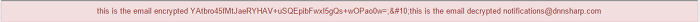

# Security

## AES Encrypt 

If you want to encrypt, let's say the email addresses which are populated on a grid, you need to do the following steps:

1. Add an Item button on which set AES Encrypt as Action and in the AEW Key and IV V fields paste the data generated on the Generate your Key and Initialization Vector page, then in Data set the text you need to encrypt and the field you want to save the data in:

2. In order to have confirmation that the field is encrypted, you can set a Display (Error) Message action where you have to set the token where you've saved the fields, in our case `[test1]`.
## AES Decrypt

As additional step to the steps provided on AES Encrypt section, you can decrypt the same field which was previously encrypted by adding the AES Decrypt as second action and setting the same Key and IV as the ones used into the AES Encrypt action but on Data Text to Encrypt you just have to use the token where you've previously saved the data, in our case, `[test1]`. 

And here's the how the grid item will look encrypted and decrypted:

## RSA Encrypt and RSA Decrypt

The RSA Encrypt and RSA Decrypt actions can be used in the same way as the AES actions but the only difference consists in the fact that you'll need to use the Public and Private generated keys, the Public key for encrypting and the Private key for decrypting. 

