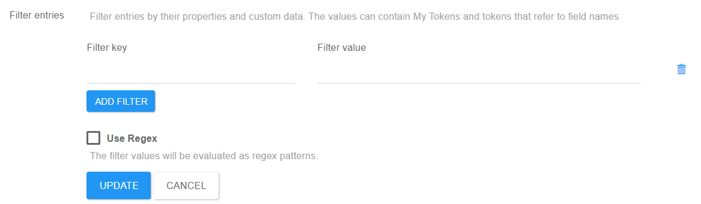

# Credential Store

## Credential Type

Select the type of the credential you want to use.

## Credential Group

To make columns with the custom data, add the keys here separated by new line or commas.

## Custom Data Keys

Filter entries by their properties and custom data. The values can contain My Tokens and tokens that refer to field names

## Filter Entries

* Use Regex
  * The filter values will be evaluated as regex patterns.
