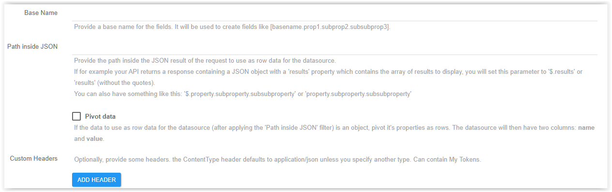
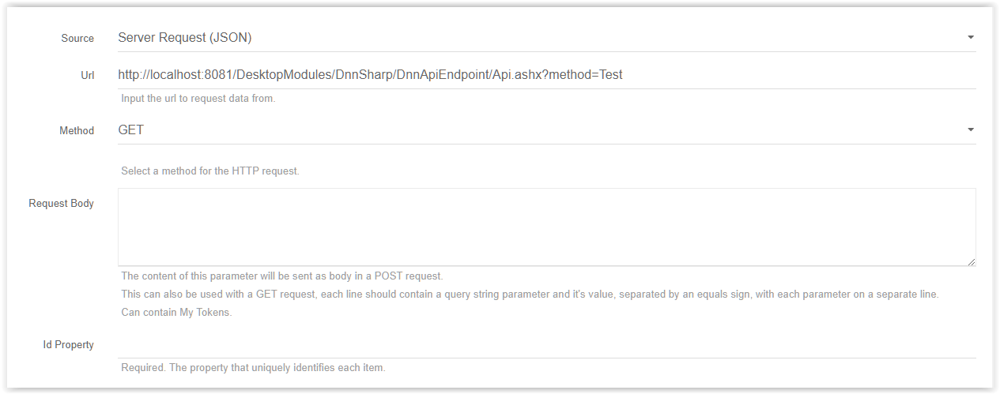
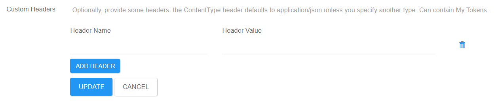

# Server Request JSON

These datasource takes a JSON returned from a API call.

## Url

Input the url to request data from.

## Method

Select a method for the HTTP request. (GET/POST)

## Request Body

The content of this parameter will be sent as body in a POST request. 
This can also be used with a GET request, each line should contain a query string parameter and it's value, separated by an equals sign, with each parameter on a separate line.
Can contain My Tokens.

## Id Property

Required. The property that uniquely identifies each item.

## Base Name

Provide a base name for the fields. It will be used to create fields like [basename.prop1.subprop2.subsubprop3].

## Path inside JSON

Provide the path inside the JSON result of the request to use as row data for the datasource.
If for example your API returns a response containing a JSON object with a 'results' property which contains the array of results to display, you will set this parameter to '\$.results' or 'results' (without the quotes). 
You can also have something like this: '$.property.subproperty.subsubproperty' or 'property.subproperty.subsubproperty'

* Pivot Data
    * If the data to use as row data for the datasource (after applying the 'Path inside JSON' filter) is an object, pivot it's properties as rows. The datasource will then have two columns: **name** and **value**.

## Custom Headers

Optionally, provide some headers. the ContentType header defaults to application/json unless you specify another type. Can contain My Tokens.

