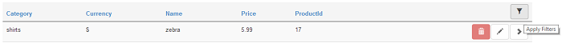

# Filter

You can filter the grid by values in columns, if the field is set to be filtered in the admin settings. Once this is set, the user can click on the filter icon displayed on the right top of the grid, and then select from the column(s) the values to be filtered.

If you are done filtering, you can click on clear filters button.

