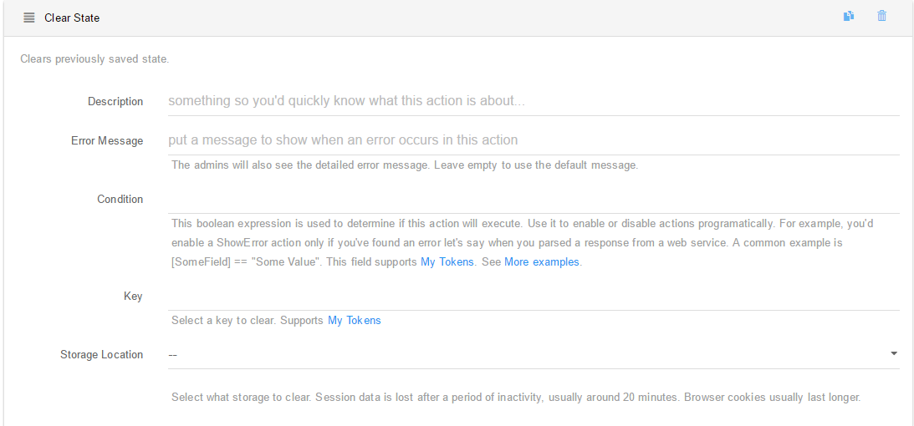

### Clear State

This action has the purpose of clearing the previously saved state, for example, if you have a contact form and on its button you've set the Save state on server session action, to not keep the values that the user fills in the boxes, you can use the Clear state action so that the form refreshes and clears all the data which was inserted in the boxes. Using this Action you can edit the following fields:

* **Description**. A short description for the action. Only admins will be able to see this field.
* **Error Message**. An error message that will be displayed in case if a error occurs in this action.
* **Condition**. This boolean expression is used to determine if this action will execute. Use it to enable or disable actions programatically. For example, you'd enable a **ShowError** action only if you've found an error let's say when you parsed a response from a web service. A common example is * **Key**. Select a key to save under. Note that the scope is global, data can be shared between any two Action Forms. Important! This is saved in cookies. So, when using **LoadState** action, make sure to load from cookies. Supports **My Tokens**.
* **Storage Location**. Select where to load the saved data from. Session data is lost after a period of inactivity, usually around 20 minutes. Browser cookies usually last longer.

