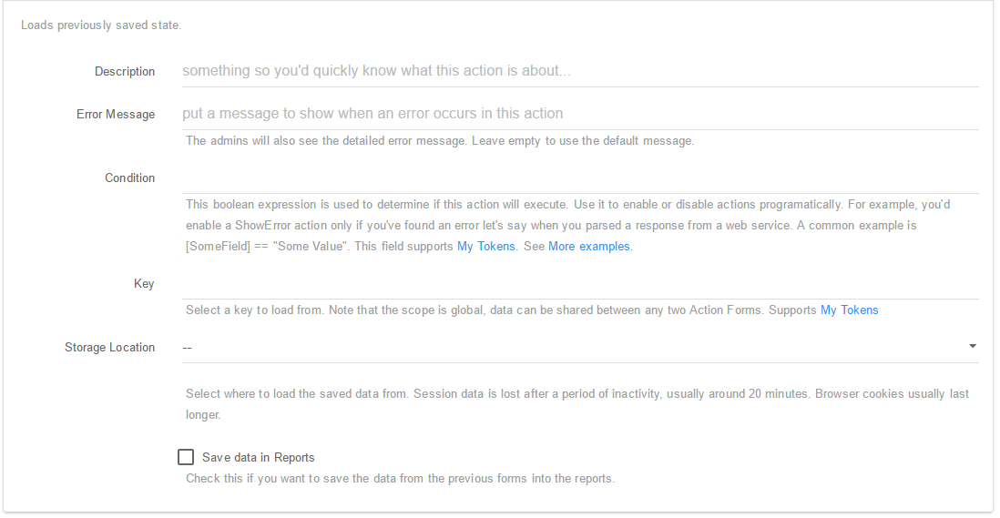

### Load State

As it says, from the label, this  action will load the previously saved state in the form. 

To see a practical example where the Form State actions are used, you can [Click here](https://www.youtube.com/watch?v=oIclb99Xgt4)  and check our tutorial where we use the Form State action in order to create a Multi form. Using this Action you can edit the following fields:

* **Description**. A short description for the action. Only admins will be able to see this field.
* **Error Message**. An error message that will be displayed in case if a error occurs in this action.
* **Condition**. This boolean expression is used to determine if this action will execute. Use it to enable or disable actions programatically. For example, you'd enable a **ShowError** action only if you've found an error let's say when you parsed a response from a web service. A common example is **[SomeField] == "Some Value"**. This field supports **My Tokens**. 
* **Key**. Select a key to load from. Note that the scope is global, data can be shared between any two Action Forms. Supports **My Tokens**.
* **Storage Location**. Select where to load the saved data from. Session data is lost after a period of inactivity, usually around 20 minutes. Browser cookies usually last longer.
* **Save data in Reports**. Check this if you want to save the data from the previous forms into the reports.
 

