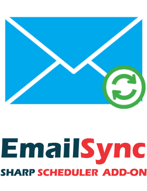

# Email Sync Add-On

The Email Sync Add-On allows you to manage email processing by setting up a server-side synchronization. This extension connects Sharp Scheduler with an IMAP or POP3 server for incoming email and starts listening for push mail. This way, you can centrally manage mailboxes and configure actions according to your needs.

It supports most of the popular email providers like Yahoo! Mail, Gmail, and many others more.

More specific, when the emails you receive meet certain conditions set by you, a trigger is fired and actions (also preset by you) are executed. There are 2 types of triggers, depending on the protocol used: [POP3 Trigger](triggers/pop-mail.html) and [IMAP Trigger](triggers/imap.html). You can choose either of them.

Regarding the conditions, you can filter the emails by subject, recipient, sender, CC, BCC, body and attachment and you can also choose to use RegEx. For instance, you can automatically reply to an email where a client asks you for a custom product. For the email you send, you can custom the subject, body, attachments and many more. Simple as that, with nothing more that presetting conditions.

**Integration requirements:**

+ Sharp Scheduler version 2.1.174+

**General requirements:**

+ .Net 4 version 4
+ DNN Platform version 7.2.1+

