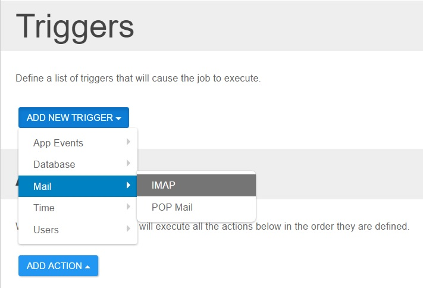

# Scheduler Triggers

## What is a trigger

A trigger is an event that will start executing all the actions assigned to the Job. In short, a job is a combination of triggers and actions. More simpler, ACTIONS decide WHAT to execute and TRIGGERS decide WHEN to execute the job. The execution is serialized, this basically means that you can create as many Jobs as you want, and they can be executed in the same time if there is any thread available. A maximum of 10 jobs can be executed in the same time. We strongly recommend you to create a separate job for every action, this way it's better to keep track of what job was executed and when. Also, it will reduce the CPU utilization.

## Type of Triggers

+ [POP3 Trigger](pop-mail.html)
+ [IMAP Trigger](imap.html)

