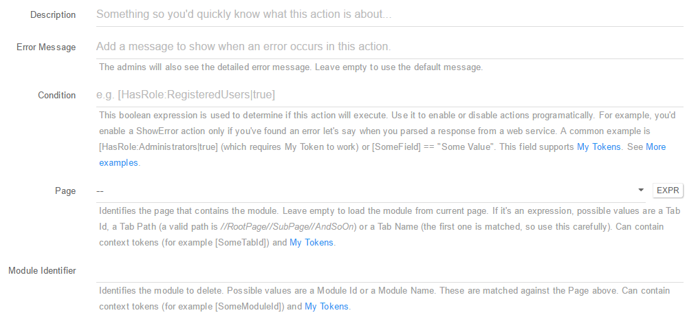
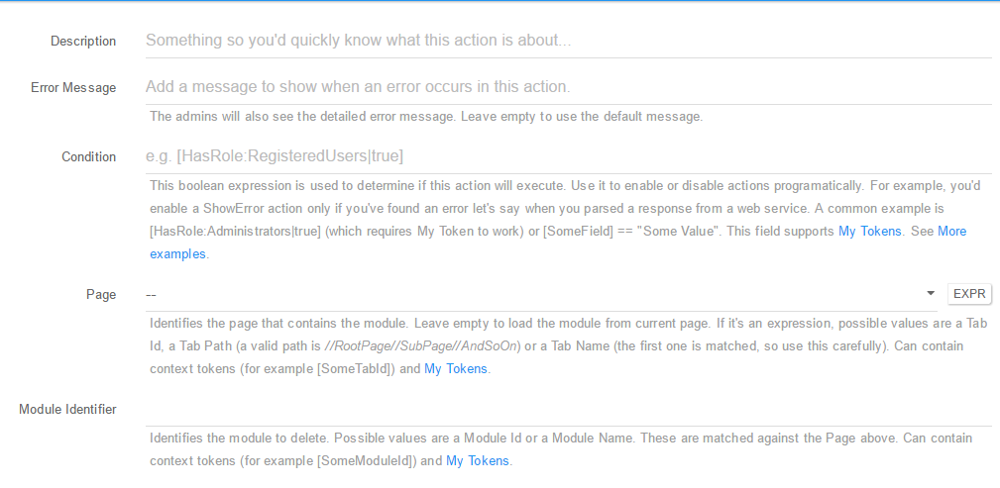
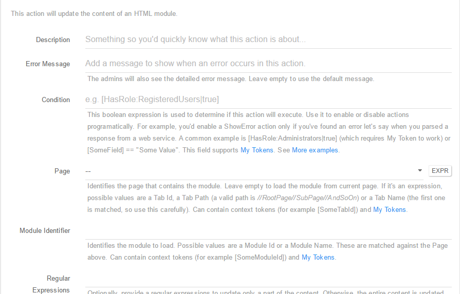
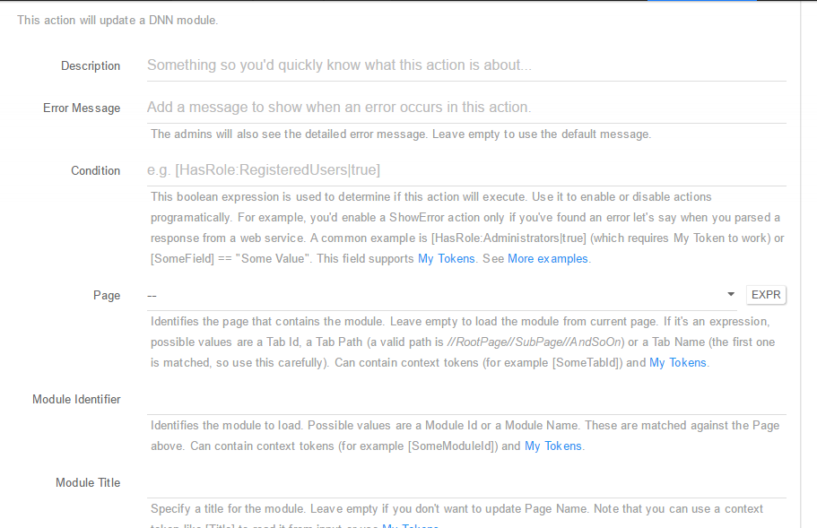
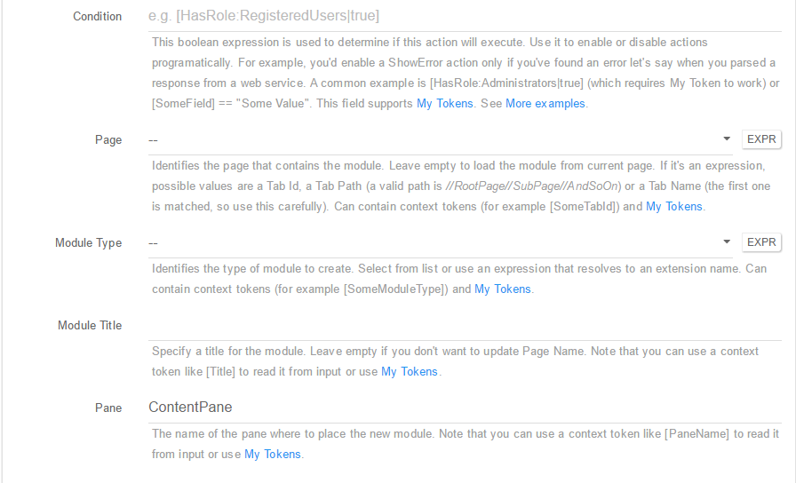
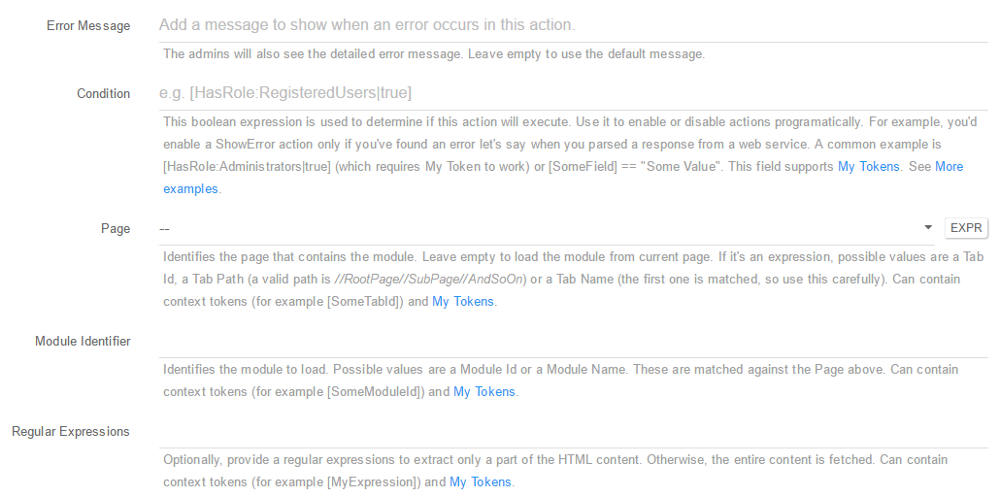
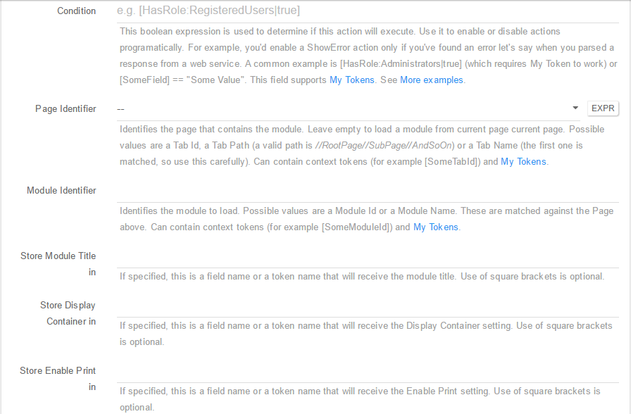

### Module Actions

* **Delete Module (Hard)** - Using this action you can Hard Delete (Delete Permanently) a selected module; You can setup this action using the following fields:

 * **Description**: A short description of the action so you'd quickly know what this is about;
 * **Error Message**: The admins will also see the detailed error message. Leave empty to use the default message;
 * **Condition**: This boolean expression is used to determine if this action will execute. Use it to enable or disable actions programatically. For example, you'd enable a ShowError action only if you've found an error let's say when you parsed a response from a web service. A common example is [HasRole:Administrators|true] (which requires My Token to work) or [SomeField] == "Some Value". This field supports My Tokens. See More examples;
 * **Page**: Identifies the page that contains the module. Leave empty to load the module from current page. If it's an expression, possible values are a Tab Id, a Tab Path (a valid path is //RootPage//SubPage//AndSoOn) or a Tab Name (the first one is matched, so use this carefully). Can contain context tokens (for example [SomeTabId]) and My Tokens;
 * **Module Identifier**: Identifies the module to delete. Possible values are a Module Id or a Module Name. These are matched against the Page above. Can contain context tokens (for example [SomeModuleId]) and My Tokens.

* **Delete Module (Soft)** - Using this action you can Soft Delete (move to Recycle Bin) a selected module; You can setup this action using the following fields:

 * **Description**: A short description of the action so you'd quickly know what this is about;
 * **Error Message**: The admins will also see the detailed error message. Leave empty to use the default message;
 * **Condition**: This boolean expression is used to determine if this action will execute. Use it to enable or disable actions programatically. For example, you'd enable a ShowError action only if you've found an error let's say when you parsed a response from a web service. A common example is [HasRole:Administrators|true] (which requires My Token to work) or [SomeField] == "Some Value". This field supports My Tokens. See More examples;
 * **Page**: Identifies the page that contains the module. Leave empty to load the module from current page. If it's an expression, possible values are a Tab Id, a Tab Path (a valid path is //RootPage//SubPage//AndSoOn) or a Tab Name (the first one is matched, so use this carefully). Can contain context tokens (for example [SomeTabId]) and My Tokens;
 * **Module Identifier**: Identifies the module to delete. Possible values are a Module Id or a Module Name. These are matched against the Page above. Can contain context tokens (for example [SomeModuleId]) and My Tokens.

* **Update HTML Module** - With this action it is now easier than ever to edit a specific HTML Module. You can setup this action using the following fields:

 * **Description**: A short description of the action so you'd quickly know what this is about;
 * **Error Message**: The admins will also see the detailed error message. Leave empty to use the default message;
 * **Condition**: This boolean expression is used to determine if this action will execute. Use it to enable or disable actions programatically. For example, you'd enable a ShowError action only if you've found an error let's say when you parsed a response from a web service. A common example is [HasRole:Administrators|true] (which requires My Token to work) or [SomeField] == "Some Value". This field supports My Tokens. See More examples;
 * **Page**: Identifies the page that contains the module. Leave empty to load the module from current page. If it's an expression, possible values are a Tab Id, a Tab Path (a valid path is //RootPage//SubPage//AndSoOn) or a Tab Name (the first one is matched, so use this carefully). Can contain context tokens (for example [SomeTabId]) and My Tokens;
 * **Module Identifier**: Identifies the module to delete. Possible values are a Module Id or a Module Name. These are matched against the Page above. Can contain context tokens (for example [SomeModuleId]) and My Tokens;
 * **Regular Expressions**: Optionally, provide a regular expressions to update only a part of the content. Otherwise, the entire content is updated. Can contain context tokens (for example [MyExpression]) and My Tokens;
 * **Content**: The content that needs to go in the HTML module. Can contain context tokens (for example [Content]) and My Tokens.

* **Update Module** - Using this action you can edit the settings of any module. You can setup this action using the following fields:

 * **Description**: A short description of the action so you'd quickly know what this is about;
 * **Error Message**: The admins will also see the detailed error message. Leave empty to use the default message;
 * **Condition**: This boolean expression is used to determine if this action will execute. Use it to enable or disable actions programatically. For example, you'd enable a ShowError action only if you've found an error let's say when you parsed a response from a web service. A common example is [HasRole:Administrators|true] (which requires My Token to work) or [SomeField] == "Some Value". This field supports My Tokens. See More examples;
 * **Page**: Identifies the page that contains the module. Leave empty to load the module from current page. If it's an expression, possible values are a Tab Id, a Tab Path (a valid path is //RootPage//SubPage//AndSoOn) or a Tab Name (the first one is matched, so use this carefully). Can contain context tokens (for example [SomeTabId]) and My Tokens;
 * **Module Identifier**: Identifies the module to delete. Possible values are a Module Id or a Module Name. These are matched against the Page above. Can contain context tokens (for example [SomeModuleId]) and My Tokens;
 * **Module Title**: Specify a title for the module. Leave empty if you don't want to update Page Name. Note that you can use a context token like [Title] to read it from input or use My Tokens;
 * **Display Container**: This option will be evaluated as a boolean such as true. Note that you can use a context token like [DisplayContainer] to read it from input or use My Tokens;
 * **Enable Print**: This option will be evaluated as a boolean such as true. Note that you can use a context token like [EnablePrint] to read it from input or use My Tokens;
 * **Enable RSS**: This option will be evaluated as a boolean such as true. Note that you can use a context token like [EnableRss] to read it from input or use My Tokens;
 * **Start Date**: When specified, this option determines the date after which the module becomes visible on the site. Can contain context tokens (for example [DateStart]) and My Tokens;
 * **End Date**: When specified, this option determines the date after which the module is no longer visible on the site. Can contain context tokens (for example [DateEnd]) and My Tokens;
 * **Permissions**: Set permissions for the module. The first column would contain VIEW or EDIT. The second is a list of role IDs or role names delimited by comma or semicolon. If you're linking to a Permission Grid control, you can use [PermissionGrid:PermissionName] tokens in this field. Can contain context tokens (for example [RoleName]) and My Tokens.

* **Add Module** - Use this action to add a new module. You can use the following fields to set-up the action:

 * **Description**: A short description of the action so you'd quickly know what this is about;
 * **Error Message**: The admins will also see the detailed error message. Leave empty to use the default message;
 * **Condition**: This boolean expression is used to determine if this action will execute. Use it to enable or disable actions programatically. For example, you'd enable a ShowError action only if you've found an error let's say when you parsed a response from a web service. A common example is [HasRole:Administrators|true] (which requires My Token to work) or [SomeField] == "Some Value". This field supports My Tokens. See More examples;
 * **Page**: Identifies the page that contains the module. Leave empty to load the module from current page. If it's an expression, possible values are a Tab Id, a Tab Path (a valid path is //RootPage//SubPage//AndSoOn) or a Tab Name (the first one is matched, so use this carefully). Can contain context tokens (for example [SomeTabId]) and My Tokens;
 * **Module Type**: Identifies the type of module to create. Select from list or use an expression that resolves to an extension name. Can contain context tokens (for example [SomeModuleType]) and My Tokens;
 * **Module Title**: Specify a title for the module. Leave empty if you don't want to update Page Name. Note that you can use a context token like [Title] to read it from input or use My Tokens;
 * **Pane**: The name of the pane where to place the new module. Note that you can use a context token like [PaneName] to read it from input or use My Tokens;
 * **Display Container**: This option will be evaluated as a boolean such as true. Note that you can use a context token like [DisplayContainer] to read it from input or use My Tokens;
 * **Enable Print**: This option will be evaluated as a boolean such as true. Note that you can use a context token like [EnablePrint] to read it from input or use My Tokens;
 * **Enable RSS**: This option will be evaluated as a boolean such as true. Note that you can use a context token like [EnableRss] to read it from input or use My Tokens;
 * **Start Date**: When specified, this option determines the date after which the module becomes visible on the site. Can contain context tokens (for example [DateStart]) and My Tokens;
 * **End Date**: When specified, this option determines the date after which the module is no longer visible on the site. Can contain context tokens (for example [DateEnd]) and My Tokens;
 * **Permissions**: Set permissions for the module. The first column would contain VIEW or EDIT. The second is a list of role IDs or role names delimited by comma or semicolon. If you're linking to a Permission Grid control, you can use [PermissionGrid:PermissionName] tokens in this field. Can contain context tokens (for example [RoleName]) and My Tokens.

* **Load HTML Module** - Loads the content of an HTML Module that can be loaded later using a token. You can setup this action using the following fields:

 * **Description**: A short description of the action so you'd quickly know what this is about;
 * **Error Message**: The admins will also see the detailed error message. Leave empty to use the default message;
 * **Condition**: This boolean expression is used to determine if this action will execute. Use it to enable or disable actions programatically. For example, you'd enable a ShowError action only if you've found an error let's say when you parsed a response from a web service. A common example is [HasRole:Administrators|true] (which requires My Token to work) or [SomeField] == "Some Value". This field supports My Tokens. See More examples;
 * **Page**: Identifies the page that contains the module. Leave empty to load the module from current page. If it's an expression, possible values are a Tab Id, a Tab Path (a valid path is //RootPage//SubPage//AndSoOn) or a Tab Name (the first one is matched, so use this carefully). Can contain context tokens (for example [SomeTabId]) and My Tokens;
 * **Module Identifier**: Identifies the module to load. Possible values are a Module Id or a Module Name. These are matched against the Page above. Can contain context tokens (for example [SomeModuleId]) and My Tokens;
 * **Regular Expressions**: Optionally, provide a regular expressions to extract only a part of the HTML content. Otherwise, the entire content is fetched. Can contain context tokens (for example [MyExpression]) and My Tokens;
 * **Store content in**: This is a field name or a token name that will receive the HTML content. Use of square brackets is optional.

* **Load Module** - Loads the content of a Module that can be loaded later using a token. You can setup this action using the following fields:

 * **Description**: A short description of the action so you'd quickly know what this is about;
 * **Error Message**: The admins will also see the detailed error message. Leave empty to use the default message;
 * **Condition**: This boolean expression is used to determine if this action will execute. Use it to enable or disable actions programatically. For example, you'd enable a ShowError action only if you've found an error let's say when you parsed a response from a web service. A common example is [HasRole:Administrators|true] (which requires My Token to work) or [SomeField] == "Some Value". This field supports My Tokens. See More examples;
 * **Page Identifier**: Identifies the page that contains the module. Leave empty to load a module from current page current page. Possible values are a Tab Id, a Tab Path (a valid path is //RootPage//SubPage//AndSoOn) or a Tab Name (the first one is matched, so use this carefully). Can contain context tokens (for example [SomeTabId]) and My Tokens;
 * **Module Identifier**: Identifies the module to load. Possible values are a Module Id or a Module Name. These are matched against the Page above. Can contain context tokens (for example [SomeModuleId]) and My Tokens;
 * **Store Module Title in**: If specified, this is a field name or a token name that will receive the module title. Use of square brackets is optional;
 * **Store Display Container in**: If specified, this is a field name or a token name that will receive the Display Container setting. Use of square brackets is optional;
 * **Store Enable Print in**: If specified, this is a field name or a token name that will receive the Enable Print setting. Use of square brackets is optional;
 * **Store Enable RSS in**: If specified, this is a field name or a token name that will receive the Enable RSS setting. Use of square brackets is optional;
 * **Store Start Date in**: If specified, this is a field name or a token name that will receive the module start date. Use of square brackets is optional;
 * **Store End Date in**: If specified, this is a field name or a token name that will receive the module end date. Use of square brackets is optional;
 * **Permissions**: Load permissions for the page. The first column would contain VIEW or EDIT or other permission that appears in the Page Permissions table. The second is the token where you want to store the list of role IDs delimited by comma or semicolon.

