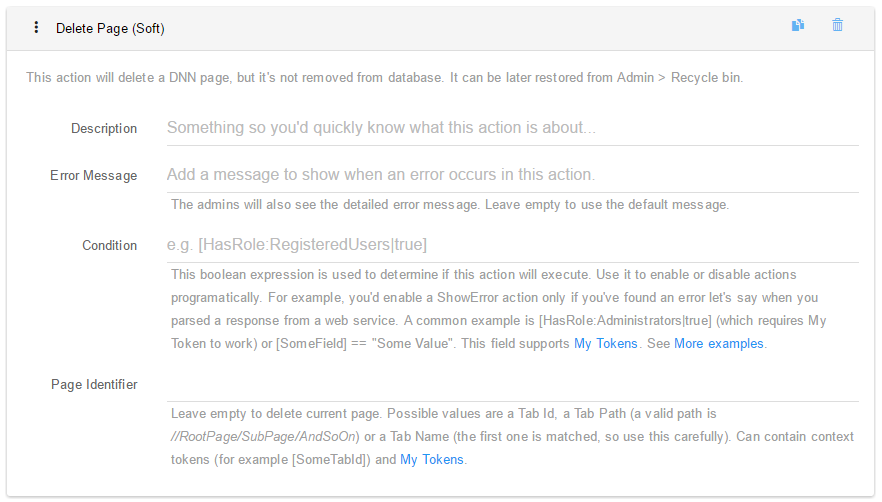
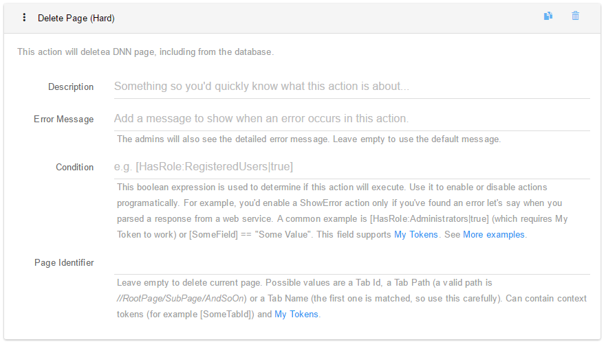
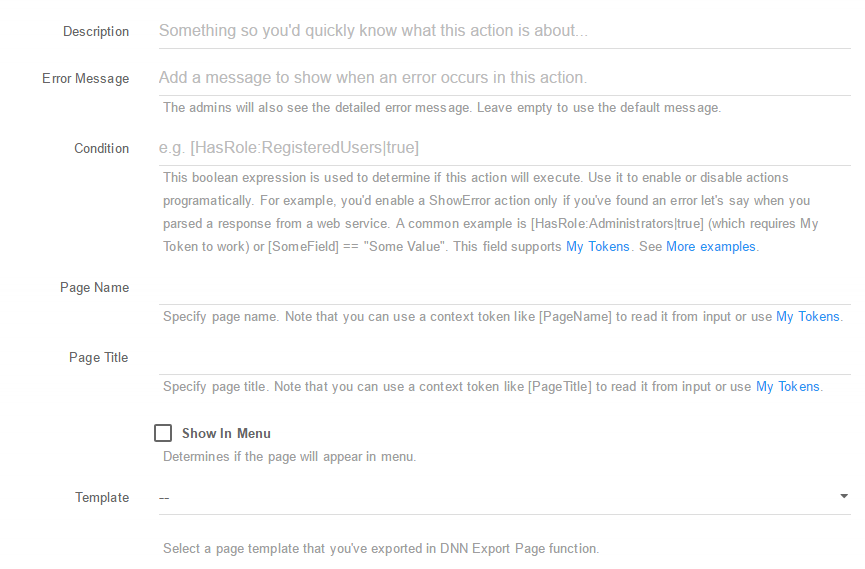
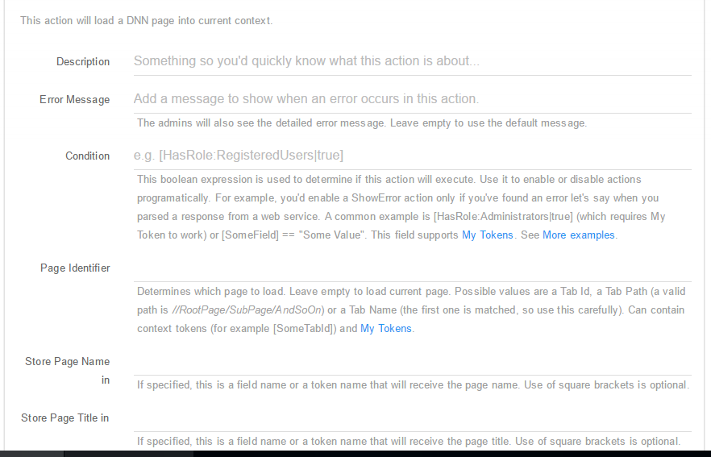
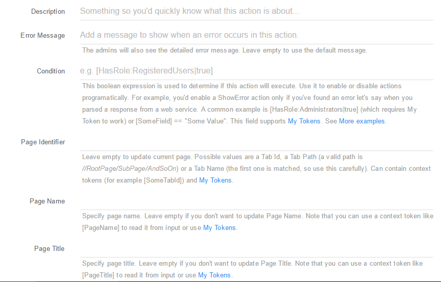

### Page Actions

* **Delete Page (Soft)** - Using this action you can Soft Delete (move to Recycle Bin) the current page, a selected page from the back-end or a page selected by user;
You can setup this action using the following fields:
 * **Description**: A short description of the action so you quickly know what this is about;
 * **Error Message**: The admins will also see the detailed error message. Leave empty to use the default message;
 * **Condition**: This boolean expression is used to determine if this action will execute. Use it to enable or disable actions programatically. For example, you'd enable a ShowError action only if you've found an error let's say when you parsed a response from a web service. A common example is [HasRole:Administrators|true] (which requires My Tokens to work) or [SomeField] == "Some Value". This field supports My Tokens;
 * **Page Identifier**: Leave empty to delete current page. Possible values are a Tab Id, a Tab Path (a valid path is //RootPage/SubPage/AndSoOn) or a Tab Name (the first one is matched, so use this carefully). Can contain context tokens (for example [SomeTabId]) and My Tokens.

* **Delete Page (Hard)** - Using this action you can Hard Delete (Delete Permanently) the current page, a selected page from the back-end or a page selected by user. You can setup this action using the following fields:
 * **Description**: A short description of the action so you quickly know what this is about;
 * **Error Message**: The admins will also see the detailed error message. Leave empty to use the default message;
 * **Condition**: This boolean expression is used to determine if this action will execute. Use it to enable or disable actions programatically. For example, you'd enable a ShowError action only if you've found an error let's say when you parsed a response from a web service. A common example is [HasRole:Administrators|true] (which requires My Tokens to work) or [SomeField] == "Some Value". This field supports My Tokens;
 * **Page Identifier**: Leave empty to delete current page. Possible values are a Tab Id, a Tab Path (a valid path is //RootPage/SubPage/AndSoOn) or a Tab Name (the first one is matched, so use this carefully). Can contain context tokens (for example [SomeTabId]) and My Tokens.

* **Create Page** - Gives you the possibility to create a new page in a friendly yet complex way.  You can edit the following: Title, Name, Parent, Description, Keywords, Start and End date, Permissions. You can setup this action using the following fields:
  * **Description**: A short description of the action so you quickly know what this is about;
  * **Error Message**: The admins will also see the detailed error message. Leave empty to use the default message;
  * **Condition**: This boolean expression is used to determine if this action will execute. Use it to enable or disable actions programatically. For example, you'd enable a ShowError action only if you've found an error let's say when you parsed a response from a web service. A common example is [HasRole:Administrators|true] (which requires My Tokens to work) or [SomeField] == "Some Value". This field supports My Tokens;
  * **Page Name**: Specify page name. Note that you can use a context token like [PageName] to read it from input or use My Tokens;
  * **Page Title**: Specify page title. Note that you can use a context token like [PageTitle] to read it from input or use My Tokens;
  * **Show In Menu**: Determines if the page will appear in menu;
  * **Template**: Select a page template that you've exported in DNN Export Page function;
  * **Dynamic Template**: If the path to the template is dynamic (determined at runtime based on context data for example), you can input it into this filed which can contain context tokens and My Tokens;
  * **Parent Page**: The new page will be created under this page. Leave empty to create a root page;
  * **Parent Page Token**: Optionally provide a token to set the parent page dynamically. For example, use [Tab:TabId] to create the new page under current page. Can contain context tokens (for example [SelectPage]) and My Tokens;
  * **Page Description**: Optionally, provide a meta description for this page. Note that you don't want to put HTML or large text in meta. Can contain context tokens (for example [Description]) and My Tokens;
  * **Page Keywords**: Optionally, provide meta keywords for this page. Can contain context tokens (for example [Keywords]) and My Tokens;
  * **Start Date**: This determines the date after which the page becomes visible on the site. Leave empty to show instantly. Can contain context tokens (for example [DateStart]) and My Tokens;
  * **End Date**: This determines the date after which the page is no longer visible on the site. Leave empty to disable this option. Can contain context tokens (for example [DateEnd]) and My Tokens;
  * **Permissions**: Set permissions for the page. The first column is the permission key (for example VIEW or EDIT) or permission name (View Tab or Edit Tab). The second is a list of role IDs or role names delimited by comma or semicolon. If you're linking to a Permission Grid control, you can use [PermissionGrid:PermissionName] tokens in this field. Can contain context tokens (for example [RoleName]) and My Tokens;
  * **Other Settings**: Here you can update any other setting you can think of, including custom settigs. Can contain context tokens (for example [SettingValue]) and My Tokens. If you have latest My Tokens you will be able to access any of these with [Tab:];
  * **Store URL in Token**: Provide the name of a token where to store the URL of the newly created page so it can be used later for example to redirect to that page or send an email with the link;
  * **Store ID in Token** - Provide the name of a token where to store the ID of the newly created page.

* **Load Page** - Loads basic information from a specific page. You can setup this action using the following fields:

  * **Description**: A short description of the action so you'd quickly know what this is about;
  * **Error Message**: The admins will also see the detailed error message. Leave empty to use the default message;
  * **Condition**: This boolean expression is used to determine if this action will execute. Use it to enable or disable actions programatically. For example, you'd enable a ShowError action only if you've found an error let's say when you parsed a response from a web service. A common example is [HasRole:Administrators|true] (which requires My Token to work) or [SomeField] == "Some Value". This field supports My Tokens;
  * **Page Identifier**: Determines which page to load. Leave empty to load current page. Possible values are a Tab Id, a Tab Path (a valid path is //RootPage/SubPage/AndSoOn) or a Tab Name (the first one is matched, so use this carefully). Can contain context tokens (for example [SomeTabId]) and My Tokens;
  * **Store Page Name in**: If specified, this is a field name or a token name that will receive the page name. Use of square brackets is optional;
  *** Store Page Title in**: If specified, this is a field name or a token name that will receive the page title. Use of square brackets is optional;
  * **Store Parent Page ID in**: If specified, this is a field name or a token name that will receive the parent page ID. Use of square brackets is optional;
  * **Store Parent Page Name in**: If specified, this is a field name or a token name that will receive the parent page name. Use of square brackets is optional;
  * **Store Page Description in**: If specified, this is a field name or a token name that will receive the page description. Use of square brackets is optional;
  * **Store Page Keywords in**: If specified, this is a field name or a token name that will receive the page keywords. Use of square brackets is optional.
  * **Store Start Date in**: If specified, this is a field name or a token name that will receive the page start date. Use of square brackets is optional;
  * **Store End Date in**: If specified, this is a field name or a token name that will receive the page end date. Use of square brackets is optional;
  * **Permissions**: Load permissions for the page. Set permissions for the page. The first column is the permission key (for example VIEW or EDIT) or permission name (View Tab or Edit Tab) that appears in the Page Permissions table.. The second is the token where you want to store the list of role IDs delimited by comma or semicolon;
  * **Other Settings**: Here you can load any other setting you can think of, including custom settigs. If you have latest My Tokens you will be able to access any of these with [Tab:];
  * **Store Page URL in**: If specified, this is a field name or a token name that will receive the parent URL. Use of square brackets is optional.

  * **Update Page** - With this action you can easily update informations for an existing page, info like Title, Name, Parent, Description, Keywords, Start and End date. You can setup this action using the following fields:

   * **Description**: A short description of the action so you'd quickly know what this is about;
   * **Error Message**: The admins will also see the detailed error message. Leave empty to use the default message;
    * **Condition**: This boolean expression is used to determine if this action will execute. Use it to enable or disable actions programatically. For example, you'd enable a ShowError action only if you've found an error let's say when you parsed a response from a web service. A common example is [HasRole:Administrators|true] (which requires My Token to work) or [SomeField] == "Some Value". This field supports My Tokens;
    * **Page Identifier**: Leave empty to update current page. Possible values are a Tab Id, a Tab Path (a valid path is //RootPage/SubPage/AndSoOn) or a Tab Name (the first one is matched, so use this carefully). Can contain context tokens (for example [SomeTabId]) and My Tokens;
    * **Page Name**: Specify page name. Note that you can use a context token like [PageName] to read it from input or use My Tokens;
   * **Page Title**: Specify page title. Note that you can use a context token like [PageTitle] to read it from input or use My Tokens;
   * **Parent Page**: The new page will be created under this page. Leave empty to create a root page;
   * **Parent Page Token** - Optionally provide a token to set the parent page dynamically. For example, use [Tab:TabId] to create the new page under current page. Can contain context tokens (for example [SelectPage]) and My Tokens;
   * **Parent Page (text)**: The page will be moved under this page (only if text parameter is left empty);
   * **Page Description**: Optionally, provide a meta description for this page. Note that you don't want to put HTML or large text in meta. Can contain context tokens (for example [Description]) and My Tokens;
   * **Page Keywords**: Optionally, provide meta keywords for this page. Can contain context tokens (for example [Keywords]) and My Tokens;
   * **Start Date**: This determines the date after which the page becomes visible on the site. Leave empty to show instantly. Can contain context tokens (for example [DateStart]) and My Tokens;
   * **End Date**: This determines the date after which the page is no longer visible on the site. Leave empty to disable this option. Can contain context tokens (for example [DateEnd]) and My Tokens;
   * **Permissions**: Set permissions for the page. The first column is the permission key (for example VIEW or EDIT) or permission name (View Tab or Edit Tab). The second is a list of role IDs or role names delimited by comma or semicolon. If you're linking to a Permission Grid control, you can use [PermissionGrid:PermissionName] tokens in this field. Can contain context tokens (for example [RoleName]) and My Tokens;
   * **Other Settings**: Here you can update any other setting you can think of, including custom settigs. Can contain context tokens (for example [SettingValue]) and My Tokens. If you have latest My Tokens you will be able to access any of these with [Tab:];
   * **Store URL in Token**: Provide the name of a token where to store the URL of the newly created page so it can be used later for example to redirect to that page or send an email with the link.

