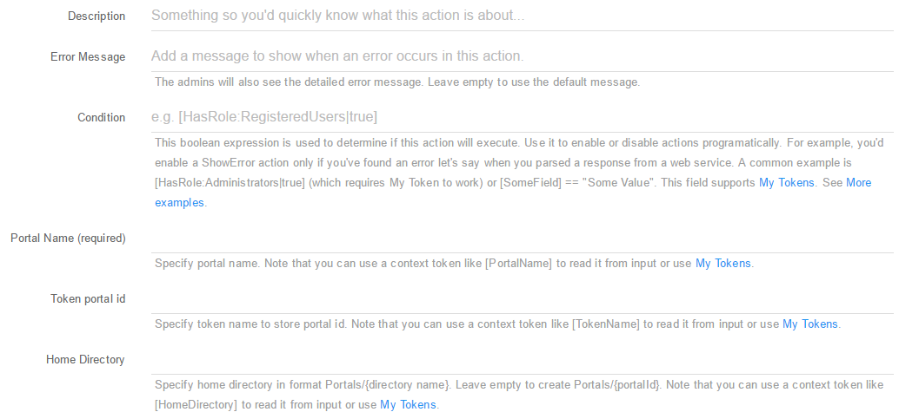
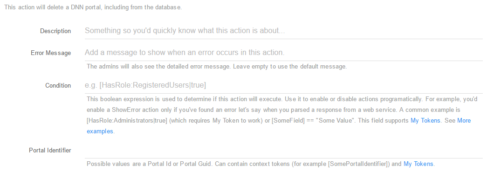

### Portal Actions

* **Create Portal** - Using this action you can easily create a new portal. You can setup this action using the following fields:

 * **Description**: A short description of the action so you'd quickly know what this is about;
 * **Error Message**: The admins will also see the detailed error message. Leave empty to use the default message;
 * **Condition**: This boolean expression is used to determine if this action will execute. Use it to enable or disable actions programatically. For example, you'd enable a ShowError action only if you've found an error let's say when you parsed a response from a web service. A common example is [HasRole:Administrators|true] (which requires My Token to work) or [SomeField] == "Some Value". This field supports My Tokens. See More examples;
 * **Portal Name (required)**: Specify portal name. Note that you can use a context token like [PortalName] to read it from input or use My Tokens.
 * **Token portal id**: Specify token name to store portal id. Note that you can use a context token like [TokenName] to read it from input or use My Tokens.

* **Delete Portal**: Use this action if you want to delete a portal. You can setup this action using the following fields:

 * **Description**: A short description of the action so you'd quickly know what this is about;
 * **Error Message**: The admins will also see the detailed error message. Leave empty to use the default message;
 * **Condition**: This boolean expression is used to determine if this action will execute. Use it to enable or disable actions programatically. For example, you'd enable a ShowError action only if you've found an error let's say when you parsed a response from a web service. A common example is [HasRole:Administrators|true] (which requires My Token to work) or [SomeField] == "Some Value". This field supports My Tokens. See More examples;
 * **Portal Identifier**: Possible values are a Portal Id or Portal Guid. Can contain context tokens (for example [SomePortalIdentifier]) and My Tokens.

* **Update Portal**: Using this action you can easily update an existing portal. You can setup this action using the following fields:

 * **Description**: A short description of the action so you'd quickly know what this is about;
 * **Error Message**: The admins will also see the detailed error message. Leave empty to use the default message;
 * **Condition**: This boolean expression is used to determine if this action will execute. Use it to enable or disable actions programatically. For example, you'd enable a ShowError action only if you've found an error let's say when you parsed a response from a web service. A common example is [HasRole:Administrators|true] (which requires My Token to work) or [SomeField] == "Some Value". This field supports My Tokens. See More examples;
 * **Portal Identifier**: Possible values are a Portal Id or Portal Guid. Can contain context tokens (for example [SomePortalIdentifier]) and My Tokens.
 * **Portal Name**: Specify portal name. Note that you can use a context token like [PortalName] to read it from input or use My Tokens;
 * **Administrator Id**: Specify administrator id. Note that you can use a context token like [AdministratorId] to read it from input or use My Tokens;
 * **KeyWords**: Specify portal keyWords. Note that you can use a context token like [KeyWords] to read it from input or use My Tokens;
 * **Description**: Specify portal description. Note that you can use a context token like [Description] to read it from input or use My Tokens;
 * **Email**: Specify portal email. Note that you can use a context token like [Email] to read it from input or use My Tokens.

* **Load Portal**:  Loads the content of a Portal that can be loaded later using a token. You can setup this action using the following fields:

 * **Description**: A short description of the action so you'd quickly know what this is about;
 * **Error Message**: The admins will also see the detailed error message. Leave empty to use the default message;
 * **Condition**: This boolean expression is used to determine if this action will execute. Use it to enable or disable actions programatically. For example, you'd enable a ShowError action only if you've found an error let's say when you parsed a response from a web service. A common example is [HasRole:Administrators|true] (which requires My Token to work) or [SomeField] == "Some Value". This field supports My Tokens. See More examples;
 * **Portal Identifier**: Possible values are a Portal Id or Portal Guid. Can contain context tokens (for example [SomePortalIdentifier]) and My Tokens;
 * **Store Portal Name in**: If specified, this is a token name that will receive the portal name. Use of square brackets is optional;
 * **Store Administrator Id in**: If specified, this is a token name that will receive the portal administrator id. Use of square brackets is optional;
 * **Store Portal CreatedByUserID in**: If specified, this is a token name that will receive the Portal CreatedByUserID. Use of square brackets is optional;
 * **Store Portal CreatedOnDate in**: If specified, this is a token name that will receive the Portal CreatedOnDate. Use of square brackets is optional;
 * **Store Culture Code in**: If specified, this is a token name that will receive the Culture Code. Use of square brackets is optional;
 * **Store Default Language in**: If specified, this is a token name that will receive the Default Language. Use of square brackets is optional;
 * **Store Portal Email in**: If specified, this is a token name that will receive the Portal Email. Use of square brackets is optional;
 * **Store LastModifiedByUserID in**: If specified, this is a token name that will receive the LastModifiedByUserID. Use of square brackets is optional;
 * **Store LastModifiedOnDate in**: If specified, this is a token name that will receive the LastModifiedOnDate. Use of square brackets is optional.