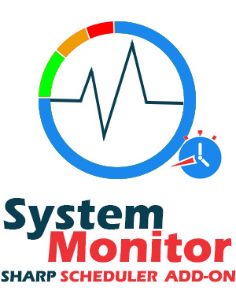

# 

System monitor is an add-on used to monitor the disk space in a computer system.

## Installation

Install the add-on from Host &gt; Extensions just as you would any other extension. The following steps will guide you through using the System Monitor add-on.

## Getting started

System Monitor is very easy to setup. In this guide we will create a simple job with a trigger to send an email, which fires once when the disk free space goes under the threshold:

1.Add the Sharp Scheduler module to a page

2.Create a new job, select a title and a portal

3.Add the System Monitor trigger for Low Disk Space

4.Select the desired Threshold and the Drive Letter that will be monitored

5.Add and setup a Send Email action

You can use the \[DriveLetter\], \[Threshold\], \[DiskSize\] and \[FreeSpace\] tokens to show more info.

## **Settings Reference**

•Threshold \(MB\)

 The trigger will fire when disk space goes below this threshold.

•Drive Letter

Select drive letter to watch, for example: C, D and so on.
