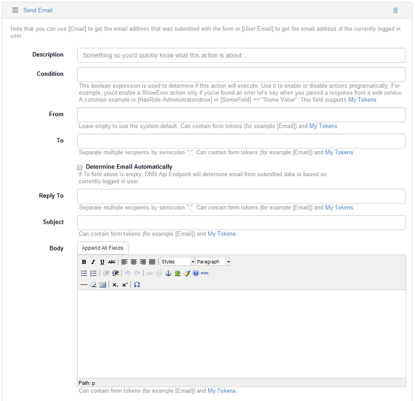

# Email

## Send Email

This action does exactly what it says. It sends an email using the SMTP server that is defined in DNN Host Settings. The following fields can be configured: 
* **From.** This is the sender of the email as it will appear to the recipient. Leave empty to use the system default – if a portal context is set, the portal administrator email is used; otherwise, the email defined in Host Settings is used. This field supports context tokens and My Tokens.
* **To.** Determines who will receive the email. Separate multiple email addressed with semicolon. If the Determine Automatically option is used, then Sharp Scheduler tries to infer the email from the Context User. This field supports context tokens and My Tokens.
* **Reply To.** When the recipient of the email replies to this email, the To field fills with this email instead of the original From. This only makes sense when sending emails to non-admin users that are likely to reply to those emails. For example, it can be a trial reminder email. Separate multiple email addressed with semicolon. This field supports context tokens and My Tokens.
* **Subject.** Used as email subject. For best experience, choose something not too short but not too long either. This field supports context tokens and My Tokens.
* **Body.** This is the email content. If you need custom data then use other actions, for example the Run SQL action, to fetch it and store it in the job context. Then access it through the context tokens. This field also supports My Tokens.

## Troubleshooting

Before starting everything, test that the form is working perfectly. Go to `Admin > Event Viewer` to see if you get any errors. If the form doesn't work as it should be, you need to check some settings.
1. Make sure that the SMTP settings are configured properly. You can find this in Host Settings. 
* Follow this path: `Host > Host Settings > Advanced Settings`
* Test that the Username and Password used to connect to the Server are correct. You can do this by clicking on the Test SMTP Settings button.
* Make sure that the email address used to send the form is allowed to send emails. Action Form uses the system default (site email) which is the Administrator's email. Some servers like Amazon needs that the email address used to send the form, to be verified. Only specific email addresses are allowed to send emails. In Event Viewer, you might get the next error:

So, if in Event Viewer you get the Email address not verified error, you need to set-up in the From field, the Host email address. The host email could be found under the `Host > Host Settings > Basic Settings`. 
Follow this path to set-up the email address: `Manage Action Form > Fields > Send (submit button) > Send Email (action)`
Click on the Save button and now you Action Form should work perfectly.

It is not difficult to set-up Action Form but there are a few aspects to look after and details that are difficult to debug if you don't know them already or where to look. In this scenario it was simple because the server told us that he rejected the email and why. In other cases the server will not tell you the reason so you will have to figure it out yourself or sometimes it will not even tell you that it was rejected. It will just show the message that is was successfully submitted but the recipient will not get it, probably the email just remains blocked somewhere in a pick-up folder for example. If the server doesn't do his job, the email will remain in that pick-up folder and no error will get reported.

Once again, if there is any error, Action Form will log it in `Admin > Event Viewer`.

## Subscribe to MailChimp

You can set up this action to a button so when the form is submitted it subscribes an email address to a Mailchimp list. The following fields needs to be configured so that the form will subscribe the email address to your list:

* **API Key.** Login to MailChimp and go to `Account > Extra > API Keys`. Follow [this](http://kb.mailchimp.com/article/where-can-i-find-my-api-key) link to find out more about MailChimp API Key. Action Form requires an API key to successfully connect to a MailChimp account and transfer subscriber information and other data to your list.
* **List Name.** The list name has to be exactly as it appears in your MailChimp account. 

If you are not sure what [MailChimp](http://www.mailchimp.com/features/full_list/) is or if it will be helpful, signup up for a [FREE Trial Account](http://www.mailchimp.com/signup/) and see for yourself!

