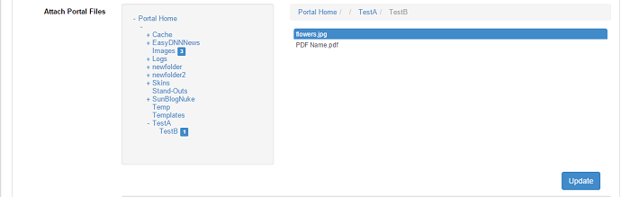
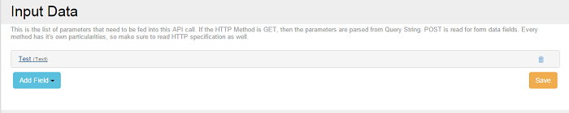
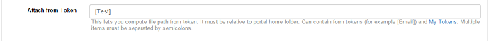
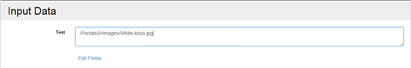
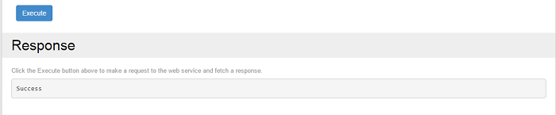

# Email

## Send Email

This action does exactly what it says. It sends an email using the SMTP server that is defined in DNN Host Settings. The following fields can be configured: 

* **From.** This is the sender of the email as it will appear to the recipient. Leave empty to use the system default – if a portal context is set, the portal administrator email is used; otherwise, the email defined in Host Settings is used. This field supports context tokens and My Tokens.
* **To.** Determines who will receive the email. Separate multiple email addressed with semicolon. If the Determine Automatically option is used, then Sharp Scheduler tries to infer the email from the Context User. This field supports context tokens and My Tokens.
* **Reply To.** When the recipient of the email replies to this email, the To field fills with this email instead of the original From. This only makes sense when sending emails to non-admin users that are likely to reply to those emails. For example, it can be a trial reminder email. Separate multiple email addressed with semicolon. This field supports context tokens and My Tokens.
* **Subject.** Used as email subject. For best experience, choose something not too short but not too long either. This field supports context tokens and My Tokens.
* **Body.** This is the email content. If you need custom data then use other actions, for example the Run SQL action, to fetch it and store it in the job context. Then access it through the context tokens. This field also supports My Tokens.
* **Attachments.** This action allows you to attach up to 5 email attachments to the email. If a Portal Context is specified, then the file picker will show files that belong to that portal; otherwise, files from the Host folder are listed.

### Send email containing attachments

In order to send emails containing attachments, you must create an API Endpoint Method as follows. From the Modules drop-down menu select Add New Module, then choose API Endpoint. Under Methods, click on New Method. Go to Actions and select Add Action. From the menu pick Email > Send Email. Click on the button, scroll down to the To field. There, insert the address to which you want to send the email. Now, say you want the email to contain attachments. There are two ways to do that. 

You can either go to Attach Portal Files, click on Change, and select your item from there. If a Portal Context is specified, then the file picker will show files that belong to that portal. Click on the + sign to expand the folders until you get to the one that contains the item you want to attach. To de-attach, click on the highlighted folder(s) until you reach the files you previously added, which are also highlighted. Click to de-highlight and thus de-attach. Click on Update for the changes to take effect.

Another method is via Attach from Token. Click on the Add Field button under Input Data and select Text.

Name it Test, for example, and go back to Send Email. In the Attach from Token field write [Test].

Click on Save and Test and go back to the landing page. There, in the Input Data field at the top of the page, write the path to the item(s) you want to attach. Note that only the relative or physical paths work, i.e. ``/Portals/0/Images/White-lotus.jpg or C:\Users\Name\Folder\ImageName``

Click on Execute. A progress bar and a Success message will be displayed and the mail will be sent containing the respective attachment(s).

#### Subcribe to Mailchimp

You can use this action to submit an email address to a Mailchimp list. The following fields needs to be configured so that the subscription of the email address to be made:

* **API Key** - Login to MailChimp and go to Account > Extra > API Keys. Follow [this](https://mailchimp.com/help/about-api-keys/){:target="_blank"} link to find out more about MailChimp API Key.
* **List Name** - the list name has to be exactly as it appears in your [MailChimp](https://mailchimp.com/features/all/){:target="_blank"} account.If you are not sure what MailChimp is or if it will be helpful, signup up for a [FREE Trial Account](https://login.mailchimp.com/signup/){:target="_blank"} and see for yourself!