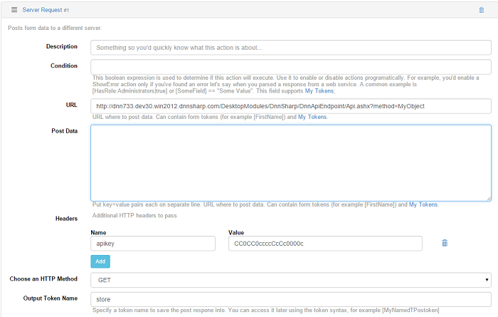
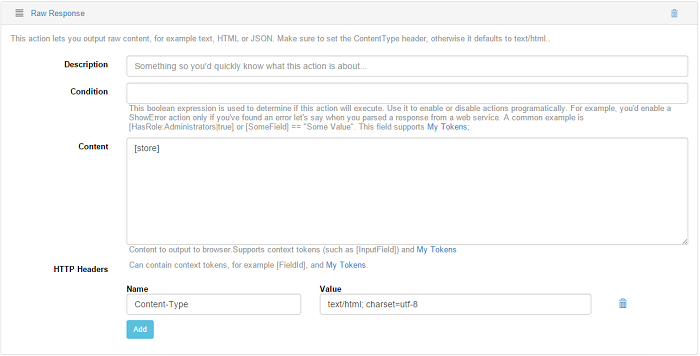
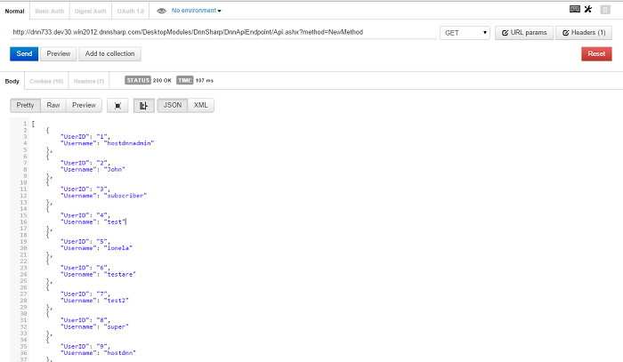

# Examples

We compiled a list of API Endpoint test cases for different methods with integration of other DNN modules like Action Form, Action Grid and URL Adapter in order to help you understand how API Endpoint module should work.

## How to Create an API POST method that Adds Products in an existing table with two possible results

Result 1: Success - if the product was successfully added.

Result 2: Failed - if the product wasn't added for one reason or another.The steps you need to make in order to test this case are:

1. In API Endpoint module click on "New Method" button;

2. Set an Object name > select POST as method > check the Is enabled box;

3. In Input Data section, add one/several text fields with the name of an existing column from the table previously created (e.g. Category, Price, Currency etc.);

4. Add Run SQL Query action in which insert an SQL statement and a Store Scalar Result value (in which the data will be stocked, e.g. "ProductId" which is the primary key in the table)

5. Add two Output JSON Object responses:
   * One for Success where Properties Name = Success and Value = true
   * Another for Error where Properties Name = Error and Value = "Unable to create product" (an error message in case the SQL statement fails)

6. Click on Save & Test button

7. Insert in Input Data fields some values and execute the code

Result 1: the request should be correctly made to the web service and fetch a response: {"Success":"true"}

For when the SQL Query fails the error message set as property value in the second JSON Object response should be displayed.

## How to create an API DELETE Method to Delete a Product

Steps to follow:

1. Create a POST method > name it > check it as Is Enabled

2. Create a Run SQL Query action where you should insert a correct SQL Delete statement

3. Click on save & test button

4. Execute the code and check in the database if the values were deleted

As expected result, after the method was executed, the values from the Delete SQL query should be removed from the table.

## How to create an API GET method that Lists Products

Steps to follow:

1. Create a GET method > name it and check it as `Is Enabled`

2. Leave the Input Data section empty

3. Create a Load Entities (SQL) action in which insert an SQL Select Query > add an Entity Name = "Product" > add two Properties:
   * SQL Column = "ProductId "and Entity Property = "ProductId"

   * SQL Column = "Name" and Entity Property = "Name"

4. Add an Output JSON Entity List response where Entity Name = "Product"

5. Click on save &test button and execute the method

The normal behavior is that the web service fetches a response in which all the values inserted in the database which correspond to the Properties set in the Actions get displayed on the page.

## How to create an API PUT Method to Edit Products

Steps to follow:

1. Create a PUT method > name it

2. Add some Input Data fields named as the columns from the database where you want to update the records

3. Add a Run SQL Query action with an Update SQL statement:

4. Add two Output JSON Object responses (one for success and the other for when there's an error in the SQL statement)
   * first with Properties Name = Success and Value = true
   * the second with Properties Name = Error and Value = error message

5. Click on save & test button > add some values in the Input fields > execute the code

Expected result: when executing the code with the correct SQL statement the response should be {"Success":"true"} and the existing records from the database should be correctly updated

When there's a failure in the Query, the error message which was inserted in the Property Value as response should be displayed and the records should not be updated.

## Testing with User Login and Registration actions

### How to create a POST method for registration

Steps:

1. Add a new POST method > name it

2. Create Username/Email/Password fields > save the actions

3. Add User Registration action > select in the drop Username/Password/Email drop down lists the parameters from the input data accordingly

4. Click on save & test button

5. Fill in the fields with valid data > execute the method

After the method is executed the new account should be available and active, you can ensure if this works as expected by logging into the portal with the credentials used to create the new account or you could create another POST method in which you can use the User Login action. How? It's simple, create a POST method by going through the same steps as above, add Username Login action, set the Username and the Password fields previously added in the Input Data section; save and test the method.

In the Username and Password fields you must use the credentials with which you've registered. After the "Success" message is displayed in the response, refresh the page and click on "Visit my Profile" - you were logged out from the account with which you created the method and logged in into the new account after the User Login action method was executed.

### GET Method with Server Request and Raw Response

Steps:

1. Add a GET method in General section and name it;

2. Add as action `Server Request` and set in the URL box an external source or a method previously created in API Endpoint module where to post data (in this example I've used another GET method with which I load entities via SQL from the table Users); additionally you can use an api key in Headers and set a token name to save the response into in the Output Token Name box

    

3. Add as response `Raw Response` where you have to set in Content box the token previously created in the Server Request action where you store the data in and set as HTTP Header Name = "Content-Type" and Value = "text/html; charset=utf-8" or "Application/json; charset=utf-8" or "text/xml; charset=utf-8".

And here are the results listed in Postman after testing this method with Server Request and Raw Response:

