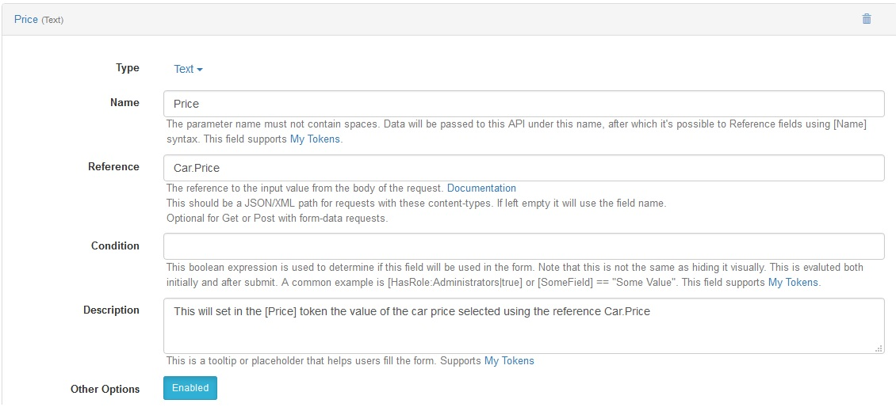

# JSON

### Handling Http POST requets with a JSON body

When a web browser make a request it sends information to the server about what it is looking for in headers. One of these headers is the Content-Type header. The Content-Type header tells the server what file format, or more correctly MIME-type, the browser is looking for. One such type is application/json. By using this Content-type you are telling the server that the data received from the request is in a JSON format and it should be treated accordingly.

The entire input is stored into the [RawInput] Token.

### Using the Reference option to extract data from JSON

The reference option binds a field to a specified JSON (More Info) expression that will be applied to the body. 

Given a request to API Endpoint using the following URL

``example.com/DesktopModules/DnnSharp/DnnApiEndpoint/Api.ash?method=UpdatePrice``

Having the header:

``Content-Type    application/json``

and with the following body:

```json
            {
                "City" : "New York",
                "Address" : "Some street",
                "Car" : {"Model": "VH100", "Price" : "1500" }
            }
```

Using the reference option parse the JSON and extract specific values from it. To do this, in the reference field type the JSON path of the element and in the name field write anything you want. In this example, the reference option could be ``Car.Price`` and the name ``Price``. Now, you can use the token associated with the field (i.e. [Price]), as it will have the value from the request (i.e. *1500*).

So for example if you use JQuery the code looks like this:

```js
var carInfo = {
                "City" : "New York",
                "Address" : "Some street",
                "Car" : {"Model": "VH100", "Price" : "1500" }
            } ;

$.ajax({
        type: "POST",
        headers : {"Content-Type" : "application/json"},
        url: "http://example.com/DesktopModules/DnnSharp/DnnApiEndpoint/Api.ashx?method=UpdatePrice",
        data: JSON.stringify(carInfo)
    }).done(function( data ) {
        // process response
    });
```

This is how the configuration for extracting the price would look like:



If the reference option is left empty DnnApiEndpoint returns the entire value based on the field name.