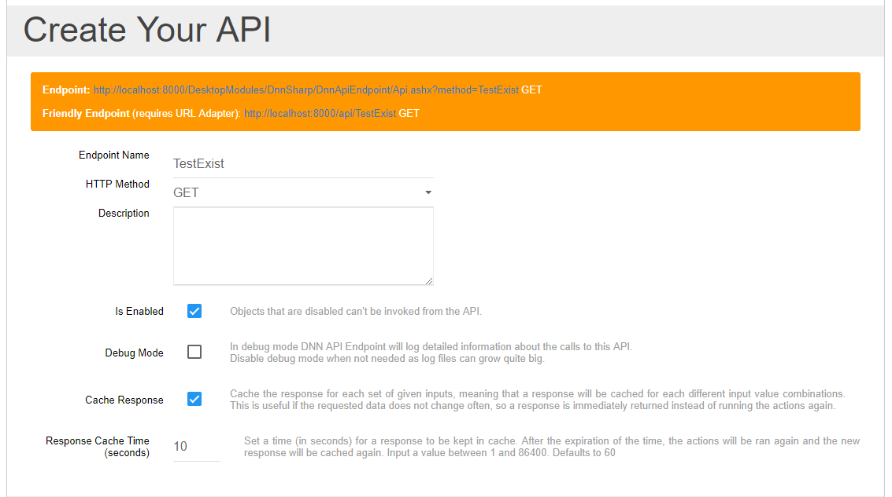

# Response Caching

## About Caching

A small amount of faster, more expensive memory is used to improve the performance of recently accessed or frequently accessed data that is stored temporarily in a rapidly accessible storage media that's local to the cache client and separate from bulk storage. Cache is frequently used by cache clients, such as the CPU, applications, web browsers or operating systems (OSes).

When a cache client needs to access data, it first checks the cache. When the requested data is found in a cache, it's called a cache hit. The percent of attempts that result in cache hits is known as the cache hit rate or ratio.

If the requested data isn't found in the cache -- a situation known as a cache miss -- it is pulled from main memory and copied into the cache. How this is done, and what data is ejected from the cache to make room for the new data, depends on the caching algorithm or policies the system uses.

Cache is important for a number of reasons:

* The use of cache reduces latency for active data. This results in higher performance for a system or application.
* It also diverts I/O to cache, reducing I/O operations to external storage and lower levels of SAN traffic.
* Data can stay permanently on traditional storage or external storage arrays. This maintains the consistency and integrity of the data using features provided by the array, such as snapshots or replication.

## How to use it in API Endpoint

Starting with version 05.00.63 DNN ApiEndpoint ships with a new configurable caching feature where you can store your computed response in cache and rapidly return it when it is requested again.

All you have to do is to enable **`Cache Response`** option like in the example below and set the **`Response Cache Time`** to your desired value (in seconds). Accepted values range from 1 second to 86400 seconds (one day). Defaults to 60 seconds.

## How API Endpoint caching works

When you enable the response caching:
1) The inputs of the API are hashed.
2) The cache is checked, but **no response is found**.
3) The actions **are** executed and the **response is computed**.
4) The hash from the step 1 along with the response from the second step are **stored in cache** for later use.
5) The **computed** response is returned.

This way, we ensure that all API calls are cached based on **input values**, meaning that you can safely call the method with different input values and the response for each combination is cached separately.

When a method is called again:
1) The inputs of the API are hashed.
2) The cache is checked and a **response is found**.
3) The actions are **no longer** executed.
4) The response **found in cache** is returned.

**Note** The cache is cleared every time you edit and save the API method or when the `Response Cache Time` elapsed. Then the actions are ran again and the cache is refreshed.

## Recommendations

1) Use caching only on the API methods that do not alter the data in the database or on your disk. (ie. `GET` methods that only selects data and returns it)

2) Use low caching times if the data is subject to often changes (like 10, 30, 60, 300 seconds, or even more, depending on your implementation)