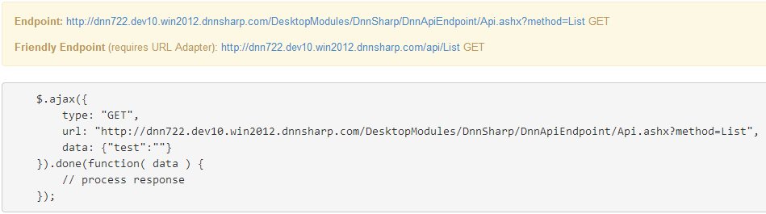

# API Keys

### Summary

* use API keys to restrict access and identify requests
* it doesn't make sense to use API Keys from client side (since they can be easily seen in page source)
* API keys can be passed via Authorization HTTP Header or via query string or post data
* API keys are available as tokens (in any action) as [ApiKeyName] and [ApiKeyValue]

API keys are used to track and control how the API is being used, for example to prevent malicious use or abuse of the API. An API key is submitted alongside web service requests in order to identify the origin of the request - for example, you can restrict access to certain API actions based on who's performing the request.

DNN API Endpoint looks in multiple places for the presence of the API Key: the Authorization HTTP header or the Query String/POSTed data/Cookies for a parameter named apikey. If the API runs on the client side on same site, the API key will not be required if current user is Administrator.

API Endpoint has two access options, public and restricted. By enabling the public access, the method is public to any user but if the method you created contains sensitive data, the restricted access with an API key is the best choice.

To try the API key functionality first you need a method like the one in [Setup -> Creating Your First API method](../getting-started/setup.html). Then go to the API Keys section (in the main screen, below the Methods) and create at least a key. On our method, in Security section, set dropdown API Keys to *Restricted to list* and check the required key.

To test if the method is restricted to the API key you should test the Endpoint with and without the API Key:

You can test the existing method by putting the Endpoint URL in the browser address bar. If you do so without the API key you should see the following on the screen:
``{"error": "Current request is not authorized to invoke this API method."}`` .
Now if you also specify the API key by adding ``&apikey={api_key_here}`` to the url then you should have access to the method. 

Notes for testing:

* you can also use the  Friendly Endpoint (requires URL Adapter). Since there are no additional query parameters in the url you should have a ? instead of &.
* if the *HTTP Method* is not *GET* then you must use a special tool to make the request (like Postman).