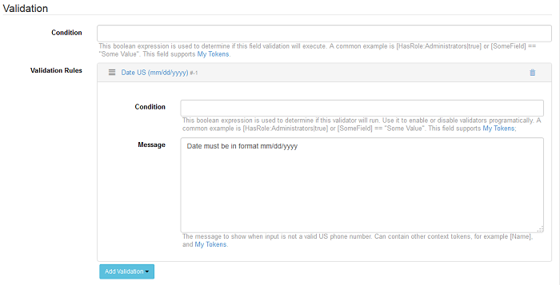

# Validation

### Summary

* Use validation to ensure input is in correct format
* Conditionally disable entire validation or specific validators
* DNN API Endpoint comes with a dozen predefined validators
* New validator can be created via config files or through custom .NET assemblies
* The fields created in the Input Data section have predefined validation rules as well as Condition options. Here we want to make a clear distinction on the Condition fields, there are two Condition fields, one on the Validation section which disables the whole validation, and the other Condition field on the chosen validation rule, this one disables only the selected rule.

In the list below you can find listed all the predefined rules we've managed to implement in DNN API Endpoint module and their behavior:

* **Date US (mm/dd/yyyy)**

  When this rule is set on a field and the user fills in the field with an incorrect data, then the validation message, which you can put in the Message box, is displayed, informing the user that the date must be in the set in the correct format. 

* **Email Address**

  When the value inserted in the email address field is incorrect, the error message set in the message box should be displayed informing the user that the value inserted is not correct.

* **Floating Point Number**
  
  When this field is filled a text the error message set on the rule should be displayed informing the user that only numbers are allowed in the box.

* **Integer Number**

  When this field is filled with text, then the error message should be displayed in order to inform the user that only Integer numbers are allowed (negative numbers, 0, as well as positive numbers).

* **No Funny Characters**
  
  When special characters like "%" or "&" are added in this box, the validation message should be displayed informing the user that these characters are not allowed.

* **No Whitespace**

  When this field is filled in with text with spaces between characters, the error message set in the validation message box should be displayed.

* **Phone**
  
  This field should allow only phone numbers in the format set on the field: "(###) ###-####" and other phone formats should not be allowed

* **RegEx**

  This field allows only regular expressions on which the validation is made. To see how we tested this validation, please check the Input Data page.
  
* **Required Field**
  
  This validation rule, ensures that the fields are mandatory

* **Web Address**
  
  The validation will be made on the URL structure, so if you don't insert a correct web address in the field, then the validation will be made.  

* **User exists (by email)**
  
  The validation should be made on the users which are already created and the warning message should be displayed when an existing user's email address is added in the field

* **Username is available**

  The validation will be made when the field will be completed with existing username. 