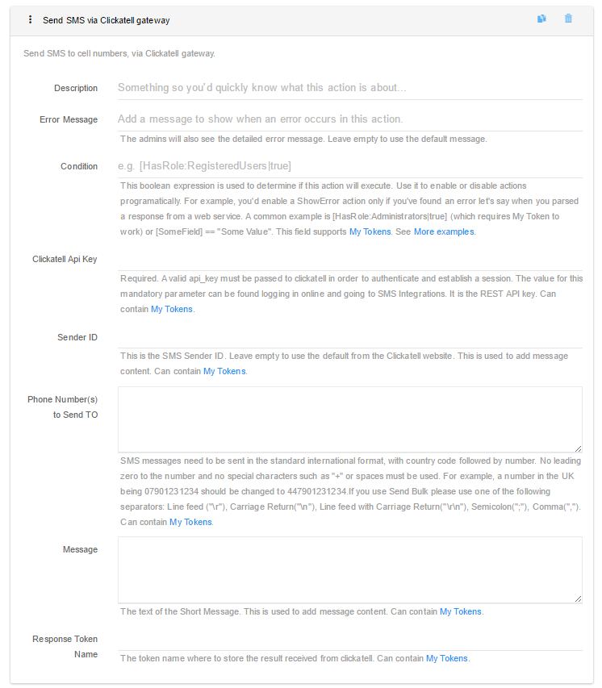
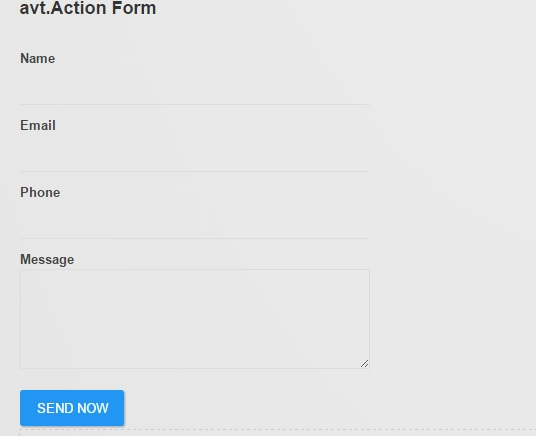

# Action Form Setup

Once you have the Clickatell ApiKey, you can proceed to set up Action Form. The Clickatell integration is provided as an add-on that can be purchased from DNN Store. So you will need to already have Action Form on the server before installing the Clickatell add-on. You can install both packages from Host &gt; Extensions.

In this guide we will create a simple form to send an SMS message to a single phone number supplied in a text box. Start by adding a new Action Form module to the desired page. At the initial configuration step, for demo purposes, we will choose a Blank Form. It creates an empty form so you build everything from scratch. For our example we will need a text box to collect the phone number and a text area for the message. Add these using the Add Field button in Action Form - Manage Screen.

Next, add a button that will push the message to the Clickatell API. The action can be found under Add Action &gt; Communications &gt; Send SMS via Clickatell gateway. Here, you will use your ApiKey from [Clickatell setup](clickatell-setup.html). Finally, we will need to wire the phone number and the message fields to the respective settings under the Clickatell action. We do this by referencing the form fields using their token syntax. Assuming the fields are called Phone Number and Message, the tokens that go under the Clickatell settings are ``[PhoneNumber]`` and ``[Message]``. If it's configured correctly, it should look like in the following screenshot:

Save settings, go back to the front end. The form should look similar to

