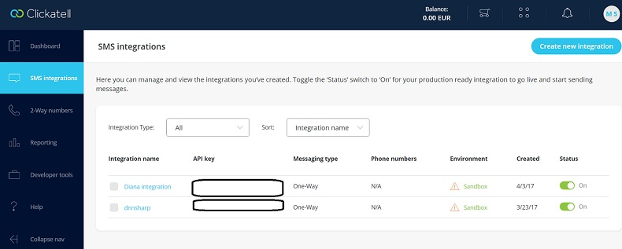

# Clickatell setup

Dnn Sharp modules \(Action Form, Action Grid, Infobox, Sharp Scheduler, Dnn Api EndPoint\) integrate with Clickatell using SOAP or REST API. This needs to be setup in Clickatell Developers' Central.

## Platform

If you have a Clickatell account created November 2016 onwards, you should login at new [Clickatell communications platform](https://portal.clickatell.com/#/login){:target="_blank"}.

Access the Profile Photo &gt; Profile Settings &gt; SMS Integration and create a new integration. After successfully filling all the required fields, save it. Your integration will be displayed into SMS Integration Dashboard. Only the API Key will be necessary to authorize a clickatell session through the Clickatell AddOn and one of the base DnnSharp Modules along the Send SMS via Clickatell gateway action.

## Communicator / Central

If you have a Clickatell account created prior to November 2016 you should login at [Communicator / Central](https://archive.clickatell.com/login){:target="_blank"} page.

Append the SOAP API to your account from APIs &gt; Set up a new API &gt; Add SOAP API. Complete all the required fields to configure your API. After successfully adding a connection, a confirmation message will be displayed with a unique API ID and information on how to get started. It displays the API connection parameters and authentication details.

These are required when connecting to the Clickatell gateway from DnnSharp Modules to send a message.

You can double check this API ID in the main menu: APIs &gt; Manage APIs.

