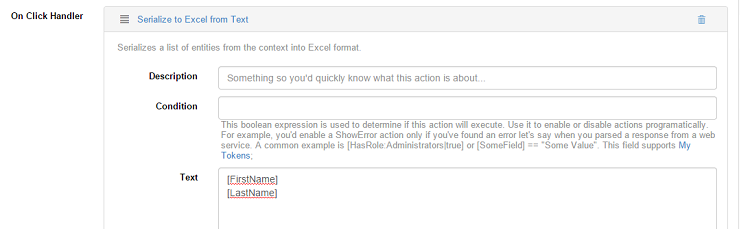
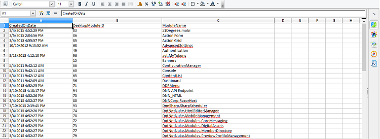

# Excel Generator

The Excel addon allows you to export your data in Excel format. It comes in 2 flavors, namely Serialize from Text and Serialize from entity list, respectively.

In **Action Form**, you have the ability to save your data to reports and download it as CSV file. However, there is also the option to export the inputted data to an XLS file.

Setting it up is pretty simple - on an existing or new button add as action Serialize > Serialize to Excel from Text.

Inside the handler, in the Text field, you can define what text will be serialized. For example, the \[FirstName\] and \[LastName\] fields. Keep in mind that these fields must exist within the form and you need to add their ID, not field name.

Then, you must select the folder to which the file is uploaded.

Lastly, fill in your form and hit Submit. Check your destination folder and you'll see the newly-created XLS file there. Open it and it will look like this:

**Action Grid** too offers the possibility to serialize to CSV, and now with the Excel addon you can serialize from entity list - basically some or all the entries of a grid of your choice.

Similar to Serialize from Text, add a grid button with Action Serialize > Serialize from Entity List. You have the possibility to choose which entities to export to XLS, and even to include all fields at once by ticking one single button.

Here is one example of such an exported grid:

