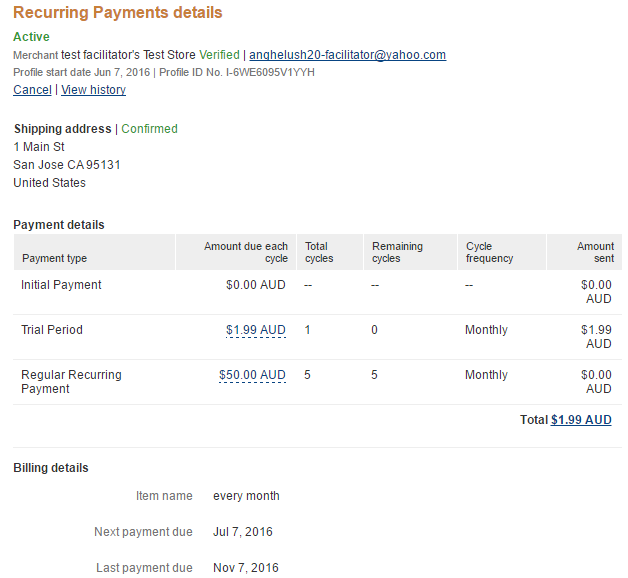
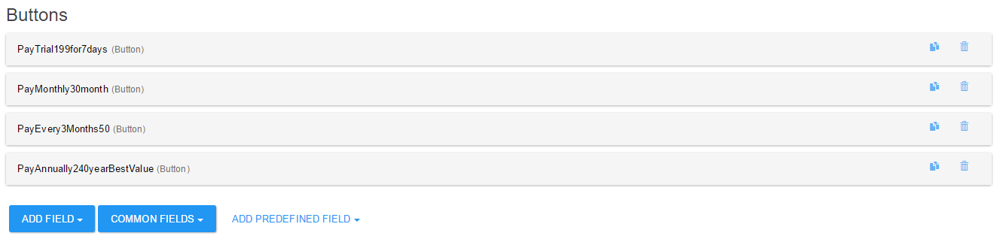
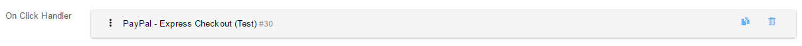
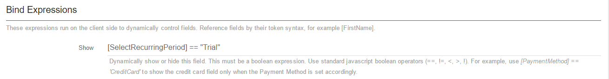
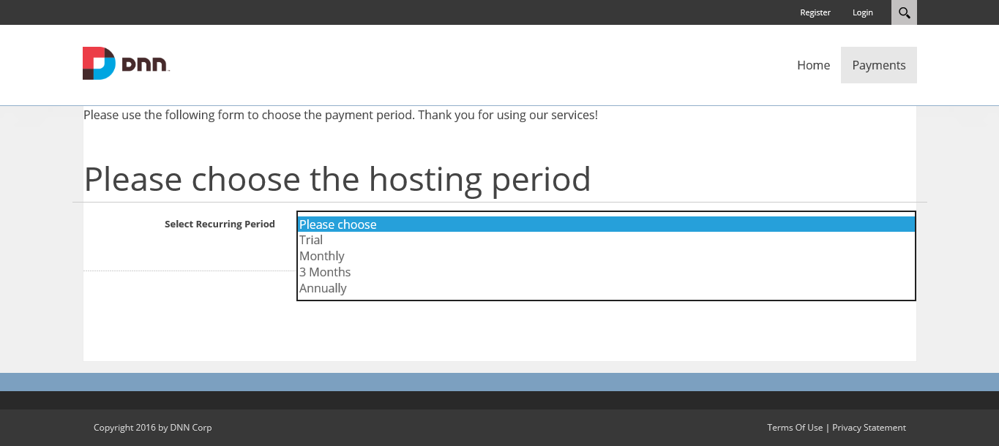
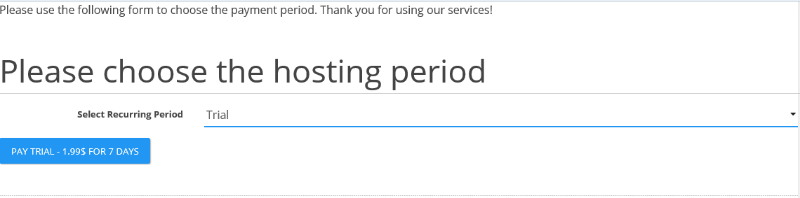
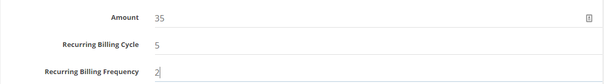
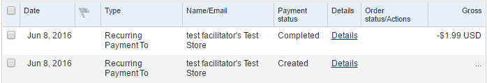
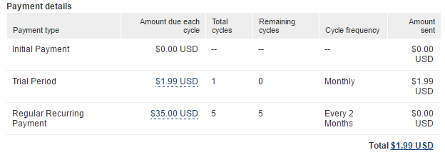

# FAQs

### Is there a trial of PayPal available?

No, we don't provide trial for add-ons, just for modules. If you need a preview of the functionality best is to go through the documentation or check our YouTube channel.

### Q. How can I set a trial of 0.99$ for one-week?

**A.** In order to set a trial for one week, the setup should look like this:

* Trial Amount: **0.99** ;
* Recurring Trial Billing Period: **Week** ;
* Recurring Trial Billing Frequency: **1** ;
* Recurring Trial Billing Cycles: **1**.

### Q. Is there any way to make sure that the trial and recurring payment settings are sent correctly to PayPal?

**A.** Yes, you can check this using PayPal Sandbox. After you click the "Pay" button and you'll be redirected to PayPal website, you can pay using a Sandbox account. After this, you can log-in to sandbox.paypal.com using the same account, then you can go to History - Basic Search. A recurring payment should look like this:

### Q. Is there any way to offer my clients multiple recurring periods in a drop-down?

**A.** Yes, definitely. In order to achieve this, please follow this tutorial:

1) Create an action form module;

2) Add a **"Multiple Choice (with Dropdown)"** field;

3) On the **DataSource**, select **"Items"** and add the desired in the **"Items List"** so it would look like this:

4) Now create a button for each item in the dropdown **(Add Fields - Buttons - Button)**;

5) On each button we will create an "**On Click Handler**" with "**PayPal - Express Checkout**" action and configure the desire type of payment;

6) Now we need to link the buttons to the dropdown items. For this, we will go on each button, on parameter "**Show**" from the "**Bind expressions**" and a token like this one: **[SelectRecurringPeriod] == "Trial"**.

The first part of the token, **[SelectRecurringPeriod]** is the ID of the dropdown field, and on the second part (**"Trial"**) will be item from the dropdown.
At the end, it will look like this:

And when an item for the dropdown is selected, the button will be displayed:

### Q: Is there any way to let users choose how much and when they pay?

**A.** Sure! You can do this by using tokens in the PayPal Checkout payment action. For example, here's a little tutorial for creating a 7-day trial (1.99$) and then let the user choose the Amount, Recurring Billing Cycle and Recurring Billing Frequency:

1. Add an action form module and choose "Pay With Credit Card, PayPal";
2. Create 3 text boxes. In our example, we have the following IDs: Amount, RecurringBillingCycle and RecurringBillingFrequency .
3. On the PayPal checkout action, locate and add the following IDs to parameters:
4. [Amount] to Amount;
5. [RecurringBillingFrequency] to Recurring Billing Frequency;
6. [RecurringBillingCycle] to Recurring Billing Cycles.
7. Save and test.

Note that in this example we used some intuitive names for IDs. Also, using this example you can let the user choose whatever you want.

Let's test the created form. Let's say the user wants to buy a service and pay 35$ billed every 2 months for a total period of 10 months. It should look like this:

And on payment history on PayPal wesite, the user will see 2 payments. One for 1.99$, the trial period, and one recurring payment that starts right after the trial period expires:

The recurring payment we can see that the client is billed with 35$ every 2 months, for a total period of 10 months (5 cycles):

That's all.