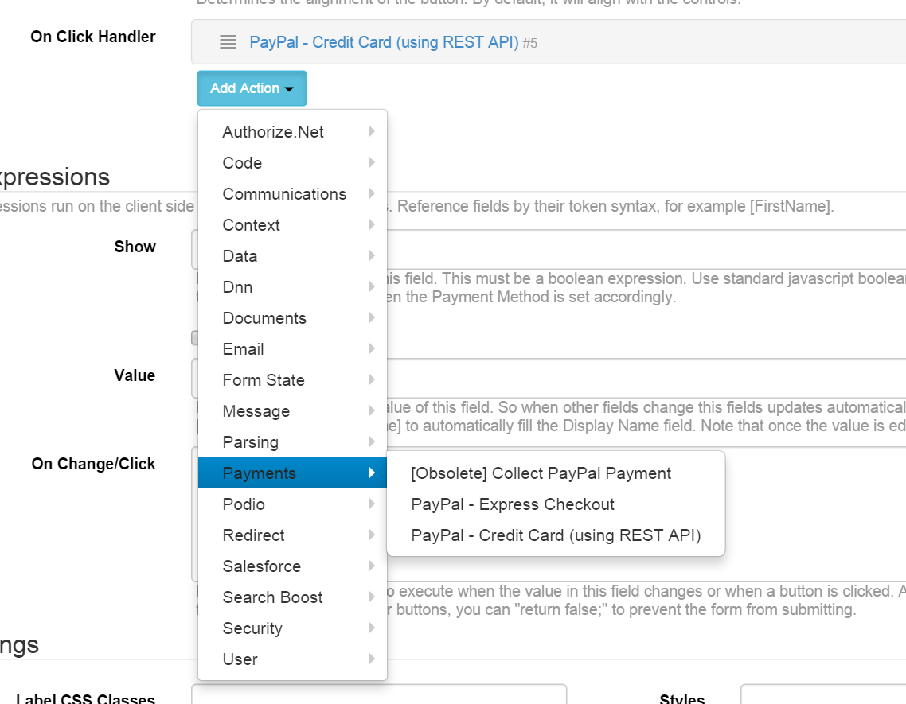
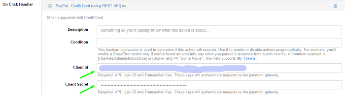
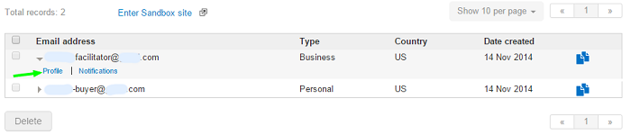
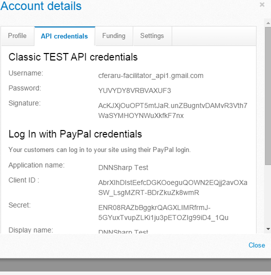
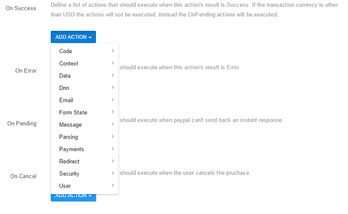
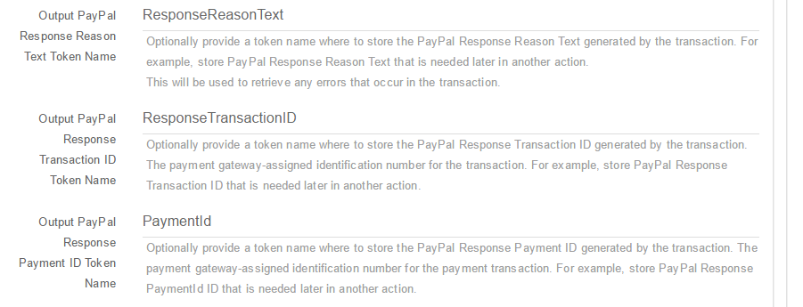

# PayPal - Credit Card (using REST API)

**Update 3rd of October, 2018** As of 14th of September, 2017, PayPal REST API has been placed into [restricted mode](https://developer.paypal.com/docs/release-notes/release-notes-2017/#14-september-2017). Currently, this is [only available for UK accounts](https://www.paypal-community.com/t5/Sandbox-Environment/PayPal-REST-payments-API/td-p/1333777).

**Breaking Changes** Increased minimum requirements to .NET 4.5 and DNN 6+

Start by adding a new form on the page. On the Initialization Screen, either use the template or start with a blank form. If latter, then add a button the form. From the list of actions select one of the paypal actions under Payments section. Check screenshot below for exact location.

## How to setup a test account

PayPal integration Credit Card (using REST API)

* go to https://developer.paypal.com/
* Login
* go to Dashboard
* go to Applications -> My Apps
* Create a new app.
* After you created the app, you can click on it in the apps list, and you will see the Client ID and the Secret.  

You can use then the credentials in your module settings, as seen in the above image.

## PayPal integration Express Checkout

Test your application by creating a Sandbox account for each user entity represented in your PayPal transactions. When testing, use the test accounts in place of all the live accounts you will use while processing live transactions.

* Create a PayPal account and log in to the Developer website at developer.paypal.com.
* Create a set of virtual Sandbox test accounts.
* go to https://developer.paypal.com/
* Login
* go to Dashboard
* go to Applications -> Accounts
* On Sandbox test accounts -> Create accounts
* If not seen when created, you can check the credentials for each facilitator and buyer pair by clicking on their profile link on the list, as seen below:

Format your PayPal API requests using the details from your test accounts. When filling the form, for testing purposes, use the other account, the buyer one, credentials.

The payments are made on-site, without the need for the user to navigate to paypal.com.

Depending on the transaction's result, you can set a host of actions to be executed:

Several tokens are available to use On Error for example to get a clue on what an error is about: ResponseReasonText, ResponseTransactionID, PaymentId:

When making the payment, if the credit card number is invalid, then a clear message will be displayed.
