# PayPal - Express Checkout

**Breaking Changes** Increased minimum requirements to .NET 4.5

Express Checkout is a fast, easy way for buyers to pay with PayPal. Express Checkout eliminates one of the major causes of checkout abandonment by giving buyers all the transaction details at once, including order details, shipping options, insurance choices, and tax totals.

### Configuration

Start by adding a new form on the page and select the blank template. Add the fields of your choice and a button. As On Click Handler action add Make a payment with PayPal Express.

Click on the handler and proceed with the configuration.

After you add the desired text fields, add a button. For On Click Handler select as action PayPal - Express Checkout. 

Click on Express Checkout and proceed to fill in all the fields:  

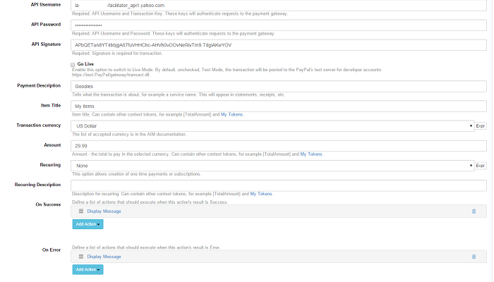

In our experience, using US Dollar for currency is guaranteed to work - however, if you'd like to use some other currency, check the Settings in case you need to do any adjustments.* The fields' labels are self-explanatory, and make sure you fill them all in.
When you click on the button and the transaction is successful, you should be redirected to this page:

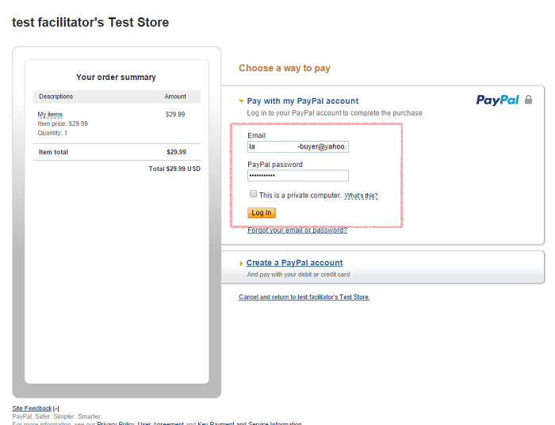

This is where you log in with your buyer test account.

### Accounts

For testing purposes, you have to set up a test account. Go to , log in with your PayPal developer account, then navigate to Dashboard > Sandbox > Accounts. 

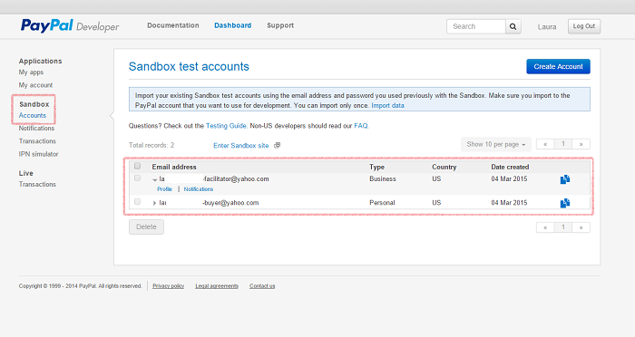

You can find your test credentials by clicking on the Profile link under your facilitator email address (pictured above). You will need the following pieces of information: API Username, API Password, and API Signature.

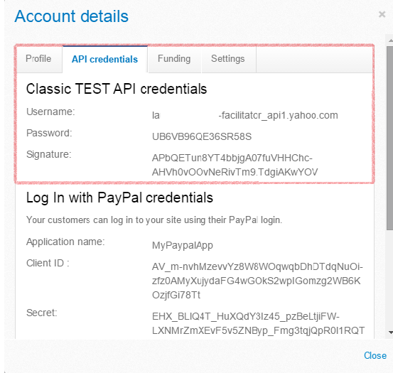

Next up, make sure that Enable Express Checkout is on. You can do this by logging to
with your facilitator account. Go to My Account > Profile > My Selling Tools > API Access, as illustrated below: 

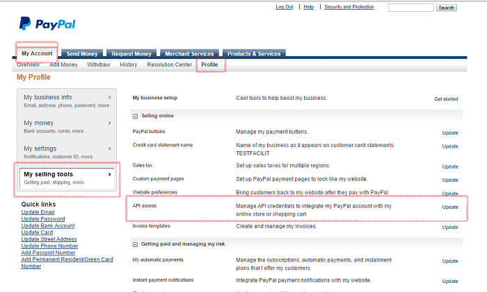

Click on the Update button and you will land on this page: 

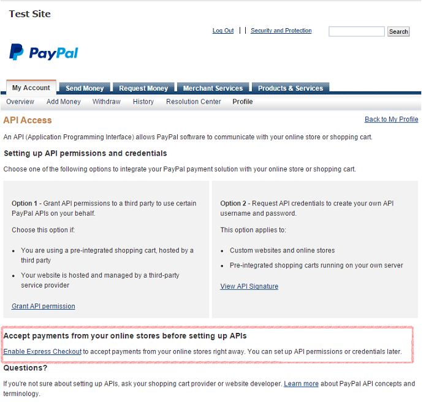

Click on Express Checkout and enable it if it's not.
For business purposes, the credentials can be found by navigating to My Account > Profile > My Selling Tools > API Access (illustrated previously) and clicking on View API Signature (Option 2).

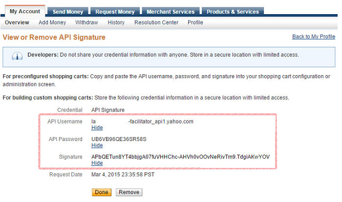

If you would like to change your primary currency, log in to your PayPal account, click on Profile, select My Money and click on Currencies:

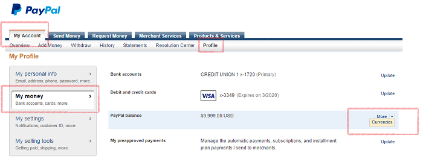

Next up, add the currency of your choice, select it from the list, then click on "Make Primary." That's it, you can now safely select other currencies for your form.

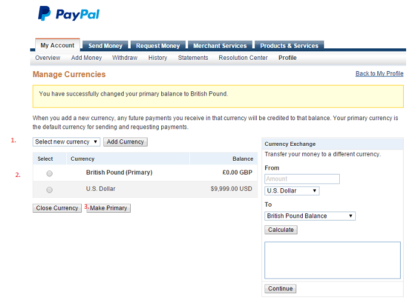

The payments are made on-site, without the need for the user to navigate to paypal.com.
Depending on the transaction's result, you can set a host of actions to be executed:

## New features (from v2.0.25):

#### Trial Billing

You can now offer your clients the possibility to test the product/service for a selected period of time before the main subscription starts.

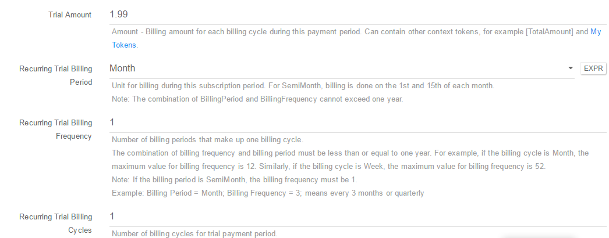

#### Recurring Billing

This new feature allows you to create custom payments very easily, using the following paramters:

* **Recurring Billing Period**. Unit for billing during this subscription period. For SemiMonth, billing is done on the 1st and 15th of each month. Note: The combination of BillingPeriod and BillingFrequency cannot exceed one year. You can select the billing period as daily, weekly, semimonthly, monthly and early.
* **Recurring Billing Frequency**. Number of billing periods that make up one billing cycle. The combination of billing frequency and billing period must be less than or equal to one year. For example, if the billing cycle is Month, the maximum value for billing frequency is 12. Similarly, if the billing cycle is Week, the maximum value for billing frequency is 52. Note: If the billing period is SemiMonth, the billing frequency must be 1. Example: Billing Period = Month; Billing Frequency = 3; means every 3 months or quarterly
* **Recurring Billing Cycles**. Number of billing cycles for payment period. For the regular payment period, if no value is specified or the value is 0, the regular payment period continues until the profile is canceled or deactivated. For the regular payment period, if the value is greater than 0, the regular payment period will expire after the trial period is finished and continue at the billing frequency for the specified number of cycles 

Example: Billing Period = Month; Billing Frequency = 1; Cycles = 10 means every months for the next 10 months. The same parameters are available for setting up the trial billing.

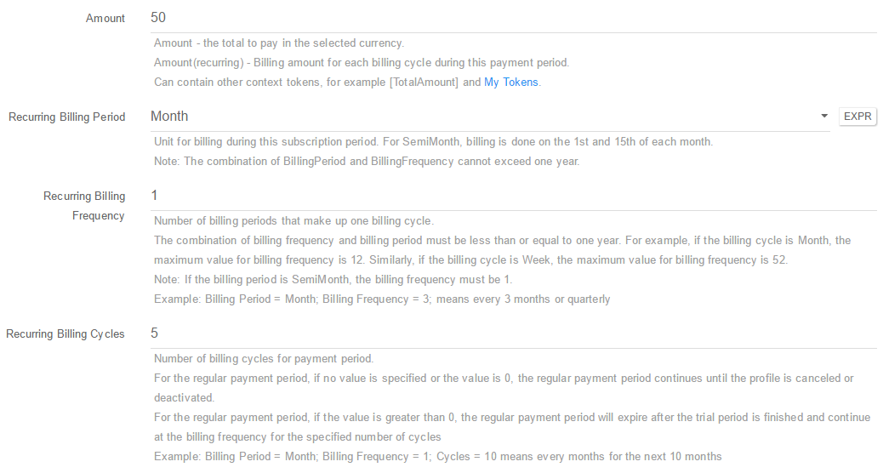

For more info please see our FAQs section.