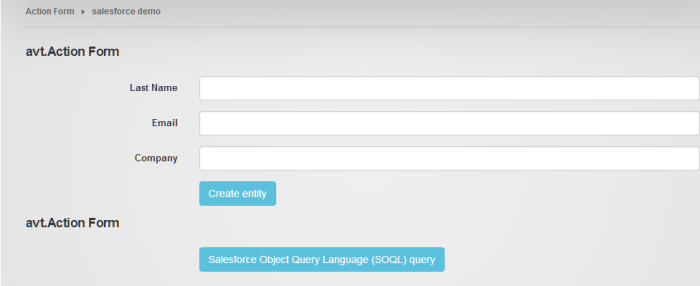
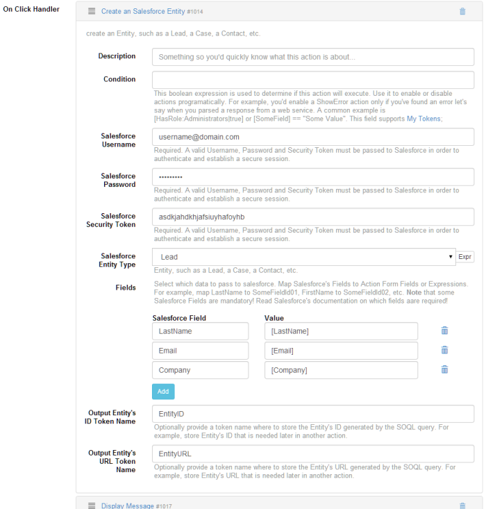
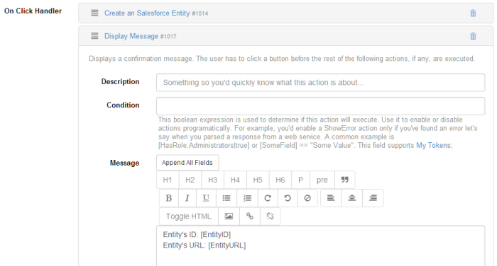

### Create a Lead form

Start by adding a new Action Form module to the desired page. At the initial configuration step, for demo purposes, we will choose a Blank Form. It creates an empty form so you build everything from scratch. For our example we will add three text boxes to collect the Last Name, the Email and the Company for the new Lead. Add these using the Add Field button in Action Form - Manage Screen. Also add a button to perform the desired action.

Note that different entities have different requirements in terms of required fields. Make sure to read the documentation.

Add two actions on the On Click handler: 
* Create an Salesforce Entity action, for actually creating the entity

* and a Display message action, for displaying the newly created entity's id and URL. You can pass these tokens for later use in other actions.

