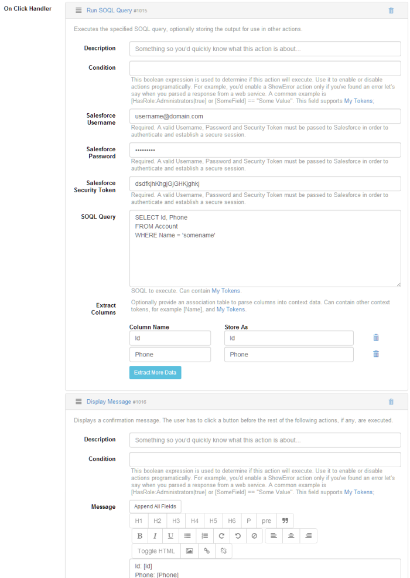

### Query Salesforce form

Start by adding a new Action Form module to the desired page. At the initial configuration step, for demo purposes, we will choose a Blank Form. It creates an empty form so you build everything from scratch. For our example we will need a button to perform the desired action. Add this using the Add Field button in Action Form - Manage Screen. 

SOQL is very similar to SQL. Make sure to read the documentation [here](http://www.salesforce.com/us/developer/docs/soql_sosl/index_Left.htm). The example below returns the Id and Phone of an Account for which we know the name.

