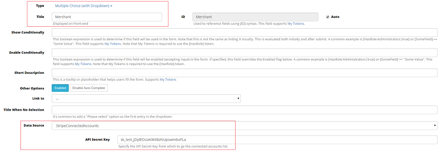
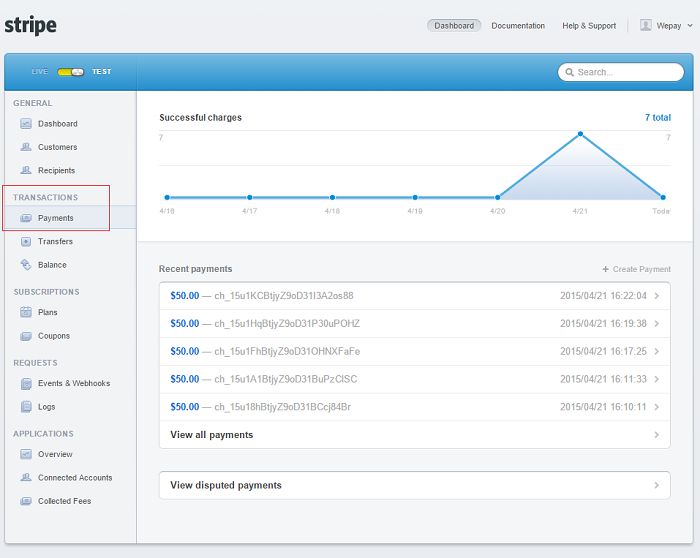

# Stripe Payment through the platform

Create a payment through your stripe platform. The payment is made to the platform and then automatically to the destination account.

You can use the [Stripe:ChargeId] token if the payment to platform was made successfully.

A refund must be initiated by the platform.

_API Secret Key_ - Specify your platform's Secret Key.Can contain [My Tokens](/my-tokens/index.html).

_Application Fee Percentage_ - Percentage of how much the application will charge based on the amount field. Use dot to separate decimals. (Ex: 2.35).Can contain [My Tokens](/my-tokens/index.html).

_Application Fee Fixed Amount_ - A fixed amount that the application will charge. This amount is added after the Application Fee Percentage. Use dot to separate decimals. (Ex: 0.50).Can contain [My Tokens](/my-tokens/index.html).

_Payee Email_ - Can contain [My Tokens](/my-tokens/index.html).

_Description_ - Description of the payment.Can contain [My Tokens](/my-tokens/index.html).

_Payment To_ - The destination AccountID of the payment. Leave the field empty in case you want the transfer to go directly to your platform. Can contain [My Tokens](/my-tokens/index.html).

It can be configured as a multiple choice dropdown with Stripe Connected Accounts datasource. Underneath Data Source fill in your API Secret Key, which you can find in your Stripe account [https://dashboard.stripe.com/account](https://dashboard.stripe.com/account){:target="_blank"}, under Account Settings > API Keys.

Card Number - Credit card number. Can contain [My Tokens](/my-tokens/index.html).

Card CVC/CCV - Credit card cvc/ccv. Can contain [My Tokens](/my-tokens/index.html).

Card Expiration Month - Can contain [My Tokens](/my-tokens/index.html).

Card Expiration Year - Can contain [My Tokens](/my-tokens/index.html).

Card Owner's Name - Can contain [My Tokens](/my-tokens/index.html).

Card Address City - Can contain [My Tokens](/my-tokens/index.html).

Card Address Country - Can contain [My Tokens](/my-tokens/index.html).

Card Address - Can contain [My Tokens](/my-tokens/index.html).

Amount - Amount that is going to be transfered (in cents). Can contain [My Tokens](/my-tokens/index.html).

Currency - Can contain [My Tokens](/my-tokens/index.html).

On Success - Define a list of actions that should execute when this action's result is Success.

On Error - Define a list of actions that should execute when this action's result is Error. You can see the error message in [Stripe:ErrorMessage].

When you click on Execute, the amount set up within the button will be sent to the merchant selected from the dropdown. You can check this in your Stripe account, under Transactions > Payments.

