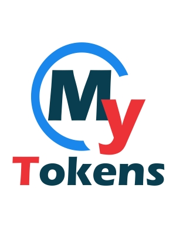

# Home

Everybody needs tokens. They allow including dynamic content in static places and are also very useful for achieving seamless integration between otherwise isolated components. At least My Tokens does!

Standard token replacement in DotNetNuke has limited features. Fortunately, My Tokens builds on top of it to unleash unlimited potential for your tokens. You can now define tokens to access all objects in the application: cookies, session, application, query string, post data, etc. Additionally, My Tokens allows defining tokens directly against the database, HTTP Web Services or web pages, files on local disk or on FTP Servers or emails from POP3 or IMAP Servers. That is, you can define a token that runs a query or loads a node from an XML or JSON Response and puts the result where you need it. Furthermore, token sources (SQL queries, URLs, Constant Strings, etc) can invoke other tokens, therefore recursively replacing them.

You can download latest version of My Tokens from [dnnsharp.com](/my-tokens/index.html){:target="blank"}. While on that page, you can also check the [changelog](https://www.dnnsharp.com/dnn/modules/my-custom-tokens/whats-new?version=5.0.0){:target="blank"} to see what's new.