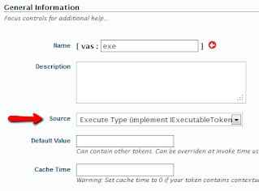
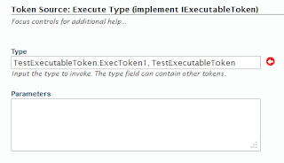

# Execute Type

#### Important notice

**Support for IExecutableToken has been dropped in since version 2.6.31. So documentation below only applies to previous versions. Use razor tokens or ITokenSource interface instead.**

## About

This token makes it possible to hook your own code into My Tokens and make it available to all modules and components that support tokens. Note that this is not the only method to add tokens through custom code, but is the simplest method and requires less work. For more information on other methods please refer to Integration Notes pages.

## Workflow

The Execute Type token loads a class from the assembly you specify and executes some special methods that basically return a list of tokens. This method requires you to link to avt.MyTokens.Core.dll assembly and implement interface IExecutableToken. If you're looking for a method that doesn't require setting MyTokens as a dependency read at [Integration Notes > Exposing Token Interface](../integration-notes/exposing-token-interface.html) page which uses the reflection method but also requires more work to set it up.

To create an Execute Type token following steps are required:

* Create new Visual Studio project and link to avt.MyTokens.Core.dll

* Create new class that implements avt.MyTokens.Core.Sources.IExecutableToken2.

  There are two methods to implement:

  + ``IList<string> AllItemKeys { get; }``
  
  Returns ``List<string>`` with all keys you want to export

  + ``IDictionary<string, string> Execute(avt.MyTokens.MyTokensReplacer tknReplacer, Dictionary<string, object> tknParams, string strParams)``

  Returns ``IDictionary<string, string>`` where first parameter is the key from AllItemKeys and second parameter is the token value for that key. Read below for how different keys are accessed.

* Compile the project and copy the DLL to your website /bin folder so it's visible to the web application

* Go to My Tokens studio and create a new Execute Type token. In the second screen specify the name of your class to execute. The format is *Your.Full.Namespace.YourClass, YourAssemblyName*.





* Go to a HTML module, enable Token Replacement in Module Setting, then Edit Content and access your token; the format is:*[namespace:TokenName.ItemKey]*. Note how ItemKey is a key name you exported in AllItemKeys list and the dictionary returned by Execute().

That's it. It may sound more complicated than it actually is. Read next section for an example.

### Example

This pages provides a simple example on how to implement an Execute Type token backed up by C# code. Project files are at the end of the article.

All the code required to create a simple token is listed below:

```c#
using System;
using System.Collections.Generic;
using System.Text;
using avt.MyTokens.Core.Sources;

namespace TestExecutableToken
{
    public class ExecToken2 : IExecutableToken
    {
        public IList<string> AllItemKeys {
            get {
                return new List<string>() {
                    "Item1", "Item2"
                };
            }
        }

        public IDictionary<string, string> Execute(avt.MyTokens.MyTokensReplacer  tknReplacer, Dictionary<string, object> tknParams, string configString)
        {
            return new Dictionary<string, string>(){
                {"Item1", "Value of Item1"},
                {"Item2", "Value of Item2"},
                { "Item3", tknParams.ContainsKey("dyn") ? tknParams["dyn"].ToString() : "" }
            };
        }
    }
}
```

What this code does is it exports a token with two values identified by the keys specified in the AllItemKeys list. To invoke the token from a HTML module you would call *[MyNamespace:MyToken.Item1]* and *[MyNamespace:MyToken.Item2]*.

**Note** that MyNamespace and MyToken are actually names you specify when you create the namespace or the token. So to test this you'll first have create a namespace with any name you think is relevant, then create a new token, give it a name, set it to Execute Type and provide the class in this example. 

Assuming the assembly name is also *TestExecutableToken*, then all we need to do is specify the type in the second screen of token definition to *TestExecutableToken.ExecToken2*, *TestExecutableToken*. Note how the first part is the class name qualified with the namespace and the second part after the comma is the assembly name without the DLL extension.

In real world you can have any number of keys exported from a token and each key will likely be dynamically computed (in my example I returned hard coded strings).