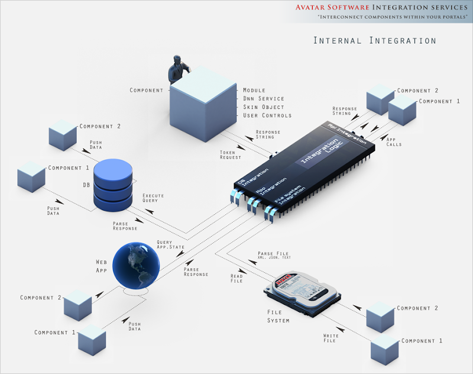
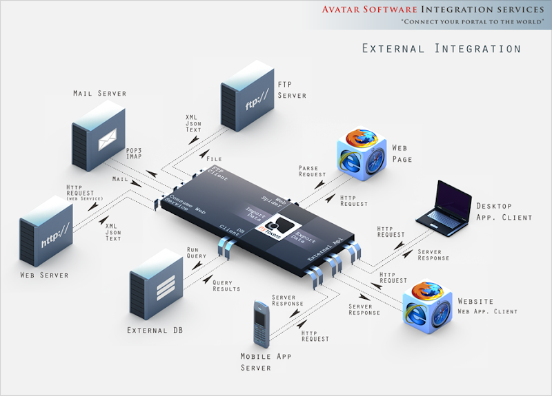

# Integration Notes

*NOTE:* This section contains advanced topic meant for developers and system integrators. Portal Administrators need not worry with the technical details. All is needed to make My Tokens work is installing the module and optionally patch the DotNetNuke Core where needed.

There are 3 distinct topics regarding integration:

* [Replace tokens with My Tokens](replace-tokens-my-tokens.html)

Read this if you need to integrate your components with My Tokens so you allow users to write content that has special markup that get replaced with actual value by My Tokens.

Note that starting with version 1.8 My Tokens will automatically ask if you want to Patch the DNN Core on first install. This will make My Tokens available in ALL places where standard tokens are supported.

* [Expose Token Interface](exposing-tokens-interface.html)

This allows you to export tokens from your specific module that can be accessed from any place that supports tokens (for example the HTML module, Links module, commercial modules and so on).

MyTokens will act as a bridge between components, allowing them to exchange data and interact. Furthermore, tokens from various sources can be combined and nested, resulting in a portal connected to the world, with data synchronized components. Also, a powerful and reliable syntax allows 3rd party developers to expose simple to complex tokens under a unified interface. 

* [Build API/Web Services](api-web-services.html)

This allows invoking tokens via HTTP from outside the DotNetNuke framework and modules (for example from a desktop application, an AJAX call from another website, a synchronization service and so on).

**Please [Contact Us](https://www.dnnsharp.com/contact){:target="_blank"} for more integration information and link exchange.** We are maintaining a list of modules and other components that integrate with MyTokens.

Another way to look at My Tokens is to consider it an *Integration Framework* as it can create communication channels both between portal modules and also between the portal and external clients such as desktop apps or AJAX calls from web pages.
The graphics below illustrate how the data sources and the external API (Web Services) can be leveraged to achieve integration.

