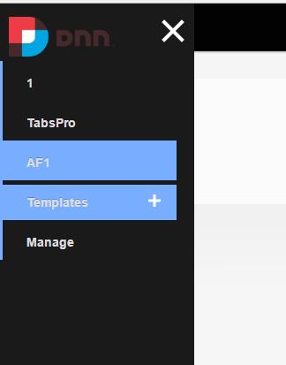
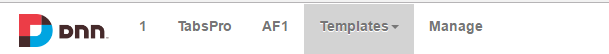

### NavXP Themes

By default, NavXP comes with 5 preinstalled skins:

* **Bootstrap Left Sticky**: A hamburger menu that, once clicked, pulls the menu from the left side of the screen.

* **Bootstrap Right Sticky**: A hamburger menu that, once clicked, pulls the menu from the right side of the screen.

* **Bootstrap Fixed**:  
  

* **Bootstrap Top Sticky**: The same design as fixed bootstrap menu that will stick to the top of the menu when page is scrolled down.

* **Simple Unordered List**: A simple menu that will list the elements vertically.

