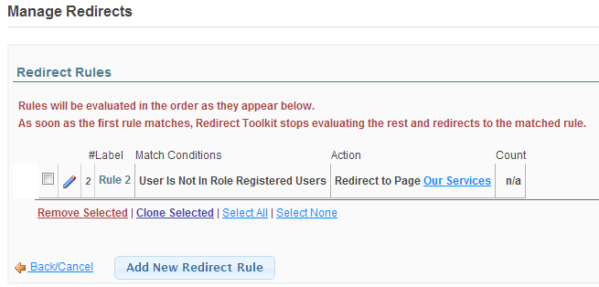

# Redirect Rules

A **rule** in Redirect Toolkit defines the conditions and what steps to execute in case of positive match. There can be any number of rules defined for a module. Creator of the rules is responsible to order rules in the order they should be checked. The way it works, Redirect Toolkit will check one rule at a time starting with the one at the top if finds one for which the conditions are met. At this point the actions associated with the rule are executed and Redirect Toolkit stops so the rest of the rules are not checked.

Logically, a rule has the following parts:

* General
* Conditions
* Redirect Action
* Advanced Options and Additional Actions

Conditions are checked against following criteria:

* REDIRECTS BY TYPE
* BROWSER INFORMATION
* DATABASE DATA
* DATE AND TIME
* HOST INFO
* IP GEO LOCATION
* MY TOKENS
* PAGE PARAMETERS
* PAGE VIEW COUNT
* RANDOM
* REFERRER INFO
* ROLE INFO
* USER INFO
  
Rules are maintained from Manage Redirects. Note that it is possible to order rules both from Manage Redirects (by using right arrows) and from Rule Add/Edit Form (by using the priority field).

