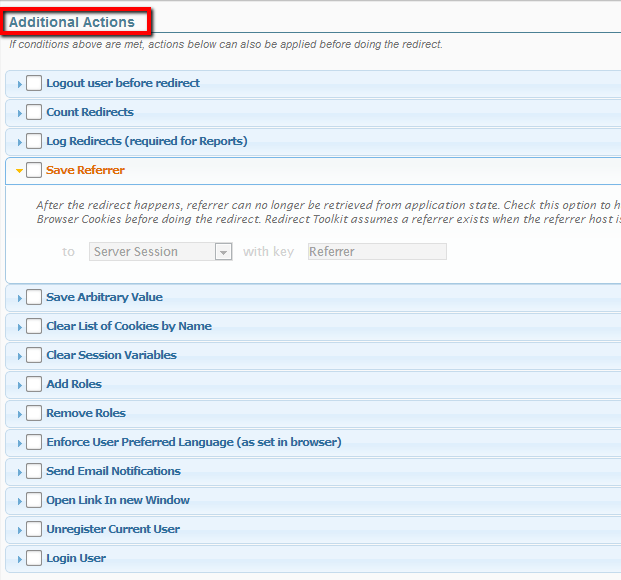

# Additional Actions

When Redirect Toolkit matches a rule, it can be configured with additional actions to do before executing the redirect. These actions are useful for reporting and for achieving complex scenarios where for example values need to be saved in the application state so logic can be run against that user at a later stage.

## Following additional actions are possible:

* Logout Before Redirect - If this option is set, Redirect Toolkit will logout user from current portal before doing the redirect.
* Count Redirects - This option is useful for minimal reporting to see how many users are affected by each rule. It has a very minor performance impact so it's recommended that you set this on.
* Log Redirects - This option provides full logging capabilities. For each user affected by the redirect it saves information about the user, remote address, browser capabilities, etc. Logs are saved in the database and can be downloaded in CSV format.
* Save Referrer - This solves the problem with referrer being lost after user navigates on another page. Redirect Toolkit can be instructed to save the initial referrer in Browser Cookies, Server Sessions or User Profile Property (that is, if user affected by the redirect is logged in). Each of these options require an additional field to specify the key (cookie name, session variable name, profile property name) under which the referrer should be saved.
* Save Arbitrary Value - This is same as above, except you can save anything you want in the Browser Cookies/Server Session/User Profile. By anything I mean a string that can also contain tokens created with My Tokens.
* Clear Cookies - Given a list of cookie names, Redirect Toolkit will iterate each and remove the cookie from the browser if it exists.
* Clear Session Variables - This option allows clearing the specified session variables before doing the redirect.
* Add Roles - If user is logged in, this option grants the selected security roles if the user doesn't already have them. This is a very powerful option to enforce workflows.
* Remove Roles - Same as above, except security roles are removed if user has them.
* Enforce User Preferred Language (as set in browser) - If this option is set, Redirect Toolkit checks if there's a localization matching the languages passed through browser preferences. If a match is found, then Redirect Toolkit appends the language parameter to the URL specified for the rule.
* Send Email Notifications - Use this action to send email notifications to users in specific DNN roles or to a list of email addresses when a redirect executes.
* Open Link in New Window - Provide a second link to open in new window. Note that when this action is set the main redirect (if any) is made from javascript.
* Unregister User - If current user is logged in, this action will delete the associated user account. Use this function to provide easy unsubscribe features.
* Login User - Logins the user with given username and password. Use this action to automatically login users, for example for demoing purposes or to force interaction to go under a Guest Account. Note that in conjunction with My Tokens you can log users based on various criteria, so this can become a very powerful feature.