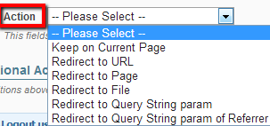
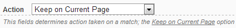
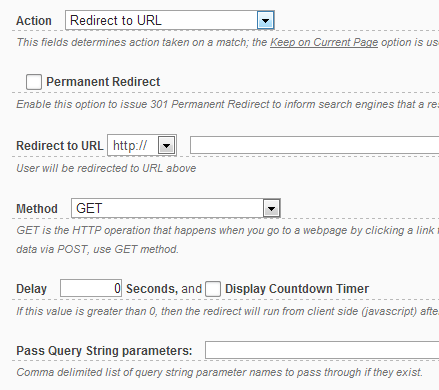
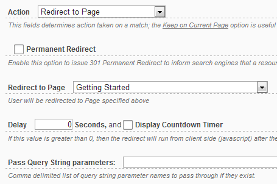
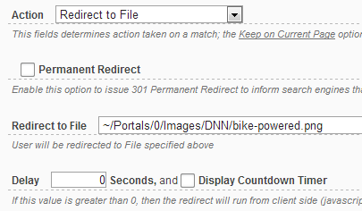
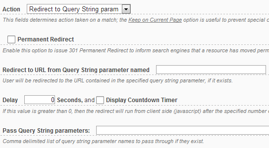
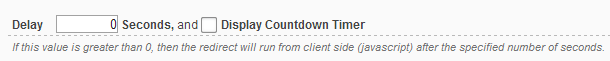
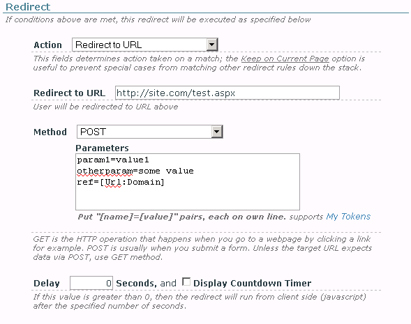

# Redirect Actions

When a rule's conditions are met, Redirect Toolkit will execute the redirect action associated with the rule. The actions are edited through the interface below:

There are few possible actions to take when a rule is matched.

* **Keep on Current Page** 
This option is useful to prevent special cases from matching other redirect rules down the stack. For example, a first rule in a Redirect Module could say *Keep all Registered Users* on this page; next rule could say *Redirect Everyone to Benefits page*. Users that already have an account will stay on the page, while others will be shown the benefits of becoming members.

* **Redirect to URL** 
Allows freely imputing a URL to any location. This option also offers three possibilities:

    * Normal (redirect to target URL using GET HTTP method)
    * Permanent Redirect
    * POST to URL (added in version 1.7.0) - described below

Note that the URL fields supports tokens.

* **Redirect to Page** 
Allows selecting a page from the portal to which users matched by current rule will be redirected to

* **Redirect to File** 
This option allows choosing a file to which users will be redirected to

* **Redirect to Query String param**

* **Redirect to Query String param or Referrer**

## JavaScript Redirects (or Delay Redirects) 

Redirect Toolkit allows specifying a delay in seconds before redirect happens. If the delay is 0 then the redirect is initiated from the *Server Side*. If greater than 0, Redirect Toolkit generates JavaScript code set to run after the specified number of seconds, in which case the redirect happens from *Client Side*.

Optionally, Redirect Toolkit can be instructed to show a message that also contains a countdown timer. *A common example is You will be redirected in (5.4.3.2.1) seconds...*
This message can be modified and localized from DotNetNuke Localization Functions, but we plan to change this behavior because you may need different text for different modules.

## POST to URL
This option was added in version 1.7.0 and allows providing additional data that Redirect Toolkit will pass to target URL using POST HTTP method.

The POST option is available when *Action is set to Redirect to URL*. When selected, a new text box appears that it allows to provide POST data. Input one key=value pair per line as reflected in screenshot of example below.

Note that the POST Parameters filed support My Tokens, making it possible to send with POST almost anything you can think off.
