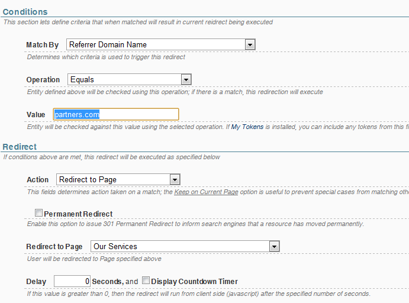

# Redirect Conditions

A **condition** instructs Redirect Toolkit what criteria should be used to identify users affected by the redirect. Usually, throughout the documentation, we refer to Rule types based on their conditions. This is true for now, but it the future we plan to allow multiple conditions per rule joined with boolean operators (for example *Condition1 OR (Condition2 AND Condition3))*, each condition matching different criteria so actually the rule will involve mixed types. But for readability as a convention we assume a Rule always involves just one type of condition.

The interface for defining conditions looks like in following image:

First step in defining the condition is to select which entity should be checked against. Redirect Toolkit supports the following entities:

* **Role** - Condition is checked against the roles of current user
* **User** - Condition is checked against properties of current user
* **Referrer** - Condition is checked against Referrer URL
* **Parameters** - Condition is checked against parameters from current context (GET, POST and Browser Cookies)
* **Host** - Condition is checked against current URL (either just the domain name or full url)
* **Browser** - Condition is checked against browser information and capabilities (such as browser name, browser type - IE, Firefox, etc, either if it's a device or not and by many other criteria)
* **View Count** - Condition is checked against the number of times the Rule has been evaluated for current user
* **Random** - Condition matches randomly based on a probability setup in the rule; Setting the probability to 100% will have the rule always execute

Each of these entities expose a number of **properties**. For example, the User Entity exposes properties such as First Name, Last Name, Email Address, Profile Property and so on. Read specific redirect pages for more information about capabilities of each Entity Type.

Each property can be checked in a number of ways. Most common is to check if a property is equal to a specific value (for example, if User ID is 7 or if Referrer is somesite.com). This is labeled as **Operation** on the UI and varies based on selected Entity and Property.